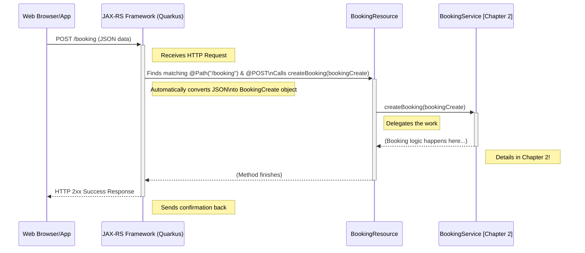

# Chapter 1: Command Resources (`BookingResource`, `CustomerResource`, `RoomResource`)

Welcome to the first chapter of our journey into the `cqrs` project! We're going to start at the very beginning: how does our application receive instructions from the outside world?

Imagine you're building a website for a hotel. A user visits the site, finds a nice room, fills in their details, and clicks the "Book Now" button. How does that click translate into an actual booking in our hotel system? This is where **Command Resources** come in.

## What's the Problem?

Our application needs a way to listen for requests coming from users (via web browsers, mobile apps, or other systems). These requests aren't just asking for information; they are *commands* – instructions to *do* something, like:

*   Create a new booking.
*   Cancel an existing booking.
*   Register a new customer.
*   Add a new room to the hotel.

We need a clear, organized way to handle these incoming commands.

## The Solution: Command Resources

Think of Command Resources as the **front desk** or **reception** for the "command" part of our application. They are the public-facing entry points that listen for specific types of requests.

In our project, we use standard Java web technology (specifically JAX-RS) to define these entry points. We have three main Command Resources:

1.  `BookingResource`: Handles all commands related to bookings (create, cancel, pay).
2.  `CustomerResource`: Handles commands related to customers (create).
3.  `RoomResource`: Handles commands related to rooms (create, update).

These resources act like specialized receptionists: one handles booking requests, another handles customer requests, and the third manages room requests.

## How They Work: A Look at `BookingResource`

Let's focus on the `BookingResource` to see how it works. Imagine that "Book Now" click sends a request to our application.

**1. Defining the Address (`@Path`)**

```java
// File: command/src/main/java/fhv/hotel/command/BookingResource.java
package fhv.hotel.command;
// ... other imports ...
import jakarta.ws.rs.*;
import jakarta.ws.rs.core.MediaType;

@Path("/booking") // <--- This is the main address for booking commands
@Produces(MediaType.APPLICATION_JSON) // Says we'll usually send back JSON
@Consumes(MediaType.APPLICATION_JSON) // Says we expect to receive JSON data
public class BookingResource {
    // ... methods inside ...
}
```

*   `@Path("/booking")`: This annotation is like putting a signpost on our front desk. It tells the web server framework (Quarkus, in this case) that any request whose URL starts with `/booking` should be directed to this `BookingResource`.
*   `@Consumes(MediaType.APPLICATION_JSON)`: This tells the resource, "When you receive data, expect it to be in JSON format." JSON is a common way to structure data sent over the web.
*   `@Produces(MediaType.APPLICATION_JSON)`: This tells the resource, "If you need to send data back, send it in JSON format." (Though for simple commands, we often don't send much back).

**2. Handling a Specific Command (`@POST`)**

Now, how does `BookingResource` handle the *specific* command to *create* a booking?

```java
// Inside BookingResource class...

@Inject // We'll explain this later
BookingService bookingService;

@POST // <--- Handles HTTP POST requests sent to /booking
public void createBooking(BookingCreate bookingCreate) {
    // Takes the incoming data (bookingCreate) and passes it on
    bookingService.createBooking(bookingCreate); 
}
```

*   `@POST`: This annotation marks the `createBooking` method. It means this method should be called when an HTTP `POST` request arrives at the `/booking` path. `POST` is typically used for creating new things.
*   `createBooking(BookingCreate bookingCreate)`: This is the method itself.
    *   `BookingCreate bookingCreate`: This is the input parameter. The web framework automatically takes the JSON data sent in the `POST` request and converts it into a `BookingCreate` Java object for us. This object holds the details needed to create a booking (like guest name, room ID, dates). We don't need to parse the JSON manually!
    *   `bookingService.createBooking(bookingCreate);`: This is the crucial line. Notice the `BookingResource` *doesn't* actually perform the booking logic itself. It acts like a receptionist who receives the request form (`bookingCreate`) and immediately passes it to the specialist department – the `BookingService`. We'll learn all about this service in the next chapter: [Command Services (`BookingService`, `CustomerService`, `RoomService`)](02_command_services___bookingservice____customerservice____roomservice___.md).

**Example Interaction:**

1.  **Input:** A web browser sends an HTTP `POST` request to `http://yourserver.com/booking`. The body of the request contains JSON data like:
    ```json
    {
      "guestName": "Alice Wonderland",
      "roomId": "a7f3b...", // Some unique ID for the room
      "checkInDate": "2024-12-01",
      "checkOutDate": "2024-12-05",
      "numberOfGuests": 2
    }
    ```
2.  **Processing:**
    *   The web server sees `/booking` and directs the request to `BookingResource`.
    *   It sees the `POST` method and calls the `createBooking` method.
    *   It automatically converts the JSON into a `BookingCreate` object.
    *   The `createBooking` method calls `bookingService.createBooking(...)`, passing the `BookingCreate` object.
3.  **Output (What happens):** The `BookingService` takes over to handle the logic of actually creating the booking. The `BookingResource`'s job is done for this request. Usually, a success status (like HTTP 200 OK or 204 No Content) is sent back to the browser to indicate the command was received.

**3. Handling Other Actions (`@GET`, `@PUT`, `@Path`, `@PathParam`)**

Resources can handle more than just creating things. Look at these other methods in `BookingResource`:

```java
// Inside BookingResource class...

// Get details of a specific booking
@GET // Handles HTTP GET requests
@Path("/{id}") // Extends the path to /booking/{some-id}
public Booking getBooking(@PathParam("id") UUID id) { // Extracts 'id' from the URL
    return bookingService.getBooking(id); 
}

// Mark a booking as paid
@PUT // Handles HTTP PUT requests (often used for updates)
@Path("/{id}/pay") // Path is /booking/{some-id}/pay
public void payBooking(@PathParam("id") UUID id) { 
    bookingService.payBooking(id);
}

// Cancel a booking
@PUT 
@Path("/{id}/cancel") // Path is /booking/{some-id}/cancel
public void cancelBooking(@PathParam("id") UUID id) {
    bookingService.cancelBooking(id);
}
```

*   `@GET`: Used for requests that just *retrieve* information.
*   `@PUT`: Often used for requests that *update* an existing item or change its state (like paying or cancelling).
*   `@Path("/{id}")`: This adds a variable part to the URL. `/booking/{id}` means it matches URLs like `/booking/abc-123` or `/booking/xyz-789`.
*   `@PathParam("id") UUID id`: This tells the framework to take the value from the `{id}` part of the URL and put it into the `id` variable (which is of type `UUID`, a unique identifier).

These examples show how one resource (`BookingResource`) can handle various commands related to bookings by combining different HTTP methods (`POST`, `GET`, `PUT`) and path patterns.

## Under the Hood: How Does it *Really* Work?

Let's visualize the flow when that `POST /booking` request comes in:



**Key Code Elements:**

1.  **Annotations (`@Path`, `@POST`, etc.):** These are instructions for the JAX-RS framework. They aren't code that *runs* directly, but they tell the framework *how* to connect incoming web requests to your Java methods.

2.  **Dependency Injection (`@Inject`):**

    ```java
    // Inside BookingResource class...

    @Inject // Magic! Ask the framework for a BookingService instance
    BookingService bookingService; 
    ```

    What is `@Inject`? It's a feature of the underlying framework (CDI - Contexts and Dependency Injection) that automatically provides necessary objects. Instead of `BookingResource` having to create its own `BookingService` (like `BookingService bookingService = new BookingService();`), it simply declares that it *needs* one using `@Inject`. The framework takes care of creating or finding an existing `BookingService` instance and "injecting" it into the `bookingService` field. Think of it as the framework assigning a helper (the `BookingService`) to the receptionist (`BookingResource`).

3.  **Delegation:** The most important pattern here is that the `Resource` class keeps its job simple: receive the request, maybe do minimal translation (like getting the ID from the path), and immediately delegate the actual business logic to a `Service` class. This keeps the code organized and easy to understand.

## Other Resources: `CustomerResource` and `RoomResource`

The `CustomerResource` and `RoomResource` follow the exact same principles:

*   `CustomerResource` uses `@Path("/customer")` and handles commands like creating a customer.
*   `RoomResource` uses `@Path("/room")` and handles commands for creating or updating rooms.

```java
// File: command/src/main/java/fhv/hotel/command/CustomerResource.java
@Path("/customer") 
// ... annotations ...
public class CustomerResource {
    @Inject CustomerService customerService;

    @POST // Create a new customer
    public void createCustomer(CustomerCreate customerCreate) {
        customerService.createCustomer(customerCreate); 
    }
    // ... other methods ...
}

// File: command/src/main/java/fhv/hotel/command/RoomResource.java
@Path("/room")
// ... annotations ...
public class RoomResource {
    @Inject RoomService roomService;

    @POST // Create a new room
    public void createRoom(RoomCreate roomCreate) {
        roomService.createRoom(roomCreate);
    }
    // ... other methods ...
}
```

They act as the dedicated "front desks" for customer and room-related commands, respectively, and delegate the real work to their corresponding services ([`CustomerService`](02_command_services___bookingservice____customerservice____roomservice___.md) and [`RoomService`](02_command_services___bookingservice____customerservice____roomservice___.md)).

## Conclusion

In this chapter, we learned about **Command Resources** (`BookingResource`, `CustomerResource`, `RoomResource`). They are the entry points for commands coming into our application from the outside world.

*   They use **JAX-RS annotations** (`@Path`, `@POST`, `@GET`, `@PUT`, `@Consumes`, `@Produces`, `@PathParam`) to define web API endpoints.
*   They act like a **reception desk**, translating incoming HTTP requests and data (like JSON) into Java method calls.
*   They **delegate** the actual command processing work to specific **Service** classes.

We've seen how the application receives instructions. But what happens *after* the resource passes the command along? That's where the services come in!

Let's move on to the next chapter to explore them: [Chapter 2: Command Services (`BookingService`, `CustomerService`, `RoomService`)](02_command_services___bookingservice____customerservice____roomservice___.md).

