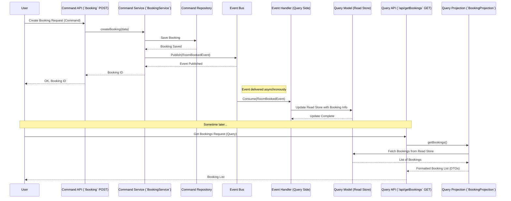

# Chapter 1: CQRS (Command Query Responsibility Segregation)

## The Problem: One Tool for Two Jobs?

Imagine you're building a system for a hotel. Guests need to do two main things:

1.  **Make changes:** Book a room, cancel a booking, pay for their stay.
2.  **View information:** See available rooms, check their booking details, view past stays.

Traditionally, you might build a single system or model to handle *both* changing data and reading data. For simple applications, this works fine. But what happens when the hotel gets really busy?

*   Lots of booking requests (changes) might slow down requests to view room availability (reading).
*   The way you structure data for efficient booking might not be the best way to structure it for fast searching or display.
*   The code handling both tasks can become complex and tangled.

It's like trying to use a single tool, say a hammer, for both hammering nails *and* tightening screws. It *might* work sometimes, but it's not efficient, and specialized tools (a hammer and a screwdriver) would do each job much better.

## The Solution: CQRS - Separate Tools for Separate Jobs

CQRS stands for **Command Query Responsibility Segregation**. That's a mouthful! Let's break it down:

*   **Command:** An instruction to *change* something in the system. Think of verbs: `CreateBooking`, `CancelBooking`, `PayForStay`. Commands change the state.
*   **Query:** A request to *read* information from the system. Think of questions: `GetAvailableRooms`, `FindBookingById`, `ListCustomerStays`. Queries *do not* change the state; they just report it.
*   **Responsibility:** Each part (Command or Query) has its own job.
*   **Segregation:** We *separate* the parts responsible for Commands from the parts responsible for Queries.

**The core idea of CQRS is simple: Use different models and paths to handle data modification (Commands) versus data retrieval (Queries).**

## The Restaurant Analogy

Think about a busy restaurant:

*   **The Kitchen (Command Side):** This is where the action happens! Chefs receive orders (Commands) from waiters. They chop vegetables, cook meat, assemble dishes – they *change the state* of the ingredients into a finished meal. The kitchen is optimized for *making food efficiently and correctly*. They use specialized tools like ovens, knives, and pans. They don't usually interact directly with the customer asking about the menu.

*   **The Serving Staff (Query Side):** Waiters take orders, but crucially, they also *answer customer questions* (Queries). "What's the soup of the day?", "Is the fish gluten-free?", "Can I see the dessert menu?". They need quick access to information (the menu, allergy info, maybe a screen showing order status). They also deliver the finished dishes (reading the result of the kitchen's work). The serving staff is optimized for *communicating with customers and presenting information clearly*. They use tools like menus, notepads, and trays.

*   **Order Tickets / Kitchen Display (Events):** How does the kitchen tell the waiters a dish is ready? Often through a printed ticket or a display screen. This communication is like an **Event** in CQRS. When the Command side (kitchen) finishes something important, it publishes an Event ("Order #123 Ready!"), which the Query side (serving staff) can react to.

CQRS applies this same separation to software.

## CQRS in Our Hotel Project

In this project, you'll see this separation clearly in the modules:

1.  **`command` module:** This is our "Kitchen". It handles all requests that change data, like creating, updating, or cancelling bookings. It contains the business logic to validate commands and ensure changes are made correctly.
2.  **`query` module:** This is our "Serving Staff". It's optimized for fetching and displaying data, like listing bookings or showing room details. It often uses data structures specifically designed for fast reads and presentation.
3.  **`core` module:** Contains shared code, including the definitions for **Events** that link the command and query sides, as we'll see in later chapters like [Event Model (`IEventModel` & Specific Events)](04_event_model___ieventmodel____specific_events__.md).

### Example Flow: Booking a Room and Viewing It

Let's walk through a simplified flow:

**1. Making a Booking (Command)**

*   A user sends a request to book a room (e.g., via a web form). This is a **Command**.
*   This request hits an endpoint in our `command` module, like `BookingResource`.

    ```java
    // File: command/src/main/java/fhv/hotel/command/controller/BookingResource.java
    // (Simplified)

    @Path("/booking")
    public class BookingResource {

        @Inject // Gets the service that does the actual work
        BookingService bookingService;

        @POST // Handles requests to create something new
        public UUID createBooking(BookingCreate bookingCreate) {
            // This bookingCreate object contains the details:
            // customer ID, room number, dates.
            System.out.println("Received COMMAND to create booking for room: " + bookingCreate.roomNumber());
            
            // Delegate the work to the service
            return bookingService.createBooking(bookingCreate);
        }

        // ... other methods for cancel, pay (also Commands) ...
    }
    ```
    *This code receives the instruction (Command) to create a booking.*

*   The `BookingResource` calls a service, like `BookingService` (also in the `command` module), to handle the logic.

    ```java
    // File: command/src/main/java/fhv/hotel/command/service/BookingService.java
    // (Simplified)

    @ApplicationScoped
    public class BookingService {

        @Inject // Gets something to publish events
        IPublishEvent eventPublisher;

        @Inject // Gets something to save the booking
        IBasicRepository<Booking, UUID> bookingRepository;
        // ... other repositories needed ...

        public UUID createBooking(BookingCreate bookingCreate) {
            // 1. Load related data (customer, room) - Not shown
            // 2. Create the new Booking object - Not shown
            Booking booking = new Booking(/*... details ...*/);

            // 3. Save the new booking to the database
            bookingRepository.save(booking);
            System.out.println("Booking data SAVED.");

            // 4. IMPORTANT: Publish an event!
            eventPublisher.publish(new RoomBookedEvent(
                // ... details about the booking ...
            ));
            System.out.println("Published RoomBookedEvent.");

            return booking.uuid(); // Return the new booking's ID
        }

        // ... methods for payBooking, cancelBooking ...
        // These also save changes and publish events.
    }
    ```
    *This service performs the change (saves the booking) and, crucially, publishes an **Event** using [Event Publishing (`IPublishEvent`)](05_event_publishing___ipublishevent___.md). This event signals that a booking was made.*

**2. Updating the View (Event Handling)**

*   Somewhere else (often related to the `query` side), a piece of code is listening for events like `RoomBookedEvent`. This uses the mechanisms described in [Event Consumption (`IConsumeEvent`, `KryoEventReceiver`, `IReceiveByteMessage`)](07_event_consumption___iconsumeevent____kryoeventreceiver____ireceivebytemessage___.md).
*   When it receives the `RoomBookedEvent`, it updates a separate data storage optimized for reading. This could be a different database table or a simplified representation of the booking. We call this read-optimized data a **Projection**, covered in [Query Projections & Panache Models](03_query_projections___panache_models__.md).

**3. Viewing Bookings (Query)**

*   Later, a user wants to see a list of bookings (e.g., on a dashboard). This is a **Query**.
*   The request hits an endpoint in our `query` module, like `BookingQueryController`.

    ```java
    // File: query/src/main/java/fhv/hotel/query/controller/BookingQueryController.java
    // (Simplified)

    @Path("/api")
    public class BookingQueryController {

        @Inject // Gets the projection logic
        BookingProjection bookingProjection;

        @GET // Handles requests to read data
        @Path("/getBookings")
        public Response getBookings(/*... optional date filters ...*/) {
            System.out.println("Received QUERY to get bookings.");
            
            // Ask the projection for the data
            List<BookingResponseDTO> bookings = bookingProjection.getBookings(/* filters */);
            
            // Return the data found
            return Response.ok(bookings).build();
        }
    }
    ```
    *This code receives the instruction (Query) to fetch booking information.*

*   The `BookingQueryController` uses a `Projection` (like `BookingProjection`) to get the data. This projection reads from the **read-optimized data store** that was updated by the event listener, *not* directly from the same tables the `command` side might be writing to.

    ```java
    // File: query/src/main/java/fhv/hotel/query/projection/BookingProjection.java
    // (Simplified)

    @ApplicationScoped
    public class BookingProjection {

        @Inject // Gets the service to read from the query model
        BookingServicePanache bookingServicePanache;

        public List<BookingResponseDTO> getBookings(LocalDate from, LocalDate to) {
            // Fetch data optimized for reading/display
            List<BookingQueryPanacheModel> queryModels = bookingServicePanache.getBookings(from, to);
            
            System.out.println("Fetching bookings from READ model.");

            // Convert to DTOs (Data Transfer Objects) for the API response
            return queryModels.stream()
                    .map(BookingQueryPanacheModel::toDTO) // Simplified conversion
                    .toList();
        }
    }
    ```
    *This code fetches data from a model specifically designed for querying (like `BookingQueryPanacheModel`), ensuring reads are fast.*

### Visualizing the Flow

Here's a simplified sequence diagram showing the separation:



This diagram highlights:
*   Commands go through one path (`CmdAPI` -> `CmdSvc` -> `CmdRepo`).
*   Queries go through a *different* path (`QryAPI` -> `QryProj` -> `QryModel`).
*   The **Event Bus** and **Event Handler** act as the bridge, updating the Query side based on what happened on the Command side.

## Why Bother? The Benefits of CQRS

Separating commands and queries gives us several advantages:

1.  **Performance:** We can optimize the database and code for writing separately from how we optimize for reading. Reads can be made super-fast using tailored query models.
2.  **Scalability:** If lots of users are viewing data (queries) but fewer are making changes (commands), we can scale up the query side independently (add more servers for reading) without affecting the command side, and vice-versa.
3.  **Simplicity (in focus):** The code for handling commands focuses *only* on validation and state changes. The code for handling queries focuses *only* on fetching and formatting data. Each part is simpler, even if the overall system has more moving parts.
4.  **Flexibility:** We could even use different types of databases for the command side (maybe one that's good at transactions) and the query side (maybe one that's good at searching).

## Conclusion

You've just learned the core idea behind CQRS: **Separating the responsibility of changing data (Commands) from reading data (Queries)**. We use the analogy of a restaurant kitchen (Commands) and serving staff (Queries), linked by order tickets (Events).

In our project, the `command` module handles changes and publishes events, while the `query` module listens for events to update its read-optimized models and serves read requests efficiently.

This separation is key to building scalable and maintainable applications. Now that you understand the big picture, we can dive deeper into how the "Command" side works in detail.

Ready to see how we handle those booking requests in the "kitchen"? Let's move on!

**Next:** [Chapter 2: Command Domain Models & Services](02_command_domain_models___services_.md)
