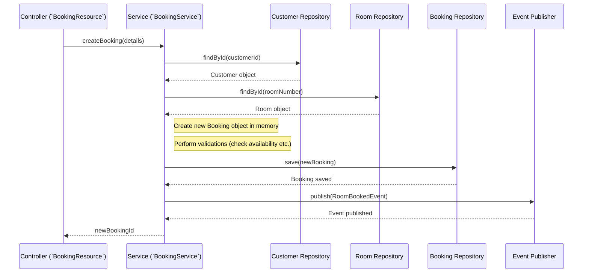

# Chapter 2: Command Domain Models & Services

## The Challenge: Managing Changes Safely

When someone wants to book a room, cancel a booking, or update customer details, we need to:

1.  Make sure the request is valid (e.g., Is the room available? Does the customer exist?).
2.  Update the system's core records accurately.
3.  Ensure all related information is consistent (e.g., if a booking is made, the room and customer records should reflect that).
4.  Let other parts of the system know about the change (like updating the availability display).

Doing this directly in the request handler (like the API endpoint) can get messy quickly. We need a structured way to manage these changes.

## The Solution: Domain Models + Services

Think of it like an **operations team** in a company:

1.  **Domain Models (`Customer`, `Room`, `Booking`):** These are like the official **records** or **files** the team works with. A `Customer` file holds all information about a specific customer, including rules (like "a customer must have a name"). A `Booking` record contains details about who booked which room and when. These models contain the *data* and the *rules* (business logic) associated with that data. They represent the core concepts of our hotel business.

2.  **Command Services (`CustomerService`, `BookingService`):** These are like the **operations staff** who process requests. When a "Create Booking" request comes in, the `BookingService` takes charge. It gets the relevant files (the `Customer` record, the `Room` record), checks the rules (Is the room free? Is the customer valid?), creates or updates the `Booking` record, saves the updated files, and maybe sends a memo (an Event) to other departments. Services **orchestrate** the work using the Domain Models.

Let's see how this works for our "Book a Room" use case.

## Using Models and Services: Booking a Room

Imagine a user clicks "Book Now" on the website. This sends a **Command** to our system.

1.  **The Request Arrives:** An API endpoint, like `BookingResource`, receives the command with details (customer ID, room number, dates).

    ```java
    // File: command/src/main/java/fhv/hotel/command/controller/BookingResource.java
    // (Simplified)

    @Path("/booking")
    public class BookingResource {

        @Inject // Ask for the BookingService staff member
        BookingService bookingService;

        @POST // Handle "create" requests
        public UUID createBooking(BookingCreate bookingDetails) {
            // Just pass the request details to the expert service
            System.out.println("Controller received command: " + bookingDetails);
            return bookingService.createBooking(bookingDetails); // Delegate!
        }

        // ... other command endpoints like cancelBooking, payBooking ...
    }
    ```
    *This controller acts like a receptionist, taking the request and immediately handing it off to the specialist `BookingService`.*

2.  **The Service Takes Over:** The `BookingService` now orchestrates the process.

    ```java
    // File: command/src/main/java/fhv/hotel/command/service/BookingService.java
    // (Simplified)

    @ApplicationScoped // Means this service is available for use
    public class BookingService {

        // We need tools to access records and notify others
        @Inject IBasicRepository<Booking, UUID> bookingRepository;
        @Inject IBasicRepository<Customer, UUID> customerRepository;
        @Inject IBasicRepository<Room, Long> roomRepository;
        @Inject IPublishEvent eventPublisher; // Tool to send notifications

        public UUID createBooking(BookingCreate details) {
            System.out.println("Service starting createBooking for room: " + details.roomNumber());

            // 1. Load necessary records (Domain Models)
            Customer customer = customerRepository.findById(details.customerId());
            Room room = roomRepository.findById(details.roomNumber());
            // (Add checks here: if customer or room not found, stop!)

            // 2. Create the new Booking record (Domain Model)
            UUID bookingId = UUID.randomUUID(); // Give it a unique ID
            Booking newBooking = new Booking(
                bookingId, /* booking number */ Booking.ID_GENERATOR.incrementAndGet(),
                /* paid? */ false, /* cancelled? */ false,
                room, customer, details.startDate(), details.endDate(),
                /* paymentOption */ null
            );
            System.out.println("Created new Booking object in memory.");

            // 3. TODO: Apply Business Logic / Validation
            //    - Is the room available for these dates?
            //    - Does the customer have any restrictions?
            //    (For simplicity, we'll skip the code for this here)

            // 4. Save the new Booking record
            bookingRepository.save(newBooking);
            System.out.println("Saved new Booking to repository.");

            // 5. Maybe update related records (Optional, depends on design)
            // customer.addBooking(newBooking); // Let the Customer know
            // room.addBooking(newBooking);     // Let the Room know
            // customerRepository.update(customer); // Save changes to Customer
            // roomRepository.update(room);         // Save changes to Room
            // Note: Sometimes this linking is done via Events instead.

            // 6. Notify others by publishing an Event
            eventPublisher.publish(new RoomBookedEvent(/* event details */));
            System.out.println("Published RoomBookedEvent.");

            return bookingId; // Return the ID of the new booking
        }
        // ... methods for payBooking, cancelBooking ...
    }
    ```
    *The `BookingService` does the heavy lifting: it uses the [Repository (`IBasicRepository`)](08_repository___ibasicrepository__.md) to load and save models, creates the `Booking` model instance, and uses [Event Publishing (`IPublishEvent`)](05_event_publishing___ipublishevent___.md) to announce the change.*

3.  **The Domain Model (`Booking`):** This class simply holds the data for a booking. It might also contain specific rules later (e.g., a method `booking.canBeCancelled()`).

    ```java
    // File: command/src/main/java/fhv/hotel/command/model/domain/Booking.java
    // (Simplified - just fields and constructor)

    public class Booking {
        private UUID uuid;
        private Long bookingNumber;
        private boolean paid;
        private boolean cancelled;
        private Room room;        // Link to the Room model
        private Customer customer;  // Link to the Customer model
        private LocalDate startDate;
        private LocalDate endDate;
        private String paymentOption;

        // Constructor used by the BookingService
        public Booking(UUID uuid, Long bookingNumber, boolean paid, boolean cancelled,
                       Room room, Customer customer, LocalDate startDate,
                       LocalDate endDate, String paymentOption) {
            this.uuid = uuid;
            this.bookingNumber = bookingNumber;
            // ... assign other fields ...
            this.room = room;
            this.customer = customer;
            // ...
        }

        // Getters to access the data (e.g., uuid(), room(), startDate())
        // ... potentially methods containing business logic ...
        // e.g., public boolean overlapsWith(LocalDate otherStart, LocalDate otherEnd) { ... }
    }
    ```
    *The `Booking` class is like the template for our booking records. It defines what information a booking holds.* We also have similar domain model classes: `Customer.java` and `Room.java`.

## How it Works Inside: The Orchestration

When `bookingService.createBooking(...)` is called, here's a simplified flow of what happens:

1.  **Load:** The Service asks the Repositories (`customerRepository`, `roomRepository`) to find the specific `Customer` and `Room` records based on the IDs provided in the `BookingCreate` details. The Repositories fetch this data (likely from a database) and return `Customer` and `Room` objects (our Domain Models).
2.  **Create:** The Service creates a *new* `Booking` object in memory, filling it with the details from the request and linking it to the `Customer` and `Room` objects it just loaded.
3.  **Validate (Optional but Important):** The Service (or potentially methods within the `Booking`, `Room`, or `Customer` models) would perform checks. Is the room already booked for those dates? Is the customer allowed to book?
4.  **Save:** The Service tells the `bookingRepository` to save the *new* `Booking` object. The Repository handles the technical details of storing this in the database. (If `Customer` or `Room` were modified, they'd be saved via their repositories too).
5.  **Publish:** The Service creates an event object (e.g., `RoomBookedEvent` from the [Event Model (`IEventModel` & Specific Events)](04_event_model___ieventmodel____specific_events__.md)) containing key details about the successful booking. It then hands this event to the `eventPublisher`, which ensures it gets sent out (we'll see how in [Event Publishing (`IPublishEvent`)](05_event_publishing___ipublishevent___.md) and [Event Bus Transport](06_event_bus_transport__tcp_server_client___frame_protocol__.md)).

Here's a diagram showing this orchestration:



## Why This Structure?

*   **Organized:** Business logic related to bookings lives near the `Booking` model or within the `BookingService`, not scattered everywhere.
*   **Testable:** We can test the `BookingService` logic separately from the web controller or the database.
*   **Maintainable:** If we need to change how bookings work, we know where to look (`Booking.java`, `BookingService.java`).
*   **Clear Responsibilities:**
    *   **Models:** Hold data and rules about that data.
    *   **Services:** Orchestrate actions using models, repositories, and event publishers.
    *   **Repositories:** Handle loading/saving models from storage.
    *   **Controllers:** Handle incoming web requests and delegate to services.

## Conclusion

You've now seen the core components of the "Command" side:

*   **Command Domain Models (`Booking`, `Customer`, `Room`):** Represent the core business concepts, holding data and related logic. They are the "records".
*   **Command Services (`BookingService`, etc.):** Orchestrate the handling of commands. They load models, apply logic, save changes via repositories, and publish events. They are the "operations staff".

This structure helps us manage changes to our system's state in a clean, organized, and reliable way. It ensures that when a command comes in, the right steps are taken, the rules are followed, and the necessary notifications are sent out.

Now that we understand how changes are *made* (Commands), how do we efficiently *read* the data for display (Queries)? That's where the other side of CQRS comes in.

**Next:** [Chapter 3: Query Projections & Panache Models](03_query_projections___panache_models__.md)
