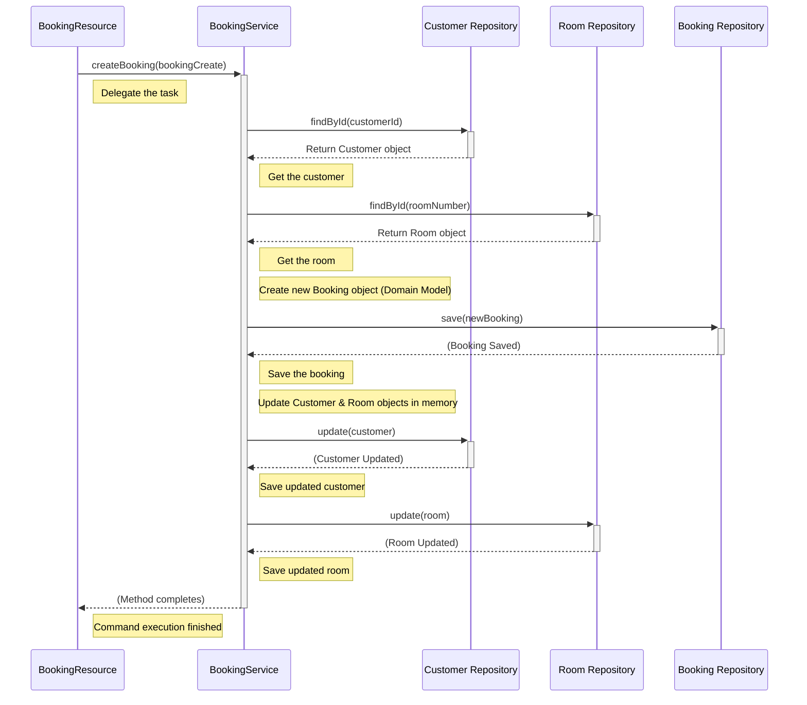

# Chapter 2: Command Services (`BookingService`, `CustomerService`, `RoomService`)

Welcome back! In [Chapter 1: Command Resources (`BookingResource`, `CustomerResource`, `RoomResource`)](01_command_resources___bookingresource____customerresource____roomresource___.md), we saw how our application receives commands from the outside world, like a receptionist taking down a request. But the receptionist doesn't actually *do* the work; they pass the request to the right department.

That's where **Command Services** come in. They are the specialized departments, or maybe the **department managers**, responsible for carrying out the commands.

## What's the Problem?

Okay, the `BookingResource` received the details for a new booking. Now what?

*   Where does the actual logic live for checking if the room is available (although we'll keep it simple for now)?
*   How do we find the correct `Customer` and `Room` information from our data storage?
*   How do we create the official `Booking` record?
*   How do we make sure everything is saved correctly?

Putting all this complex logic inside the `BookingResource` would make it messy and hard to manage. It would be like the receptionist trying to also manage the rooms, check IDs, and handle payments all at once! We need a better way to organize the *business logic* – the rules and steps required to fulfill a command.

## The Solution: Command Services

Command Services are Java classes dedicated to handling the business logic for specific types of commands. Think of them as the managers of different departments:

1.  `BookingService`: Manages all tasks related to bookings (creating, paying, cancelling).
2.  `CustomerService`: Manages tasks for customers (creating, updating details - though we only have 'create' for now).
3.  `RoomService`: Manages tasks for rooms (creating, updating).

These services act as **orchestrators**. They coordinate the steps needed to complete a command, often interacting with:

*   **Domain Models:** The core business concepts like `Booking`, `Customer`, `Room`. We'll learn about these in the [next chapter](03_command_domain_models___booking____customer____room___.md).
*   **Repositories:** Tools for saving and retrieving data from storage (like a database). We'll cover these in [Chapter 4](04_repository___ibasicrepository___.md).

## How They Work: Creating a Booking with `BookingService`

Let's follow the "create booking" request we saw in Chapter 1. The `BookingResource` received the `BookingCreate` data and called `bookingService.createBooking(bookingCreate)`. Now, what happens inside the `BookingService`?

```java
// Simplified view inside BookingResource...
public class BookingResource {
    @Inject // Ask the framework for a BookingService
    BookingService bookingService;

    @POST
    public void createBooking(BookingCreate bookingCreate) {
        // Pass the request details to the service
        bookingService.createBooking(bookingCreate); // <-- The handoff!
    }
}
```

Now, let's look inside `BookingService`:

**1. Getting the Necessary Tools (`@Inject`)**

Just like the `BookingResource` needed the `BookingService`, the `BookingService` needs tools to do its job. It needs access to the stored data for Bookings, Customers, and Rooms. It declares these needs using `@Inject`.

```java
// File: command/src/main/java/fhv/hotel/command/service/BookingService.java
package fhv.hotel.command.service;
// ... imports ...
import fhv.hotel.core.repo.IBasicRepository; // The tool for data access
import fhv.hotel.command.model.domain.*; // Booking, Customer, Room models
import jakarta.enterprise.context.ApplicationScoped;
import jakarta.inject.Inject;
import java.util.UUID;

@ApplicationScoped // Marks this as a service managed by the framework
public class BookingService {

    @Inject // Give me the tool to manage Booking data
    IBasicRepository<Booking, UUID> bookingRepository;

    @Inject // Give me the tool to manage Customer data
    IBasicRepository<Customer, UUID> customerRepository;

    @Inject // Give me the tool to manage Room data
    IBasicRepository<Room, Long> roomRepository;

    // ... methods like createBooking ...
}
```

*   `@ApplicationScoped`: Tells the framework that this service should exist as a single instance for the application.
*   `@Inject IBasicRepository<...>`: The service declares it needs helpers (repositories) to interact with the data for `Booking`, `Customer`, and `Room`. The framework provides these helpers automatically. We'll dive into [Repositories (`IBasicRepository`)](04_repository___ibasicrepository___.md) later.

**2. Performing the `createBooking` Logic**

Here's the core method that handles the command:

```java
// Inside BookingService class...

public void createBooking(BookingCreate bookingCreate) {
    // Step 1: Find the existing Customer using the ID from the request
    Customer customer = customerRepository.findById(bookingCreate.customerId());

    // Step 2: Find the existing Room using the number from the request
    Room room = roomRepository.findById(bookingCreate.roomNumber());

    // Step 3: Create the new Booking *domain object* using the found data
    // (We'll explore domain objects in the next chapter)
    Booking booking = new Booking(
        UUID.randomUUID(), // Generate a unique ID for the booking
        Booking.ID_GENERATOR.incrementAndGet(), // Generate a booking number
        false, // Not paid yet
        false, // Not cancelled
        room,  // Link to the found Room
        customer, // Link to the found Customer
        bookingCreate.startDate(), // Start date from request
        bookingCreate.endDate()    // End date from request
    );

    // Step 4: Save the new Booking to storage
    bookingRepository.save(booking);

    // Step 5: Update the Customer and Room to link them to this new booking
    customer.addBooking(booking); // (Method inside Customer model)
    room.addBooking(booking);     // (Method inside Room model)

    // Step 6: Save the updated Customer and Room information
    customerRepository.update(customer);
    roomRepository.update(room);

    // --- Potentially: Publish an event (like "BookingCreated") ---
    // We'll see event publishing in CustomerService later, and cover it
    // properly in Chapter 6: [Event Publishing (`IPublishEvent`)](06_event_publishing___ipublishevent___.md)
}
```

**Explanation:**

*   **Input:** The `bookingCreate` object containing IDs and dates.
*   **Steps:**
    1.  Use the `customerRepository` helper to fetch the `Customer` object matching the ID provided in the request.
    2.  Use the `roomRepository` helper to fetch the `Room` object matching the number provided.
    3.  Create a `Booking` object. This isn't just raw data; it's an object that represents the *concept* of a booking within our application's rules (a [Command Domain Model (`Booking`, `Customer`, `Room`)](03_command_domain_models___booking____customer____room___.md)).
    4.  Use the `bookingRepository` helper to save this newly created `Booking` object into our data storage.
    5.  Tell the `Customer` and `Room` objects about this new booking (so they know which bookings they are associated with).
    6.  Save the updated `Customer` and `Room` objects back to storage using their respective repositories.
*   **Output (What Happens):** A new booking record is created and saved. The relevant customer and room records are updated to reflect this new booking. The `BookingResource` that called this method typically just gets a signal that the operation was successful (like an HTTP 2xx status).

## Under the Hood: The Flow of Coordination

Let's visualize the journey of the `createBooking` command after it leaves the `BookingResource`:



This diagram shows how the `BookingService` acts as a central coordinator. It doesn't store data itself, but it uses the Repositories ([`IBasicRepository`](04_repository___ibasicrepository___.md)) to fetch and save the necessary information, and it works with the Domain Models ([`Booking`, `Customer`, `Room`](03_command_domain_models___booking____customer____room___.md)) to apply the business logic.

## Other Services: `CustomerService` and `RoomService`

The other services follow the same pattern:

*   **`RoomService`**: Handles commands like `createRoom`. It would receive `RoomCreate` data, create a new `Room` domain object, and use the `roomRepository` to save it.

    ```java
    // File: command/src/main/java/fhv/hotel/command/service/RoomService.java
    // Inside RoomService class...
    @Inject
    IBasicRepository<Room, Long> roomRepository;

    public void createRoom(RoomCreate roomCreate) {
        // Create the Room domain object
        Room room = new Room(
            roomCreate.roomNumber(),
            roomCreate.roomName(),
            roomCreate.description(),
            new ArrayList<>() // Empty list of bookings initially
        );
        // Save the new Room using its repository
        roomRepository.save(room);
    }
    ```

*   **`CustomerService`**: Handles `createCustomer`. It creates a `Customer` domain object and saves it. This service *also* demonstrates another potential responsibility: **publishing an event**.

    ```java
    // File: command/src/main/java/fhv/hotel/command/service/CustomerService.java
    // Inside CustomerService class...
    @Inject
    IBasicRepository<Customer, UUID> customerRepository;

    @Inject // Tool for publishing events
    IPublishEvent<CustomerCreatedEvent> customerCreatedPublisher;

    public void createCustomer(CustomerCreate customerCreate) {
        // Create the Customer domain object
        Customer customer = new Customer(
            UUID.randomUUID(),
            Customer.ID_GENERATOR.incrementAndGet(),
            customerCreate.firstName(),
            customerCreate.lastName(),
            customerCreate.birthday(),
            new ArrayList<>() // Empty list of bookings initially
        );
        // Save the new Customer
        customerRepository.save(customer);

        // --- Publish an Event! ---
        // Create an event object describing what happened
        CustomerCreatedEvent event = new CustomerCreatedEvent(
            LocalDateTime.now(), // When it happened
            customer.uuid(),
            customer.customerNumber(),
            customer.firstName(),
            customer.lastName(),
            customer.birthday()
        );
        // Use the publisher tool to send the event out
        customerCreatedPublisher.publish(event);
        // (We'll learn about events in Chapter 5, 6, 7, 8, 9)
    }
    ```

    Notice the extra steps in `createCustomer`. After saving the new customer, it creates a `CustomerCreatedEvent` (an [Event Model (`IEventModel`)](05_event_model___ieventmodel___.md)) and uses `customerCreatedPublisher` (an instance of [Event Publishing (`IPublishEvent`)](06_event_publishing___ipublishevent___.md)) to announce that a new customer has been created. This allows other parts of the system (or even other systems) to react to this change without the `CustomerService` needing to know about them directly. It's like the Customer department manager sending out a memo: "New customer registered!"

## Conclusion

In this chapter, we met the **Command Services** (`BookingService`, `CustomerService`, `RoomService`). They are the crucial link between the simple request handling of the Resources and the underlying data and business rules.

*   They act as **department managers** or **orchestrators**.
*   They contain the **business logic** for handling specific commands.
*   They use **Repositories** ([`IBasicRepository`](04_repository___ibasicrepository___.md)) to load and save data.
*   They work with **Domain Models** ([`Booking`, `Customer`, `Room`](03_command_domain_models___booking____customer____room___.md)) to represent business concepts.
*   They can also perform other actions like **publishing events** ([`IPublishEvent`](06_event_publishing___ipublishevent___.md)) to notify others about changes.

We've seen *how* commands are executed, but what exactly are those `Booking`, `Customer`, and `Room` objects they create and manipulate? Let's dive into the core concepts of our application in the next chapter.

Next up: [Chapter 3: Command Domain Models (`Booking`, `Customer`, `Room`)](03_command_domain_models___booking____customer____room___.md)

