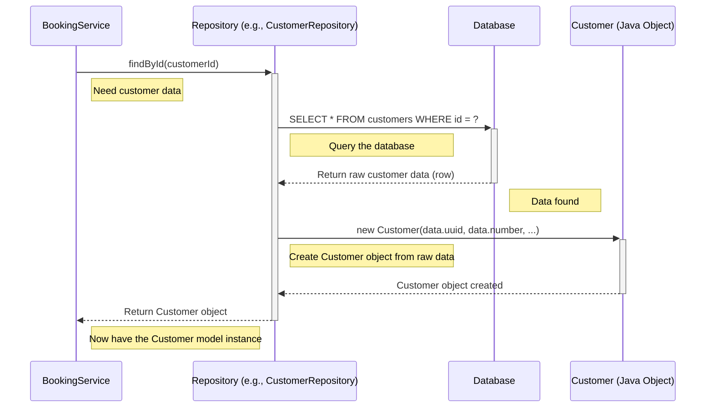

# Chapter 3: Command Domain Models (`Booking`, `Customer`, `Room`)

Welcome back! In [Chapter 2: Command Services (`BookingService`, `CustomerService`, `RoomService`)](02_command_services___bookingservice____customerservice____roomservice___.md), we saw how services like `BookingService` act as managers, coordinating the steps to handle commands like creating a booking. We saw them fetch data and save data using "repositories" (which we'll cover soon). But what *exactly* are they fetching and saving? What does a "booking" or a "customer" look like *inside* our code?

That's where **Command Domain Models** come into play. They are the heart of our application's understanding of the business.

## What's the Problem?

Think about our hotel example. We need to represent real-world things in our code:

*   A **Customer** who makes bookings.
*   A **Room** that can be booked.
*   A **Booking** that links a customer to a room for specific dates.

How do we store the information about each of these? A customer has a name and birthday. A room has a number and description. A booking has dates, a status (paid? cancelled?), and needs to know *which* customer and *which* room it's for.

We need a structured way to represent these core concepts and their details *within our Java code*, especially when we are performing actions (commands) like creating or updating them.

## The Solution: Command Domain Models

**Domain Models** are simply classes (blueprints) in our code that represent the key concepts, entities, or objects in the business domain (our hotel business). They hold the data (state) and sometimes the rules (behavior) associated with these concepts.

In our `cqrs` project, we have three main Command Domain Models:

1.  `Booking`: Represents a hotel booking.
2.  `Customer`: Represents a hotel guest.
3.  `Room`: Represents a hotel room.

These models are used primarily on the **command side** – meaning they are the objects that our `Command Services` create, modify, and save when handling commands. They hold the necessary information to perform these write operations.

Think of them like digital versions of:
*   A customer's registration card (`Customer` model)
*   A room's information sheet (`Room` model)
*   A specific booking confirmation (`Booking` model)

## A Closer Look at the Models

Let's examine the structure of these models. They are defined as Java classes.

**1. The `Customer` Model**

This class represents a hotel customer.

```java
// File: command/src/main/java/fhv/hotel/command/model/domain/Customer.java
package fhv.hotel.command.model.domain;
// ... imports ...

public class Customer /* ... implements ... */ {
    // Unique identifier for the customer
    private UUID uuid; 
    // Human-readable customer number
    private Long customerNumber; 
    private String firstName;
    private String lastName;
    private LocalDate birthday;

    // A list of all bookings made by this customer
    @JsonManagedReference // Helps manage relationship during conversion (e.g., to JSON)
    private List<Booking> bookings; 

    // Constructor used to create a new Customer object
    public Customer(UUID uuid, Long customerNumber, String firstName, /*...*/) {
        this.uuid = uuid;
        this.customerNumber = customerNumber;
        this.firstName = firstName;
        // ... set other fields ...
        this.bookings = new ArrayList<>(); // Start with an empty list of bookings
    }

    // Simple method to add a booking to this customer's list
    public void addBooking(Booking booking) { 
        bookings.add(booking); 
    }

    // ... other methods like getters ...
}
```

*   **Fields:** It holds data like `uuid` (a unique computer ID), `customerNumber`, `firstName`, `lastName`, and `birthday`.
*   **`bookings` Field:** This is important! It's a `List` that holds references to all the `Booking` objects associated with this `Customer`. This is how we represent the relationship: "A Customer can have many Bookings".
*   **`@JsonManagedReference`:** This is an annotation that helps handle the relationship between `Customer` and `Booking` when converting these objects to formats like JSON. It basically says, "When showing the customer, also show their bookings." We'll see the other side (`@JsonBackReference`) in the `Booking` model. Don't worry too much about this detail now, just know it helps manage links.
*   **`addBooking` Method:** A simple piece of behavior. It allows us to easily link a new `Booking` object to this `Customer`.

**2. The `Room` Model**

This represents a physical room in the hotel.

```java
// File: command/src/main/java/fhv/hotel/command/model/domain/Room.java
package fhv.hotel.command.model.domain;
// ... imports ...

public class Room /* ... implements ... */ {
    // The room number (also used as its unique ID here)
    private Long roomNumber; 
    private String roomName;
    private String description;

    // A list of all bookings for this room
    @JsonManagedReference // Manages the Room -> Bookings relationship
    private List<Booking> bookings; 

    // Constructor
    public Room(Long roomNumber, String roomName, String description, /*...*/) {
        this.roomNumber = roomNumber;
        this.roomName = roomName;
        this.description = description;
        this.bookings = new ArrayList<>(); // Start empty
    }

    // Method to link a booking to this room
    public void addBooking(Booking booking) { 
        bookings.add(booking); 
    }

    // ... other methods ...
}
```

*   **Fields:** Holds `roomNumber`, `roomName`, `description`.
*   **`bookings` Field:** Similar to `Customer`, a `Room` also keeps track of all the `Booking` objects associated with it. ("A Room can have many Bookings").

**3. The `Booking` Model**

This represents the actual booking, linking a `Customer` and a `Room`.

```java
// File: command/src/main/java/fhv/hotel/command/model/domain/Booking.java
package fhv.hotel.command.model.domain;
// ... imports ...

public class Booking /* ... implements ... */ {
    private UUID uuid; // Unique ID for the booking
    private Long bookingNumber;
    private boolean payed; // Has the booking been paid?
    private boolean cancelled; // Has it been cancelled?

    @JsonBackReference // Part of managing the Room -> Booking link
    private Room room; // Reference to the *specific* Room object booked

    @JsonBackReference // Part of managing the Customer -> Booking link
    private Customer customer; // Reference to the *specific* Customer object

    private LocalDate startDate;
    private LocalDate endDate;

    // Constructor
    public Booking(UUID uuid, Long bookingNumber, boolean payed, boolean cancelled, 
                   Room room, Customer customer, /*... dates ...*/) {
        this.uuid = uuid;
        // ... set other fields ...
        this.room = room; // Store the link to the Room object
        this.customer = customer; // Store the link to the Customer object
        // ... set dates ...
    }

    // Methods to set the room and customer (might be used when loading data)
    public void setRoom(Room room) { this.room = room; }
    public void setCustomer(Customer customer) { this.customer = customer; }

    // ... other methods like getters ...
}
```

*   **Fields:** Holds booking-specific data like `uuid`, `bookingNumber`, `payed`, `cancelled`, `startDate`, `endDate`.
*   **`room` and `customer` Fields:** These are crucial! They don't just store the room *number* or customer *ID*. They hold direct references to the actual `Room` object and `Customer` object involved in this booking. This creates the links: "A Booking belongs to one Room" and "A Booking belongs to one Customer".
*   **`@JsonBackReference`:** This complements `@JsonManagedReference`. It tells the system, "When showing a booking, don't try to show the full details of the customer and room again (to avoid an infinite loop), just know they are linked."

## How Services Use These Models

Remember the `BookingService` from Chapter 2? Let's look again at how it creates a booking:

```java
// Simplified snippet from BookingService.java

public void createBooking(BookingCreate bookingCreate) {
    // 1. Fetch the Customer and Room objects (models!)
    Customer customer = customerRepository.findById(bookingCreate.customerId());
    Room room = roomRepository.findById(bookingCreate.roomNumber());

    // 2. Create a NEW Booking object (the domain model!)
    Booking booking = new Booking(
        UUID.randomUUID(), 
        Booking.ID_GENERATOR.incrementAndGet(), 
        false, // not paid
        false, // not cancelled
        room,  // Pass the actual Room object
        customer, // Pass the actual Customer object
        bookingCreate.startDate(), 
        bookingCreate.endDate()
    );

    // 3. Save the new Booking model
    bookingRepository.save(booking);

    // 4. Update the related models
    customer.addBooking(booking); // Use the Customer model's method
    room.addBooking(booking);     // Use the Room model's method

    // 5. Save the updated Customer and Room models
    customerRepository.update(customer);
    roomRepository.update(room);
}
```

**See how the models are used:**

1.  The service first gets instances of the `Customer` and `Room` models using repositories.
2.  It then creates a *new* `Booking` model instance, passing the fetched `Customer` and `Room` objects directly into its constructor to establish the links.
3.  It saves the new `Booking` model.
4.  It calls methods (`addBooking`) *on* the `Customer` and `Room` model objects to update their internal list of bookings.
5.  It saves the modified `Customer` and `Room` models.

The Command Domain Models are the central actors in the business logic performed by the services.

## Under the Hood: Models and Data Storage

How do these Java objects (`Booking`, `Customer`, `Room`) relate to data stored in a database?



1.  **Loading:** When a service asks a Repository ([Chapter 4: Repository (`IBasicRepository`)](04_repository___ibasicrepository___.md)) for a `Customer` (e.g., `customerRepository.findById(...)`), the repository fetches raw data from the database. It then uses this data to construct a `Customer` object (an instance of the `Customer` model class). This object is then returned to the service.
2.  **Saving:** When a service calls `repository.save(customer)` or `repository.update(customer)`, it passes the `Customer` model object *to* the repository. The repository then takes the data *out* of the `Customer` object and translates it into database commands (like `INSERT` or `UPDATE`) to store it.

The Domain Models act as the bridge between the raw data in storage and the meaningful business concepts used in our application's logic.

**A Note on `IShallowProjection`:**

You might notice `implements IShallowProjection<...>` in the class definitions.

```java
// In Customer.java
public class Customer implements IShallowProjection<Customer, UUID> {
    // ... fields ...

    // Constructor sometimes used just to hold the ID
    public Customer(UUID uuid) {
        this.uuid = uuid;
    }

    @Override
    public boolean isShallow() { 
        // Checks if only the ID is present
        return uuid != null && customerNumber == null /* && other fields null */; 
    }
    // ... other methods related to IShallowProjection ...
}
```

This interface is part of an optimization technique. Sometimes, when loading a `Booking`, we might only need to know the *ID* of the associated `Customer` and `Room`, not all their details (like the customer's birthday or the room's description). A "shallow projection" is like having a placeholder object that only contains the ID. This can make loading data faster. We will explore this concept in detail much later in [Chapter 10: Shallow Projection (`IShallowProjection`)](10_shallow_projection___ishallowprojection___.md). For now, just be aware that it exists and helps manage how much related data is loaded.

## Conclusion

In this chapter, we explored the **Command Domain Models** (`Booking`, `Customer`, `Room`). These are the fundamental building blocks representing our core business concepts on the command side.

*   They are Java classes that model real-world entities (`Customer`, `Room`) and processes (`Booking`).
*   They hold the **state** (data fields like `name`, `id`, `date`) necessary for command operations.
*   They define **relationships** between concepts (e.g., a `Booking` holds references to its `Customer` and `Room`).
*   They can have minimal **behavior** (like `addBooking`).
*   They are created, manipulated, and passed around by the Command Services ([Chapter 2](02_command_services___bookingservice____customerservice____roomservice___.md)).
*   They are the objects that Repositories ([Chapter 4](04_repository___ibasicrepository___.md)) load from and save to data storage.

We now understand *what* the services work with. But *how* are these model objects actually saved and retrieved from a database or other storage? That's the job of the Repositories.

Let's dive into how we persist and retrieve our domain models in the next chapter: [Chapter 4: Repository (`IBasicRepository`)](04_repository___ibasicrepository___.md).

