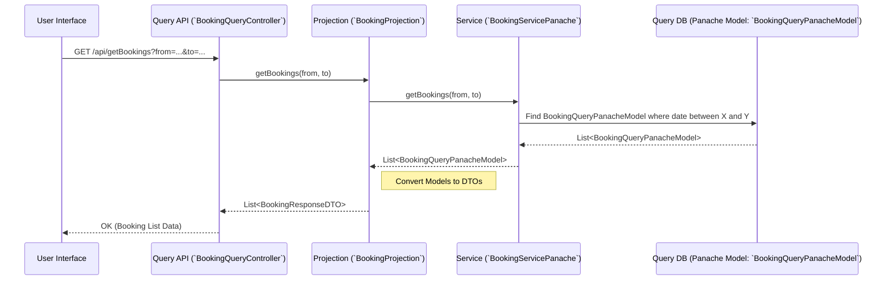

# Chapter 3: Query Projections & Panache Models

## The Problem: Fast Reads Needed!

Think about showing a simple list of bookings: Booking Number, Room Number, Start Date, End Date.

*   We don't need the full `Customer` object with all their history, just their name or ID maybe.
*   We don't need the complex `Room` object, just the room number.
*   We need the data formatted exactly as the user interface (UI) expects it.
*   Most importantly, we need this lookup to be *fast*, even if thousands of bookings exist.

Using the Command side's models and database for this is like asking the busy chefs in the kitchen to stop cooking and prepare a quick summary report – it's not their main job, and it might slow things down.

## The Solution: A Separate Read-Optimized View

CQRS solves this by creating a separate path optimized purely for reading data. It involves a few key components:

1.  **The Query Database (Read Store):** Imagine a separate filing cabinet or a specialized database containing simplified copies of the data, perfectly organized for *looking things up quickly*. This data might look different from the "master files" used by the Command side.
2.  **Query Panache Models (`*QueryPanacheModel`):** These are like the simplified file folders *inside* the query database cabinet. They represent the data stored there. In our project, these are Java classes (specifically, JPA entities using Quarkus Panache) like `BookingQueryPanacheModel` or `CustomerQueryPanacheModel`. They hold just the necessary fields for querying and display.
    *   **How do they stay updated?** This is crucial! When the Command side makes a change (like creating a booking) and publishes an event (like `RoomBookedEvent`), a listener on the Query side (an **Event Consumer**, covered in [Event Consumption](07_event_consumption___iconsumeevent____kryoeventreceiver____ireceivebytemessage__.md)) receives this event and updates the corresponding `QueryPanacheModel` in the query database. This ensures the read side reflects the changes made on the command side (though possibly with a tiny delay, known as "eventual consistency").
3.  **Query Projections (`*Projection`):** These are like expert researchers who know exactly how to find information in the query database cabinet (using the Panache Models) and prepare it for presentation. They take a query request (e.g., "get all bookings for next week"), fetch the relevant `QueryPanacheModel` data, and often convert it into simple Data Transfer Objects (DTOs) that the UI or API caller needs. Examples include `BookingProjection` and `CustomerProjection`.
4.  **Data Transfer Objects (DTOs - `*ResponseDTO`):** These are simple containers (often Java records) holding the final, formatted data that the Projection prepares. They contain only the fields needed for a specific view or API response, like `BookingResponseDTO`.

**Analogy:** Think of the Command side models as the detailed, original blueprints of a building. The Query Panache Models are like simplified floor plans stored for easy reference. The Projections are like architects who can quickly pull up a specific floor plan (Panache Model) and create a summary sheet (DTO) showing just the room layouts when asked.

## Using Projections and Models: Displaying Bookings

Let's see how we satisfy the receptionist's need to view current bookings.

1.  **The Request Arrives:** The dashboard UI makes a request to an API endpoint designed for queries, like `/api/getBookings`.

    ```java
    // File: query/src/main/java/fhv/hotel/query/controller/BookingQueryController.java
    // (Simplified)

    @Path("/api")
    public class BookingQueryController {

        @Inject // Ask for the Booking Projection expert
        BookingProjection bookingProjection;

        @GET // Handle "read" requests
        @Path("/getBookings")
        public Response getBookings(@QueryParam("from") LocalDate from,
                                    @QueryParam("to") LocalDate to) {
            System.out.println("Query Controller received request for bookings.");
            // Ask the projection to get the data
            List<BookingResponseDTO> bookings = bookingProjection.getBookings(from, to);
            // Return the prepared data
            return Response.ok(bookings).build();
        }
    }
    ```
    *This controller acts as the front desk for query requests. It receives the request and immediately delegates it to the `BookingProjection`.*

2.  **The Projection Takes Over:** The `BookingProjection` knows how to fetch and format booking data.

    ```java
    // File: query/src/main/java/fhv/hotel/query/projection/BookingProjection.java
    // (Simplified)

    @ApplicationScoped
    public class BookingProjection {

        @Inject // Needs the service that interacts with query models
        BookingServicePanache bookingServicePanache;

        public List<BookingResponseDTO> getBookings(LocalDate from, LocalDate to) {
            System.out.println("Projection fetching bookings from read model.");
            // 1. Get the raw data (Panache Models) from the service
            List<BookingQueryPanacheModel> queryModels =
                bookingServicePanache.getBookings(from, to);

            // 2. Convert each model to a DTO for the response
            return queryModels.stream()
                    .map(BookingQueryPanacheModel::toDTO) // Uses a helper method
                    .toList();
        }
    }
    ```
    *The Projection orchestrates the query: it asks the `BookingServicePanache` for the data (which comes as `BookingQueryPanacheModel` objects) and then transforms each one into a `BookingResponseDTO`.*

3.  **The Result (DTO):** The `BookingResponseDTO` is a simple data carrier, defined perhaps like this:

    ```java
    // File: query/src/main/java/fhv/hotel/query/dto/BookingResponseDTO.java

    // A simple 'record' to hold booking data for the API response
    public record BookingResponseDTO(
            Long bookingNumber,
            Boolean paid,
            Boolean cancelled,
            Long roomNumber,
            LocalDate startDate,
            LocalDate endDate,
            String paymentOption
    ) {}
    ```
    *This is the final, clean data structure returned to the caller (e.g., the dashboard UI).*

This flow (API -> Projection -> Service -> Panache Model -> DTO -> API Response) is typical for the query side.

## How It Works Under the Hood

Let's trace the journey of data for both updating the read side and querying it.

**1. Keeping the Read Side Updated (Eventual Consistency):**

*   **Command Side:** A booking is created using `BookingService`, and a `RoomBookedEvent` is published via the [Event Publishing (`IPublishEvent`)](05_event_publishing___ipublishevent___.md).
*   **Event Bus:** The event travels through the [Event Bus Transport](06_event_bus_transport__tcp_server_client___frame_protocol__.md).
*   **Query Side Listener:** An **Event Consumer** (explained in [Event Consumption](07_event_consumption___iconsumeevent____kryoeventreceiver____ireceivebytemessage__.md)) running on the query side receives the `RoomBookedEvent`.
*   **Update Query Model:** This consumer extracts the booking details from the event and creates or updates a `BookingQueryPanacheModel` record in the **query database**.

This update happens *asynchronously* after the command is processed. The read side might lag slightly behind the command side, but it eventually catches up.

**2. Handling a Query Request:**

When the receptionist requests the booking list (`/api/getBookings`):



*   The `BookingQueryController` passes the request to `BookingProjection`.
*   `BookingProjection` asks `BookingServicePanache` to fetch the data.
*   `BookingServicePanache` uses Quarkus Panache features to efficiently query the query database table associated with `BookingQueryPanacheModel`. It might look something like this conceptually: `SELECT * FROM BookingQueryPanacheModel WHERE startDate >= ? AND endDate <= ?`.
*   The database returns rows, which Panache turns into `BookingQueryPanacheModel` objects.
*   These objects travel back to the `BookingProjection`.
*   The `BookingProjection` loops through the `BookingQueryPanacheModel` list and calls the `toDTO()` method on each one to create the `BookingResponseDTO` list.
*   This DTO list is returned to the controller and then to the UI.

## A Closer Look at the Query Code Components

Let's look at the simplified code for the key query-side pieces:

**1. The Panache Model (`BookingQueryPanacheModel`):**

```java
// File: query/src/main/java/fhv/hotel/query/model/BookingQueryPanacheModel.java

import io.quarkus.hibernate.orm.panache.PanacheEntityBase;
import jakarta.persistence.Entity; // Standard JPA annotation
import jakarta.persistence.Id;    // Standard JPA annotation
import java.time.LocalDate;
import java.util.UUID;
// ... other imports ...

@Entity // Marks this as a JPA entity (maps to a database table)
public class BookingQueryPanacheModel extends PanacheEntityBase {

    @Id // Marks this field as the primary key
    public UUID uuid;
    public Long bookingNumber;
    public Boolean paid;
    public Boolean cancelled;
    public Long roomNumber; // Note: Storing primitive IDs is often simpler for queries
    public UUID customerUUID;
    public LocalDate startDate;
    public LocalDate endDate;
    public String paymentOption;

    // Default constructor needed by JPA/Panache
    public BookingQueryPanacheModel() {}

    // Helper method to convert this data into a DTO
    public BookingResponseDTO toDTO() {
        return new BookingResponseDTO(
            this.bookingNumber, this.paid, this.cancelled, this.roomNumber,
            this.startDate, this.endDate, this.paymentOption
        );
    }

    // Maybe constructors or other helpers used by Event Consumers
}
```
*This class defines the structure of booking data stored in the query database. It's a straightforward representation, optimized for reads. Note the `@Entity` annotation and the simple fields.*

**2. The Query Service (`BookingServicePanache`):**

```java
// File: query/src/main/java/fhv/hotel/query/service/BookingServicePanache.java
// (Simplified - showing only the relevant method)

import io.quarkus.panache.common.Parameters; // Panache helper
import jakarta.enterprise.context.ApplicationScoped;
import java.time.LocalDate;
import java.util.List;
// ... other imports ...

@ApplicationScoped
public class BookingServicePanache {

    // Method used by the BookingProjection
    public List<BookingQueryPanacheModel> getBookings(LocalDate from, LocalDate to) {
        // Use Panache query capabilities to find matching bookings
        // This is a simplified representation of a date overlap query
        return BookingQueryPanacheModel.find(
                "startDate <= :endDate and endDate >= :startDate",
                Parameters.with("startDate", from).and("endDate", to)
        ).list();
        // Panache handles talking to the database based on this query string
    }

    // Other methods might exist for creating/updating these models
    // when events are consumed.
}
```
*This service uses Panache's powerful querying features (`find`, `listAll`, etc.) to interact with the `BookingQueryPanacheModel` entity and retrieve data from the query database.*

The `BookingProjection` and `BookingResponseDTO` were shown earlier. Together, these components form an efficient pipeline for reading data without disturbing the Command side.

## Conclusion

You've now seen the other half of the CQRS pattern: the **Query** side!

*   We use **Query Panache Models** (`BookingQueryPanacheModel`, etc.) as simple JPA entities representing read-optimized data in a separate query database.
*   These models are kept up-to-date based on events published by the Command side, handled by Event Consumers (more on that later!).
*   **Query Projections** (`BookingProjection`, etc.) act as the interface for querying this data. They fetch data using services (like `BookingServicePanache`) that interact with the Panache Models.
*   Projections often convert the results into simple **DTOs** (`BookingResponseDTO`, etc.) suitable for API responses or UIs.

This separation allows the read operations (Queries) to be highly optimized and scaled independently from the write operations (Commands), leading to a more responsive and robust application.

But how do the Command and Query sides actually communicate? What are these "Events" that trigger updates on the Query side? Let's dive into that next!

**Next:** [Chapter 4: Event Model (`IEventModel` & Specific Events)](04_event_model___ieventmodel____specific_events__.md)
