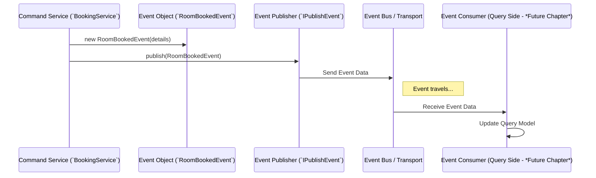

# Chapter 4: Event Model (`IEventModel` & Specific Events)

## The Problem: Announcing Important News

Imagine our hotel application again.

*   The **Command** side (the "kitchen") successfully processes a request to create a new booking ([Chapter 2: Command Domain Models & Services](02_command_domain_models___services_.md)). The booking is saved!
*   The **Query** side (the "serving staff" with their dashboard) needs to know about this new booking so it can update its list ([Chapter 3: Query Projections & Panache Models](03_query_projections___panache_models__.md)).

How does the Command side tell the Query side, "Hey, Booking #12345 for Room 101 was just created!"? We need a formal way to announce significant happenings.

## The Solution: Events - Official Announcements

In CQRS, **Events** are precisely that: **official announcements or records of things that have already happened in the system.**

Think of them like:

*   **Newspaper Headlines:** "Local Hotel Books Room 101!" - States a fact that occurred.
*   **Official Memos:** "To: All Departments, From: Booking Desk, Subject: New Booking Confirmation #12345" - A formal notification.
*   **Historical Log Entries:** "Timestamp: 2023-10-27 10:30:15, Event: RoomBooked, Details: {BookingID: ..., Room: 101, ...}" - A record of the past.

**Key characteristics of Events:**

1.  **Past Tense:** They describe something that *has happened*. Notice the names: `RoomBookedEvent`, `CustomerCreatedEvent`, `BookingPaidEvent`. They don't say `BookRoom` (that's a Command), they say `RoomBooked`.
2.  **Immutable Facts:** Once an event happens, it cannot be changed. It's a historical fact.
3.  **Data Carriers:** They carry the relevant information about what happened. A `RoomBookedEvent` would contain the booking ID, customer ID, room number, dates, etc.
4.  **Communication:** They are the primary way the Command side communicates state changes to the Query side (and potentially other interested parts of the system).

## The `IEventModel` Interface: A Common Language

To ensure all our different types of "announcements" follow a standard format, we use a common template or contract. In our project, this is the `IEventModel` interface.

Think of `IEventModel` as a fill-in-the-blanks form that every official announcement must use.

```java
// File: core/src/main/java/fhv/hotel/core/model/IEventModel.java
// (Simplified View)

package fhv.hotel.core.model;

// Defines the basic structure for ALL events
public interface IEventModel {

    // Every event MUST be able to say what *kind* of event it is.
    Event getEvent();

    // A helper to get a simple numeric type (useful later)
    default Byte getEventType() {
        // Uses the enum's position (0, 1, 2...)
        return (byte) getEvent().ordinal();
    }

    // Other potential helpers (like converting event data to a Map)
    // ...
}
```

*   **`getEvent()`:** This is the most important part. It requires every event class to return a value from our `Event` enum (we'll see this next). This tells everyone exactly *what kind* of event occurred (e.g., `ROOM_BOOKED`, `CUSTOMER_CREATED`).
*   **`getEventType()`:** This is a helper method that provides a number (specifically, a `byte`) representing the event type. This is often useful when sending events over a network, as numbers can be more efficient than sending text names.

This interface ensures consistency across all events.

## The `Event` Enum: Listing All Possible Announcements

To know *what kind* of event we're dealing with, we use a Java `enum`. An enum is simply a fixed list of named constants.

```java
// File: core/src/main/java/fhv/hotel/core/model/Event.java

package fhv.hotel.core.model;

// A fixed list of all possible event types in our system
public enum Event {
    ROOM_BOOKED,        // Someone booked a room
    BOOKING_CANCELLED,  // A booking was cancelled
    CUSTOMER_CREATED,   // A new customer was registered
    CUSTOMER_UPDATED,   // Customer details were changed
    BOOKING_PAID,       // A booking payment was confirmed
    ROOM_CREATED,       // A new room was added to the hotel
    ROOM_UPDATED;       // Room details were changed

    // Helper to get the numeric position (byte)
    public byte getOrdinalByte() {
        return (byte) this.ordinal();
    }
}
```

*   This `Event` enum defines every single type of significant event that can happen in our hotel application.
*   When an event object implements `IEventModel`, its `getEvent()` method will return one of these values (e.g., `Event.ROOM_BOOKED`).

## Specific Event Classes: The Actual Announcements

Now we have the standard format (`IEventModel`) and the list of possible types (`Event` enum). We need the actual announcements themselves! These are specific classes, often implemented as simple Java `record`s, that hold the data for a particular event.

Here's an example for when a room is booked:

```java
// File: core/src/main/java/fhv/hotel/core/model/RoomBookedEvent.java
// (Slightly simplified)

package fhv.hotel.core.model;

import java.time.LocalDate;
import java.time.LocalDateTime;
import java.util.UUID;

// Represents the fact that a room was booked
public record RoomBookedEvent(
    // Data fields carrying info about the booking:
    LocalDateTime localDateTime, // When did this event occur?
    UUID bookingUUID,            // The unique ID of the booking
    UUID customerUUID,           // Who booked it?
    Long bookingNumber,
    Boolean paid,
    Boolean cancelled,
    Long roomNumber,             // Which room?
    LocalDate startDate,
    LocalDate endDate,
    String paymentOption
) implements IEventModel { // <= It follows the standard format!

    // Store the specific type from the Event enum
    public static final Event EVENT = Event.ROOM_BOOKED;

    // Implementation of the required method from IEventModel
    @Override
    public Event getEvent() {
        return EVENT; // Returns Event.ROOM_BOOKED
    }
}
```

*   **`record RoomBookedEvent(...)`:** This defines a class named `RoomBookedEvent` that acts as a simple data container for all the listed fields (like `bookingUUID`, `roomNumber`, `startDate`, etc.). Java records automatically create constructors, getters, `equals()`, `hashCode()`, and `toString()`.
*   **`implements IEventModel`:** This declares that `RoomBookedEvent` adheres to the standard event contract.
*   **`public static final Event EVENT = Event.ROOM_BOOKED;`:** A convenient way to store the specific `Event` enum constant associated with this class.
*   **`@Override public Event getEvent() { return EVENT; }`:** This provides the required implementation for the `IEventModel` interface, returning `Event.ROOM_BOOKED`.

We have similar record classes for all the other events listed in the `Event` enum, like `CustomerCreatedEvent`, `BookingPaidEvent`, `BookingCancelledEvent`, etc. Each carries the specific data relevant to that particular event.

## How Events Bridge the Gap

Now let's see how these pieces fit together in the flow we discussed earlier:

1.  **Command Side Action:** The `BookingService` (Command side) successfully creates and saves a new `Booking`.
2.  **Create Event Object:** The `BookingService` then creates an instance of the specific event class:
    ```java
    // Inside BookingService... after saving the booking...
    RoomBookedEvent event = new RoomBookedEvent(
        LocalDateTime.now(),   // Timestamp
        newBooking.uuid(),     // Booking ID
        newBooking.customer().uuid(), // Customer ID
        // ... other details from the newBooking object ...
        newBooking.room().roomNumber(),
        newBooking.startDate(),
        newBooking.endDate(),
        newBooking.paymentOption()
    );
    System.out.println("Created RoomBookedEvent object.");
    ```
3.  **Publish Event:** The `BookingService` uses an event publishing mechanism (covered in [Chapter 5: Event Publishing (`IPublishEvent`)](05_event_publishing___ipublishevent___.md)) to send this `event` object out.
    ```java
    // Inside BookingService...
    eventPublisher.publish(event); // Hand off the announcement
    System.out.println("Published RoomBookedEvent.");
    ```

**What Happens Next? (A Preview)**



*   The `eventPublisher` sends the `RoomBookedEvent` (likely converting it into bytes first, maybe using the `getEventType()` method) onto an **Event Bus** (like a central message channel, see [Chapter 6: Event Bus Transport](06_event_bus_transport__tcp_server_client___frame_protocol__.md)).
*   On the **Query** side, an **Event Consumer** (see [Chapter 7: Event Consumption](07_event_consumption___iconsumeevent____kryoeventreceiver____ireceivebytemessage__.md)) is listening on the Event Bus.
*   The Consumer receives the data for the `RoomBookedEvent`. It knows it's a `RoomBookedEvent` (perhaps by checking the event type byte).
*   The Consumer uses the data within the event (booking ID, room number, dates, etc.) to create or update the corresponding `BookingQueryPanacheModel` in the query database.

Events act as the crucial messages passed from the Command side to the Query side, ensuring the query models eventually reflect the changes made by commands.

## Conclusion

You've now learned about the **Event Model**, a cornerstone of communication in our CQRS system:

*   **Events** are immutable records of significant past actions (e.g., `RoomBookedEvent`, `CustomerCreatedEvent`).
*   They act as announcements, primarily communicating changes from the Command side to the Query side.
*   All events implement the `IEventModel` interface, providing a common structure, including a way to identify the event type via `getEvent()` which returns a value from the `Event` enum.
*   Specific event classes (often Java records like `RoomBookedEvent`) implement `IEventModel` and carry the data associated with that particular type of event.

Understanding events is key to seeing how the two sides of CQRS stay synchronized (eventually).

Now that we know *what* events are and *why* they are important, how does the Command side actually *send* them out? Let's explore the publishing mechanism next.

**Next:** [Chapter 5: Event Publishing (`IPublishEvent`)](05_event_publishing___ipublishevent___.md)
