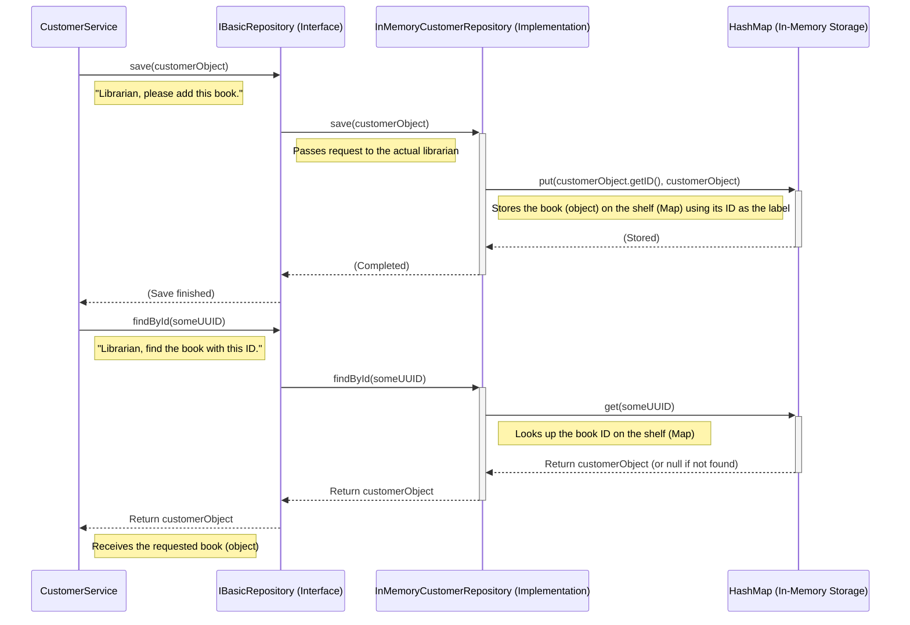

# Chapter 4: Repository (`IBasicRepository`)

Welcome back! In [Chapter 3: Command Domain Models (`Booking`, `Customer`, `Room`)](03_command_domain_models___booking____customer____room___.md), we learned about the blueprints for our key business concepts – the `Customer`, `Room`, and `Booking` classes (our models). We saw how services like `CustomerService` create these model objects, like filling out a new customer registration card.

But creating an object in the computer's memory is temporary! If the application restarts, that information is gone. We need a way to **save** these important objects permanently (or at least for the duration of the application) and **retrieve** them later when we need them. How do we interact with the storage system (like a database, or even just a simple list in memory)?

That's where the **Repository** pattern comes in, specifically our `IBasicRepository` interface.

## What's the Problem?

Imagine our `CustomerService`. When it creates a new `Customer` object using the details provided:

```java
// Inside CustomerService...
Customer customer = new Customer(
    UUID.randomUUID(), 
    Customer.ID_GENERATOR.incrementAndGet(), 
    customerCreate.firstName(), 
    // ... other details ...
);
```

What happens next? How does this `customer` object get stored so we can find it later, maybe by its unique ID (`UUID`)?

Furthermore, how do we handle different ways of storing data? Today, we might store data in the computer's memory (simple for testing), but tomorrow we might want to use a real database. Should our `CustomerService` need to change significantly just because the storage method changed? Ideally, no! The service should just say "save this customer" or "find this customer by ID" without worrying about the *how*.

## The Solution: The Repository (`IBasicRepository` Interface)

Think of a **Repository** as a dedicated **librarian** for a specific type of book (our domain models: `Customer`, `Room`, `Booking`).

*   You don't need to know where or how the books are organized on the shelves.
*   You just go to the librarian and ask them to:
    *   **Find** a specific book by its ID (`findById`).
    *   **Add** a new book to the collection (`save`).
    *   **Update** information about an existing book (`update`).

The repository **abstracts** the details of data storage. It provides a standard, simple set of operations for managing our domain models.

In our project, this standard is defined by the `IBasicRepository` **interface**. An interface in Java is like a contract or a job description – it defines *what* methods must be available, but not *how* they are implemented.

```java
// File: core/src/main/java/fhv/hotel/core/repo/IBasicRepository.java
package fhv.hotel.core.repo;

// This interface defines the standard methods for any repository
// T is the type of object being stored (e.g., Customer)
// ID is the type of the object's unique identifier (e.g., UUID for Customer)
public interface IBasicRepository<T, ID> {

    // Find an object by its unique ID
    T findById(ID id);

    // Save a new object to storage
    void save(T t);

    // Update an existing object in storage
    void update(T t);
}
```

This interface is incredibly simple! It says that any class wanting to be a "basic repository" must provide these three methods.

## How Services Use the Repository

Now, let's look back at our `CustomerService` and see how it uses this interface.

```java
// File: command/src/main/java/fhv/hotel/command/service/CustomerService.java
// ... imports ...
import fhv.hotel.core.repo.IBasicRepository; // Import the interface
import fhv.hotel.command.model.domain.Customer; // Import the model
import jakarta.inject.Inject; // Import the injection annotation
import java.util.UUID; // Import the ID type

@ApplicationScoped
public class CustomerService {

    // Ask the framework to give us an implementation 
    // of IBasicRepository that works for Customer objects (identified by UUID)
    @Inject 
    IBasicRepository<Customer, UUID> customerRepository; 

    // ... other parts like the publisher ...

    public void createCustomer(CustomerCreate customerCreate) {
        // 1. Create the Customer model object
        Customer customer = new Customer(/* ... details ... */);
        
        // 2. Use the injected repository to save the customer!
        customerRepository.save(customer); // <-- The magic happens here!

        // 3. Publish event (as seen before)
        // ...
    }

    public Customer getCustomer(UUID id) {
        // Use the injected repository to find the customer!
        return customerRepository.findById(id); // <-- Ask the repository to find it!
    }
}
```

**Explanation:**

1.  **`@Inject IBasicRepository<Customer, UUID> customerRepository;`**: The `CustomerService` doesn't create a specific repository (like `new InMemoryCustomerRepository()`). It just declares that it *needs* something that fulfills the `IBasicRepository<Customer, UUID>` contract. The framework (using Dependency Injection) figures out which specific implementation to provide and "injects" it into the `customerRepository` field. This is powerful – the `CustomerService` code doesn't depend on *how* customers are stored, only on the *contract* for storing them.
2.  **`customerRepository.save(customer);`**: When creating a customer, the service simply calls the `save` method on the injected repository, passing the `Customer` object it just created. It trusts the repository (the librarian) to handle the storage details.
3.  **`customerRepository.findById(id);`**: When asked to get a customer, the service calls `findById` on the repository, passing the requested `UUID`. It expects the repository to return the corresponding `Customer` object.

The `BookingService` and `RoomService` use their respective repositories (`IBasicRepository<Booking, UUID>` and `IBasicRepository<Room, Long>`) in exactly the same way. They talk to the **interface**, not the concrete implementation.

## Under the Hood: Interface vs. Implementation

Okay, the service talks to the `IBasicRepository` interface (the job description), but *something* must actually be doing the work of saving and finding data. These are the **implementations** of the interface – the actual librarians.

In our project, for simplicity and testing, we use **in-memory** repositories. This means they store the data directly in the computer's memory using simple Java data structures like `HashMap`. A `HashMap` is like a dictionary where you can quickly look up a value (our `Customer` object) using a key (its `UUID`).

Let's look at `InMemoryCustomerRepository`.

**1. The Librarian Analogy:**



This diagram shows:
*   The `CustomerService` only interacts with the `IBasicRepository` interface (the contract).
*   The actual work is done by the `InMemoryCustomerRepository` implementation.
*   The `InMemoryCustomerRepository` uses a `HashMap` to store and retrieve the `Customer` objects.

**2. A Look at the Implementation Code (`InMemoryCustomerRepository`)**

Here's a simplified view of how the in-memory repository for customers works:

```java
// File: command/src/main/java/fhv/hotel/command/repo/InMemoryCustomerRepository.java
package fhv.hotel.command.repo;
// ... imports ...
import fhv.hotel.command.model.domain.Customer; // The model it stores
import fhv.hotel.core.repo.IBasicRepository; // The interface it implements
import jakarta.inject.Singleton; // Managed by the framework
import java.util.HashMap;
import java.util.Map;
import java.util.UUID;

@Singleton // Ensures only one instance of this repository exists
public class InMemoryCustomerRepository implements IBasicRepository<Customer, UUID> { 

    // The actual storage: A Map where the Key is the Customer's UUID
    // and the Value is the Customer object itself.
    private final Map<UUID, Customer> customerStore = new HashMap<>();

    // We also need access to other repositories sometimes to link data,
    // but let's ignore that complexity for now.
    // @Inject Provider<InMemoryBookingRepository> ...

    @Override // This method fulfills the 'findById' part of the contract
    public Customer findById(UUID uuid) {
        System.out.println("InMemoryRepo: Trying to find Customer with ID: " + uuid);
        Customer customer = customerStore.get(uuid); // Get from the map!
        if (customer == null) {
            // Handle case where customer is not found (e.g., throw an error)
            System.out.println("InMemoryRepo: Customer not found!");
            // For simplicity, we might return null or throw an exception
            throw new RuntimeException("Customer not found with ID: " + uuid); 
        }
        // NOTE: Real code here might load related data (like bookings)
        // using the other repository providers. This involves the 
        // [Shallow Projection (`IShallowProjection`)](10_shallow_projection___ishallowprojection___.md) concept.
        System.out.println("InMemoryRepo: Found Customer: " + customer.firstName());
        return customer; 
    }

    @Override // This method fulfills the 'save' part of the contract
    public void save(Customer customer) {
        System.out.println("InMemoryRepo: Saving Customer with ID: " + customer.uuid());
        if (customerStore.containsKey(customer.uuid())) {
            // Prevent saving if a customer with this ID already exists
            throw new IllegalArgumentException("Customer already exists!");
        }
        // NOTE: The real code might store a "shallow" version first
        // to handle relationships efficiently, related to
        // [Shallow Projection (`IShallowProjection`)](10_shallow_projection___ishallowprojection___.md).
        // For simplicity, we just put the whole object here.
        customerStore.put(customer.uuid(), customer); // Put into the map!
        System.out.println("InMemoryRepo: Saved Customer: " + customer.firstName());
    }

    @Override // This method fulfills the 'update' part of the contract
    public void update(Customer customer) {
        System.out.println("InMemoryRepo: Updating Customer with ID: " + customer.uuid());
        // For a simple map, updating is the same as removing the old 
        // one (if it exists) and adding the new version.
        if (!customerStore.containsKey(customer.uuid())) {
             throw new IllegalArgumentException("Cannot update non-existent Customer!");
        }
        customerStore.put(customer.uuid(), customer); // Overwrite existing entry
        System.out.println("InMemoryRepo: Updated Customer: " + customer.firstName());
    }

    // Other methods might exist here to help link related data, 
    // e.g., finding the Customer associated with a Booking.
}
```

**Explanation:**

*   **`implements IBasicRepository<Customer, UUID>`**: This class promises to provide the methods defined in the `IBasicRepository` interface for `Customer` objects using `UUID` as the ID.
*   **`private final Map<UUID, Customer> customerStore = new HashMap<>();`**: This is the actual "shelf" where the customers (books) are stored. It's a `HashMap` that uses the `UUID` as the key to quickly find the `Customer` object.
*   **`findById(UUID uuid)`**: Implements the find method by simply calling `customerStore.get(uuid)`.
*   **`save(Customer customer)`**: Implements the save method by calling `customerStore.put(customer.uuid(), customer)`. It adds the customer to the map, using its ID as the key. (It also checks if it already exists).
*   **`update(Customer customer)`**: Implements the update method similarly by using `put`. If an entry with that key already exists in the map, `put` replaces it with the new one. (It also checks if it exists first).

We also have `InMemoryBookingRepository` and `InMemoryRoomRepository` that work the same way for `Booking` and `Room` objects, respectively, each using their own `HashMap`.

**Why is this cool?** If we later decide to use a real database, we would create *new* classes, maybe `DatabaseCustomerRepository`, `DatabaseBookingRepository`, etc. These new classes would *also* implement `IBasicRepository`. The only change needed would be to tell the framework to `@Inject` the *database* versions instead of the *in-memory* versions. Our `CustomerService`, `BookingService`, and `RoomService` code **would not need to change at all** because they only depend on the `IBasicRepository` interface!

## Conclusion

In this chapter, we learned about the **Repository** pattern and our `IBasicRepository` interface.

*   Repositories act like **librarians** for our domain models (`Customer`, `Room`, `Booking`).
*   They provide a **standard interface** (`IBasicRepository`) with methods like `findById`, `save`, and `update`.
*   They **abstract away the details of data storage**, hiding whether we're using memory, a database, or something else.
*   Services ([Chapter 2](02_command_services___bookingservice____customerservice____roomservice___.md)) use `@Inject` to get a repository instance, interacting only with the **interface**, making the code flexible and easier to maintain.
*   We saw a concrete **implementation** (`InMemoryCustomerRepository`) that uses a simple `HashMap` for storage.

We now understand how commands are received ([Chapter 1](01_command_resources___bookingresource____customerresource____roomresource___.md)), how they are processed by services ([Chapter 2](02_command_services___bookingservice____customerservice____roomservice___.md)), what data models they work with ([Chapter 3](03_command_domain_models___booking____customer____room___.md)), and how those models are saved and loaded ([Chapter 4](04_repository___ibasicrepository___.md)).

This covers the core of the "command" side of CQRS – handling instructions to change the system's state. But CQRS has two sides! What happens *after* a command successfully changes something? Often, we want to notify other parts of the system about this change. This is done using **Events**.

Let's move on to explore the other side of CQRS, starting with the events themselves.

Next up: [Chapter 5: Event Model (`IEventModel`)](05_event_model___ieventmodel___.md)

