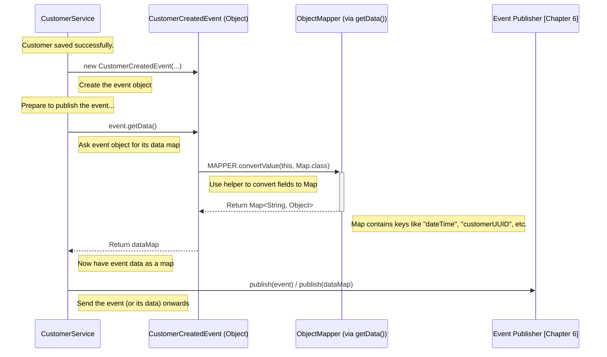

# Chapter 5: Event Model (`IEventModel`)

Welcome back! In [Chapter 4: Repository (`IBasicRepository`)](04_repository___ibasicrepository___.md), we learned how our application uses repositories to save and load our important business data, like `Customer` and `Booking` objects (our [Command Domain Models](03_command_domain_models___booking____customer____room___.md)). We saw how the command side of our application handles instructions to change things.

But what happens *after* a change is successfully made? For example, after our `CustomerService` ([Chapter 2](02_command_services___bookingservice____customerservice____roomservice___.md)) creates a new customer and saves it using the repository, wouldn't it be useful to announce this fact? Maybe other parts of our system need to know about new customers, perhaps to send a welcome email or update a different database.

This is where **Events** come into play. We need a structured way to record and share information about significant things that have already happened.

## What's the Problem?

Imagine our `CustomerService` successfully saves a new customer, "Alice".

```java
// Inside CustomerService...
Customer alice = new Customer(/* Alice's details */);
customerRepository.save(alice); 
// Okay, Alice is saved... now what?
```

How do we tell the rest of the system, "Hey everyone, a new customer named Alice was just created!"? We can't have the `CustomerService` directly call every other service that might be interested – that would create a tangled mess!

We need a standard way to represent these occurrences – these "facts" about things that happened. We need a blueprint for creating messages that describe events like "Customer Created," "Room Booked," or "Booking Cancelled."

## The Solution: Event Models (`IEventModel`)

Think of **Events** like entries in a ship's logbook. Each entry records something important that happened at a specific time: "14:00 - Sighted land," "15:30 - Changed course." These entries are facts – they state what occurred and cannot be changed (they are *immutable*).

In our application, **Event Models** are Java classes (often simple `records`) that represent these logbook entries. They define the structure for capturing the details of significant occurrences.

*   **`CustomerCreatedEvent`**: A record stating a new customer was created, including their ID, name, etc.
*   **`RoomBookedEvent`**: A record stating a room was booked, including which room, which customer, and when.
*   **`BookingCancelledEvent`**: A record stating a booking was cancelled.

The **`IEventModel` interface** acts as a common contract or template for all these different event types. It ensures every event model provides a basic, standard way to identify what *kind* of event it is.

```java
// File: core/src/main/java/fhv/hotel/core/model/IEventModel.java
package fhv.hotel.core.model;
// ... imports ...

// The contract for all event types
public interface IEventModel {
    // Method to get the type of event (e.g., CUSTOMER_CREATED)
    Event getEvent(); 

    // Helper method to convert the event data into a general format (Map)
    // (useful for sending events over networks)
    default Map<String, Object> getData() { /* ... implementation using Jackson ... */ }
}
```

*   `getEvent()`: Every event model must be able to tell us its type, using the `Event` enum (we'll see this next).
*   `getData()`: A handy helper (provided by default) to turn the event object's data into a simple key-value map, often used when preparing the event to be sent somewhere else (like turning it into JSON).

## Key Concepts Explained

1.  **Event:** An immutable (unchangeable) record of something significant that happened in the past.
2.  **Event Data:** The specific details included in the event record (e.g., for `CustomerCreatedEvent`, this would be the customer's ID, name, birthday, and the time the event occurred).
3.  **`IEventModel` Interface:** The basic contract that all specific event classes must follow. It guarantees they can identify their type.
4.  **`Event` Enum:** A simple list defining all possible types of events in our system. An `enum` (enumeration) is just a fixed set of named constants.

    ```java
    // File: core/src/main/java/fhv/hotel/core/model/Event.java
    package fhv.hotel.core.model;

    // A list of all possible event types
    public enum Event {
        ROOM_BOOKED,
        BOOKING_CANCELLED,
        CUSTOMER_CREATED,
        CUSTOMER_UPDATED,
        BOOKING_PAID
    }
    ```
    This makes it easy and safe to refer to event types in our code (e.g., `Event.CUSTOMER_CREATED`).

5.  **Specific Event Classes (`record`):** These are the concrete implementations of `IEventModel` for each event type. In modern Java, these are often defined using the `record` keyword, which is a concise way to create simple data-carrier classes.

    ```java
    // File: core/src/main/java/fhv/hotel/core/model/CustomerCreatedEvent.java
    package fhv.hotel.core.model;
    // ... imports ...

    // A specific event model for when a customer is created
    // Uses Java 'record' for simplicity - automatically creates fields, constructor, getters etc.
    public record CustomerCreatedEvent(
        LocalDateTime dateTime, // When the event happened
        UUID customerUUID,      // ID of the new customer
        Long customerNumber,    // Customer number
        String firstName,       // First name
        String lastName,        // Last name
        LocalDate birthday      // Birthday
    ) implements IEventModel { // It fulfills the IEventModel contract

        // Tell everyone what type of event this is
        public static Event EVENT = Event.CUSTOMER_CREATED;

        @Override // Implement the method required by IEventModel
        public Event getEvent() {
            return EVENT; 
        }
    }
    ```
    *   This `CustomerCreatedEvent` is a simple data holder.
    *   It automatically gets fields for `dateTime`, `customerUUID`, etc.
    *   It `implements IEventModel`.
    *   It provides the `getEvent()` method, returning `Event.CUSTOMER_CREATED`.

## How It's Used: Creating a `CustomerCreatedEvent`

Let's revisit the `CustomerService` from [Chapter 2](02_command_services___bookingservice____customerservice____roomservice___.md). Remember how it mentioned publishing an event? Here's how it creates the `CustomerCreatedEvent` object after saving the customer:

```java
// Simplified snippet from CustomerService.java

public void createCustomer(CustomerCreate customerCreate) {
    // 1. Create the Customer domain object
    Customer customer = new Customer(/* ... details ... */);
    
    // 2. Save the customer using the repository
    customerRepository.save(customer);

    // --- 3. Create the Event Model! ---
    CustomerCreatedEvent event = new CustomerCreatedEvent(
        LocalDateTime.now(), // When did it happen? Now!
        customer.uuid(),     // Get data from the saved customer object
        customer.customerNumber(),
        customer.firstName(),
        customer.lastName(),
        customer.birthday()
    );

    // 4. Publish the event (we'll cover this in the next chapter!)
    // customerCreatedPublisher.publish(event); 
}
```

**Explanation:**

1.  After the `customer` is successfully saved, the service gathers the relevant details from the `customer` object.
2.  It creates a *new* `CustomerCreatedEvent` object, passing in the current time and the customer's details. This object is an instance of our event model – a structured record of what just happened.
3.  This `event` object, which implements `IEventModel`, now holds all the information about the "Customer Created" event.
4.  The *next* step (covered in [Chapter 6: Event Publishing (`IPublishEvent`)](06_event_publishing___ipublishevent___.md)) will be to take this `event` object and send it out so other parts of the system can react.

## Under the Hood: Events as Data Carriers

Event Models are primarily **data carriers**. They don't contain complex logic; their main job is to hold the information about a past event in a structured way.

When an event needs to be sent (e.g., to another service or saved in a log), it often needs to be converted into a format like JSON. The `getData()` method in `IEventModel` helps with this.



This diagram shows:
1.  The `CustomerService` creates the `CustomerCreatedEvent` object.
2.  When preparing to send it, it might call `event.getData()`.
3.  Internally, `getData()` uses a library (Jackson `ObjectMapper`) to convert the event object's fields (`dateTime`, `customerUUID`, etc.) into a standard `Map` format.
4.  This map (or the original event object) can then be passed to an [Event Publishing (`IPublishEvent`)](06_event_publishing___ipublishevent___.md) mechanism.

The `IEventModel` interface and the specific event record classes provide the structure, while tools like Jackson handle the conversion to transferable formats when needed.

## Conclusion

In this chapter, we learned about **Event Models** and the `IEventModel` interface. They represent the "logbook entries" of our application.

*   Events are **immutable records** of significant occurrences (e.g., `CustomerCreatedEvent`, `RoomBookedEvent`).
*   They serve as **data carriers**, holding the details of what happened.
*   The **`IEventModel` interface** provides a common contract, requiring each event to identify its type via `getEvent()`.
*   Specific events are often implemented as simple Java **`records`** (like `CustomerCreatedEvent`).
*   They capture state changes *after* a command has been successfully executed.

We now understand how to define the *structure* of an event message. But how do we actually *send* or *publish* these event messages so that other interested parts of the system can receive and react to them?

Let's move on to the next step in our event-driven journey: [Chapter 6: Event Publishing (`IPublishEvent`)](06_event_publishing___ipublishevent___.md).
