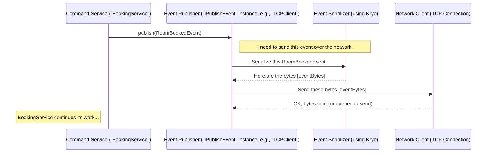

# Chapter 5: Event Publishing (`IPublishEvent`)

## The Problem: Broadcasting the News

Imagine the `BookingService` just successfully saved a new booking in the database. Hooray! As we discussed in Chapter 4, the next step is to create a `RoomBookedEvent` object containing all the details of this new booking.

Now, the `BookingService` needs to get this event message out to anyone who might care. The Query side definitely cares, as it needs to update its booking list. Other parts of the system might also be interested (maybe a notification service?).

How do we provide a standard, easy way for services like `BookingService` to shout "Newsflash! Room booked!" without needing to know exactly *who* is listening or *how* the message travels?

## The Solution: `IPublishEvent` - The Announcement Interface

Think of `IPublishEvent` as a standard **outgoing mailbox** or a **broadcaster's microphone**. It defines a simple, consistent way to "publish" or "send out" an event.

It's an **interface**, which in programming means it's a contract or a set of rules. The `IPublishEvent` interface says: "If you want to be something that can publish events, you *must* provide a way to accept an event for sending."

Crucially, the `IPublishEvent` interface itself **doesn't know *how* or *where* the event will be sent**. It just defines the action of publishing. The actual delivery mechanism (like sending it over the network using TCP, writing it to a file, etc.) is handled by whatever *implements* this interface.

**Analogy:** Imagine a standard mail slot in an office building door labelled "Outgoing Mail". Anyone in the office (`BookingService`, `CustomerService`, etc.) can drop a letter (`RoomBookedEvent`, `CustomerCreatedEvent`) into that slot. They don't need to know if the mail is picked up by a truck, a bike messenger, or a carrier pigeon. They just trust that putting the letter in the slot (`calling publish()`) gets it on its way. The `IPublishEvent` is like that standard mail slot definition.

## How to Use `IPublishEvent`

Using the event publisher in our Command services is very straightforward.

1.  **Get Access to the Publisher:** Services like `BookingService` need an instance of something that *implements* `IPublishEvent`. We use dependency injection (`@Inject`) for this. Quarkus (the framework we use) automatically provides a configured instance.

    ```java
    // File: command/src/main/java/fhv/hotel/command/service/BookingService.java
    // (Inside the BookingService class)

    import fhv.hotel.core.event.IPublishEvent; // Import the interface
    import jakarta.inject.Inject; // Import the injection annotation
    // ... other imports ...

    @ApplicationScoped
    public class BookingService {

        @Inject // Ask Quarkus to provide an instance of IPublishEvent
        IPublishEvent eventPublisher;

        // ... other needed injections like repositories ...
    ```
    *This `@Inject` line tells the system: "When you create this `BookingService`, please also give me an object that knows how to publish events, and assign it to my `eventPublisher` variable."*

2.  **Create the Event:** As we saw in Chapter 4, after performing an action (like saving a booking), the service creates the specific event object.

    ```java
    // (Inside the createBooking method, after saving the booking...)

    Booking newBooking = // ... the newly saved booking object ...

    // Create the announcement
    RoomBookedEvent event = new RoomBookedEvent(
        LocalDateTime.now(),
        newBooking.uuid(),
        newBooking.customer().uuid(),
        newBooking.bookingNumber(),
        newBooking.paid(),
        newBooking.cancelled(),
        newBooking.room().roomNumber(),
        newBooking.startDate(),
        newBooking.endDate(),
        newBooking.paymentOption()
    );
    System.out.println("Created event: " + event.getEvent());
    ```
    *Here, we create the specific `RoomBookedEvent` containing the details.*

3.  **Publish the Event:** Now, simply call the `publish` method on the injected `eventPublisher`, passing in the event object.

    ```java
    // (Continuing inside the createBooking method...)

    // Hand the event off to the publisher (like dropping mail in the slot)
    eventPublisher.publish(event);

    System.out.println("Event published!");
    // The service's job regarding this event is now done.
    ```
    *This single line is the core of using `IPublishEvent`. The `BookingService` tells the `eventPublisher` to send the `event` out. It doesn't need to worry about the details beyond this point.*

That's it! The service performs its core logic, creates an event record of what happened, and uses the injected `IPublishEvent` instance to publish it.

## What Happens Under the Hood? (Conceptual Walkthrough)

Okay, so `BookingService` calls `publish(event)`. What happens next? Remember, `IPublishEvent` is just an interface. We need a concrete class that actually *does* the publishing. In our project, this is often the `TCPClient` (which we'll explore more in [Chapter 6: Event Bus Transport](06_event_bus_transport__tcp_server_client___frame_protocol__.md)).

Here's a simplified step-by-step:

1.  **Call `publish`:** The `BookingService` calls `eventPublisher.publish(roomBookedEvent)`. The `eventPublisher` variable actually holds an instance of `TCPClient`.
2.  **Receive Event:** The `TCPClient`'s `publish` method receives the `RoomBookedEvent` object.
3.  **Serialize Event:** Network connections send *bytes*, not complex Java objects. So, the `TCPClient` needs to convert the `RoomBookedEvent` object into a stream of bytes. This process is called **serialization**. Our project uses a library called Kryo for this (see [Chapter 9: Kryo Serialization](09_kryo_serialization_.md)). It efficiently turns the event's data (IDs, dates, room number, etc.) into a compact byte format. It also likely includes the event type identifier (like the byte from `event.getEventType()`).
4.  **Send Bytes:** The `TCPClient` takes these bytes and sends them over the network connection it has established with an Event Bus server.
5.  **Off It Goes!** The bytes representing the `RoomBookedEvent` travel across the network towards the server, ready to be picked up by listeners on the other side.

Here's a sequence diagram illustrating this flow:



This shows how `IPublishEvent` acts as a simple front, hiding the more complex steps of serialization and network communication handled by its implementation (`TCPClient`).

## A Peek at the Code

Let's look at the interface itself and a simplified version of the implementation.

**1. The `IPublishEvent` Interface:**

```java
// File: core/src/main/java/fhv/hotel/core/event/IPublishEvent.java

package fhv.hotel.core.event;

import fhv.hotel.core.model.IEventModel; // Needs the base event type

// The contract for anything that can publish events.
public interface IPublishEvent {

    // The one required method: takes any object that IS an IEventModel...
    <T extends IEventModel> void publish(T event);
    // ...and sends it off somewhere. Returns void (doesn't give back a result).
    // The `<T extends IEventModel>` part is Java generics - it just means
    // this method works for ANY specific event type (RoomBookedEvent, etc.)
    // as long as it implements IEventModel.
}
```
*See how simple it is? Just one method, `publish`, that takes any valid event object.*

**2. Simplified `TCPClient` Implementation:**

```java
// File: event/src/main/java/fhv/hotel/event/client/TCPClient.java
// (Highly Simplified - focusing on the publish method)

package fhv.hotel.event.client;

import fhv.hotel.core.event.IPublishEvent;
import fhv.hotel.core.model.IEventModel;
// ... other imports for TCP connection, Vert.x, etc. ...

// This class KNOWS how to send events via TCP network connection.
public class TCPClient implements IPublishEvent { // <= Implements the interface!

    private Connection connection; // Manages the actual network socket
    private boolean ready = false; // Is the connection established?
    // Queue for events that arrive before connection is ready
    private final Queue<IEventModel> pendingEvents = new LinkedList<>();

    // Constructor and connection logic (simplified)
    public TCPClient(/*... setup details ...*/) {
        // ... code to establish connection to the server ...
        // When connection succeeds, set ready = true and send pending events.
    }

    // HERE is the implementation of the publish method from IPublishEvent
    @Override
    public <T extends IEventModel> void publish(T event) {
        if (ready && connection != null) {
            // If connected, tell the connection object to handle sending
            System.out.println("TCPClient: Sending event " + event.getEvent());
            connection.sendEvent(event); // Delegates to the Connection helper
        } else {
            // If not connected yet, store the event to send later
            System.out.println("TCPClient: Queuing event " + event.getEvent());
            pendingEvents.add(event);
        }
    }
}
```
*This snippet shows how `TCPClient` implements the `publish` method. It checks if the network connection is ready. If yes, it likely calls another method (`connection.sendEvent`) that handles the details of serializing the event and writing the bytes to the network socket. If not ready, it queues the event.* The real magic of serialization and network frames happens inside `connection.sendEvent`, which we'll touch upon in the next chapter.

## Conclusion

You've now learned how the Command side broadcasts its important news!

*   The **`IPublishEvent`** interface provides a standard, simple contract for publishing events.
*   Command services (`BookingService`, `CustomerService`, etc.) get an `IPublishEvent` instance injected and call its `publish(event)` method after successfully processing a command and creating an event object.
*   This decouples the service from the specifics of *how* the event is delivered.
*   Under the hood, an implementation like `TCPClient` takes the event, serializes it into bytes (using something like Kryo), and sends those bytes over a network connection.

We've seen *what* events are ([Chapter 4](04_event_model___ieventmodel____specific_events__.md)) and *how* they get sent out by the Command side ([Chapter 5](05_event_publishing___ipublishevent___.md)). But how do these bytes travel across the network, and how does the server handle them? Let's look at the transport layer next!

**Next:** [Chapter 6: Event Bus Transport (TCP Server/Client & Frame Protocol)](06_event_bus_transport__tcp_server_client___frame_protocol__.md)
