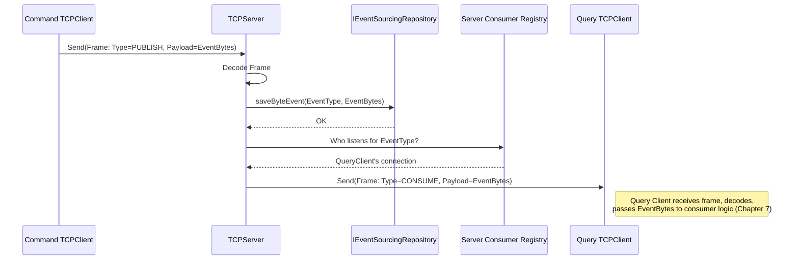

# Chapter 6: Event Bus Transport (TCP Server/Client & Frame Protocol)

## The Problem: Delivering the Mail Reliably

Imagine our busy hotel again. The kitchen (Command side) puts an "Order Ready" slip (an Event) on the counter (`IPublishEvent`). How does that slip get to the specific waiter (Query side consumer) who needs it?

*   We can't just shout it across the room – what if the waiter isn't listening or misses it?
*   We need a dedicated system to pick up the slip and deliver it reliably.
*   We also need a standard format for the slip so the delivery system knows what to do with it.

In our software, the `IPublishEvent` publisher sends out event bytes. We need a robust mechanism to transport these bytes from the publisher (Command side) to any interested consumers (Query side).

## The Solution: A Dedicated Postal Service (TCP + Frames)

Our project uses a custom-built system that acts like a dedicated postal service for events. It has three main parts:

1.  **The Central Post Office (`TCPServer`):** This is a server program running centrally. It acts as the hub for all event mail. It listens for incoming connections from "postal workers" (clients). When it receives an event message (a letter), it might store a copy (persistence) and then forwards it to all workers who have registered interest in that type of mail.
2.  **The Postal Workers (`TCPClient`):** These are client programs that connect to the central `TCPServer`. They have two jobs:
    *   **Sending Mail (Publishing):** When used by the Command side (as the implementation of `IPublishEvent`), the `TCPClient` takes the serialized event bytes, puts them in a standard envelope (`Frame`), and sends them *to* the `TCPServer`.
    *   **Receiving Mail (Consuming):** When used by the Query side, the `TCPClient` connects *to* the `TCPServer` and tells it, "I'm interested in receiving mail about `RoomBookedEvent`s and `BookingCancelledEvent`s." The server then sends any matching mail *to* this client.
3.  **The Standard Envelopes (`Frame` Protocol):** Sending raw bytes over a network can be messy. Did we receive the whole message? What *kind* of message is it? The `Frame` protocol defines a standard format, like an envelope, for every message sent over the TCP connection. Each `Frame` has:
    *   **A Header:** Contains information *about* the message, like:
        *   `FrameType`: What is the purpose of this message? (e.g., "I am publishing a new event", "I am registering to consume events", "Here is an event for you to consume").
        *   `Size`: How many total bytes are in this envelope (frame)?
    *   **A Payload:** The actual content of the message (the serialized event bytes, like the letter inside the envelope).
    *   **An End Marker:** A special byte indicating the end of the envelope.

This system ensures that event messages are structured, reliably delivered, and routed to the correct recipients.

## How it Works Together: Delivering a `RoomBookedEvent`

Let's follow the journey of a `RoomBookedEvent` from the Command side publisher to a Query side consumer:

1.  **Publish:** The `BookingService` (Command side) calls `eventPublisher.publish(roomBookedEvent)`. The `eventPublisher` is actually an instance of our `TCPClient`.
2.  **Serialize & Frame:** The `TCPClient` serializes the `RoomBookedEvent` into bytes using [Kryo Serialization](09_kryo_serialization_.md). It then wraps these bytes inside a `Frame`. The frame header specifies `FrameType.PUBLISH` and the total size.
    ```java
    // Conceptual step inside TCPClient's connection logic
    byte[] eventBytes = kryoSerializer.serialize(roomBookedEvent);

    // Add event type byte at the beginning of the payload
    byte[] payload = new byte[1 + eventBytes.length];
    payload[0] = roomBookedEvent.getEventType(); // e.g., Event.ROOM_BOOKED byte
    System.arraycopy(eventBytes, 0, payload, 1, eventBytes.length);

    // Create the 'envelope'
    Frame publishFrame = Frame.builder()
            .setType(FrameType.PUBLISH) // Mark as a publishing action
            .setPayload(payload)
            .build(); // Calculates size, adds end marker
    ```
    *This code conceptually shows how the event bytes become the payload of a `PUBLISH` frame.*

3.  **Send to Server:** The `TCPClient` sends the bytes of the `publishFrame` over its network connection to the `TCPServer`.
4.  **Server Receives & Decodes:** The `TCPServer` receives the stream of bytes. It uses the `Frame` protocol rules (looking for the size in the header and the end marker) to reconstruct the complete `publishFrame`.
    ```java
    // Conceptual step inside TCPServer's connection logic
    // (Receives raw buffer from network)
    List<Frame> receivedFrames = Frame.splitBuffer(networkBuffer);
    for (Frame frame : receivedFrames) {
        if (frame.getType() == FrameType.PUBLISH) {
            // Process this PUBLISH frame...
        }
        // ... handle other frame types ...
    }
    ```
    *The server reconstructs the 'envelope' from the raw bytes.*

5.  **Server Processes PUBLISH:** The `TCPServer` sees the frame type is `PUBLISH`.
    *   **(Optional Persistence):** It *can* be configured to save the event payload (the raw bytes) to a database using an implementation of `IEventSourcingRepository`. This creates a permanent log of all events.
        ```java
        // Conceptual step inside TCPServer's connection logic (processing PUBLISH)
        byte[] eventPayload = frame.getPayloadBytes(); // Get the letter content
        byte eventType = eventPayload[0]; // Extract the event type

        // If configured, save the event
        eventSourcingRepository.saveByteEvent(eventType, eventPayload);
        System.out.println("Server saved event type: " + eventType);
        ```
        *The server might save the event bytes using the repository.*
    *   **Forward to Consumers:** The `TCPServer` checks its list of connected clients. Which ones have registered interest in this `eventType`? For each interested client, it creates a *new* `Frame`.
        ```java
        // Conceptual step inside TCPServer's connection logic (processing PUBLISH)

        // Find sockets interested in 'eventType'
        List<NetSocket> interestedSockets = consumerRegistry.findSocketsForType(eventType);

        for (NetSocket targetSocket : interestedSockets) {
            // Create a CONSUME frame with the SAME payload
            Frame consumeFrame = Frame.builder()
                    .setType(FrameType.CONSUME) // Mark as 'for consumption'
                    .setPayload(eventPayload)
                    .build();

            // Send this frame to the specific interested client
            targetSocket.write(consumeFrame.getBuffer());
            System.out.println("Server forwarded event to consumer: " + targetSocket.remoteAddress());
        }
        ```
        *The server puts the event payload into a new 'CONSUME' envelope and sends it to interested clients.*

6.  **Query Client Receives:** The `TCPClient` instance running on the Query side receives the bytes for the `consumeFrame`.
7.  **Decode & Process:** The Query side `TCPClient` decodes the `Frame`, sees it's `FrameType.CONSUME`, extracts the `payload` (the original event bytes), and passes these bytes to the appropriate event handling logic (covered in [Chapter 7: Event Consumption](07_event_consumption___iconsumeevent____kryoeventreceiver____ireceivebytemessage__.md)).

This ensures the event travels from publisher to server to consumer, wrapped securely in `Frame` envelopes.

## A Peek Under the Hood: Implementation Details

Let's look briefly at the key components involved.

**Sequence Diagram:**


*This diagram shows the PUBLISH frame going from Command Client to Server, the Server saving and finding the right consumer, and sending a CONSUME frame to the Query Client.*

**Core Components (Simplified Code):**

1.  **`TCPServer` (The Post Office):** Listens for connections and processes incoming frames.

    ```java
    // File: event/src/main/java/fhv/hotel/event/server/TCPServer.java
    // (Simplified)

    @Singleton // Ensures only one instance
    @Startup // Starts automatically
    public class TCPServer {
        @Inject Vertx vertx; // Framework toolkit for networking
        @Inject IEventSourcingRepository eventSourcingRepository; // For saving
        @Inject ConsumerRegistry consumerRegistry; // Keeps track of listeners
        @Inject Publisher publisher; // Helps forward messages

        @PostConstruct // Called after setup
        public void start() {
            NetServer server = vertx.createNetServer(); // Create TCP server

            // Define what happens when a client connects
            server.connectHandler(this::handleNewConnection);

            // Start listening on the designated port
            server.listen(5672, res -> { /* Log success/failure */ });
        }

        // Handle a new client connection
        private void handleNewConnection(NetSocket socket) {
            System.out.println("Server: New client connected!");
            // Create a helper object to manage this specific connection
            Connection connection = new Connection(socket, vertx, eventSourcingRepository,
                                                 consumerRegistry, publisher);

            // Tell the connection helper to process any data received on this socket
            socket.handler(buffer -> connection.handleIncomingData(buffer));

            // Handle client disconnection
            socket.closeHandler(v -> { /* Log closure, clean up */ });
        }
    }
    ```
    *This code sets up the TCP server using Vert.x, defining how to handle new client connections by creating a `Connection` object for each.*

2.  **`TCPServer`'s `Connection` Helper:** Processes frames from one specific client.

    ```java
    // File: event/src/main/java/fhv/hotel/event/server/Connection.java
    // (Simplified)

    class Connection {
        // ... fields for socket, repo, registry, publisher ...

        // Process raw data buffer from the client
        public void handleIncomingData(Buffer data) {
            List<Frame> frames = Frame.splitBuffer(data); // Decode buffer into Frames
            for (Frame frame : frames) {
                processFrame(frame); // Handle each frame
            }
        }

        private void processFrame(Frame frame) {
            if (frame.getType() == FrameType.PUBLISH) {
                handlePublishFrame(frame);
            } else if (frame.getType() == FrameType.REGISTERING_CONSUMERS) {
                handleConsumerRegistration(frame);
            } // ... other frame types ...
        }

        private void handlePublishFrame(Frame frame) {
            byte[] payload = frame.getPayloadBytes();
            if (payload.length == 0) return;
            byte eventType = payload[0];

            // Save event (blocking operation offloaded)
            vertx.executeBlocking(() -> {
                eventSourcingRepository.saveByteEvent(eventType, payload);
                return payload; // Pass payload to next step
            }).onSuccess(savedPayload -> {
                // Forward event to interested consumers
                publisher.publish(Buffer.buffer(savedPayload), eventType);
            });
        }

        private void handleConsumerRegistration(Frame frame) {
            // ... (Logic to register this socket for event types in payload) ...
            // This is how the server knows where to send CONSUME frames later
             System.out.println("Server: Client registered consumers.");
        }
    }
    ```
    *The `Connection` helper decodes incoming data into `Frame`s. If it's a `PUBLISH` frame, it saves the payload via the repository and tells the `publisher` component to forward it. If it's `REGISTERING_CONSUMERS`, it notes which events this client wants.*

3.  **`TCPClient` (The Postal Worker):** Connects to server, sends PUBLISH frames, receives CONSUME frames.

    ```java
    // File: event/src/main/java/fhv/hotel/event/client/TCPClient.java
    // (Simplified - also implements IPublishEvent from Chapter 5)

    public class TCPClient implements IPublishEvent {
        private Connection connection; // Helper for the actual socket comms
        private boolean ready = false; // Is connection established?
        private Queue<IEventModel> pendingEvents = new LinkedList<>(); // Events to send once ready

        // Constructor called by framework (receives things needed to connect/process)
        public TCPClient(Vertx vertx, IReceiveByteMessage... receivers) {
            start(vertx, false, receivers); // Start connection attempt
        }

        // Attempt to connect
        void start(Vertx vertx, boolean rolloutRequested, IReceiveByteMessage... receivers) {
            NetClient client = vertx.createNetClient();
            client.connect(5672, "localhost", connResult -> {
                if (connResult.succeeded()) {
                    // Connection successful! Create helper.
                    this.connection = new Connection(connResult.result(), vertx,
                                                     rolloutRequested, receivers);
                    this.ready = true;
                    // Send any queued events
                    while (!pendingEvents.isEmpty()) {
                        publish(pendingEvents.poll()); // Use the publish method
                    }
                    System.out.println("TCPClient: Connected to server.");
                } else { /* Log connection failure */ }
            });
        }

        // Method from IPublishEvent interface
        @Override
        public <T extends IEventModel> void publish(T event) {
            if (ready && connection != null) {
                // If connected, tell connection helper to send it
                connection.sendEvent(event);
            } else {
                // Otherwise, queue it
                pendingEvents.add(event);
                System.out.println("TCPClient: Queued event: " + event.getEvent());
            }
        }
    }
    ```
    *The `TCPClient` tries to connect. Once connected (`ready=true`), its `publish` method delegates sending to its `Connection` helper. If not connected, it queues events.*

4.  **`TCPClient`'s `Connection` Helper:** Handles framing for sending, and receiving/processing incoming CONSUME frames.

    ```java
    // File: event/src/main/java/fhv/hotel/event/client/Connection.java
    // (Simplified)

    class Connection {
        private final NetSocket socket;
        private final KryoSerializer serializer = new KryoSerializer();
        private List<IReceiveByteMessage> receivers; // Consumers for received events

        // Constructor: Sets up handler for incoming data and sends registration
        public Connection(NetSocket socket, Vertx vertx, boolean rolloutRequested,
                          IReceiveByteMessage... receivers) {
            this.socket = socket;
            this.receivers = Arrays.asList(receivers);
            socket.handler(this::handleIncomingData); // Process server messages
            registerConsumers(rolloutRequested); // Tell server what we listen for
        }

        // Send an event FROM this client TO the server
        public void sendEvent(IEventModel model) {
            byte[] serializedBytes = serializer.serialize(model);
            byte[] payload = new byte[1 + serializedBytes.length];
            payload[0] = model.getEventType(); // Add type byte
            System.arraycopy(serializedBytes, 0, payload, 1, serializedBytes.length);

            Frame publishFrame = Frame.builder()
                    .setType(FrameType.PUBLISH)
                    .setPayload(payload)
                    .build();

            System.out.println("TCPClient: Sending PUBLISH frame for " + model.getEvent());
            socket.write(publishFrame.getBuffer()); // Send the frame bytes
        }

        // Process data received FROM the server
        public void handleIncomingData(Buffer data) {
            List<Frame> frames = Frame.splitBuffer(data);
            for (Frame frame : frames) {
                if (frame.getType() == FrameType.CONSUME) {
                    processConsumeFrame(frame);
                } // ... other frame types? ...
            }
        }

        // Handle a CONSUME frame received from the server
        private void processConsumeFrame(Frame frame) {
            byte[] payload = frame.getPayloadBytes();
            if (payload.length == 0) return;
            byte eventType = payload[0];

            System.out.println("TCPClient: Received CONSUME frame for type " + eventType);

            // Find the right consumer logic (IReceiveByteMessage) and pass the bytes
            for (IReceiveByteMessage receiver : receivers) {
                if (receiver.handlesType(eventType)) {
                    // Pass the raw payload bytes for processing (See Chapter 7)
                    receiver.receiveAndProcess(payload);
                    return; // Found handler
                }
            }
        }

        // Tell the server which event types this client wants to receive
        private void registerConsumers(boolean rolloutRequested) {
            // ... (Builds payload with event type bytes from 'receivers') ...
            byte[] registrationPayload = /* ... bytes of event types ... */;

            Frame registerFrame = Frame.builder()
                    .setType(FrameType.REGISTERING_CONSUMERS)
                    .setPayload(registrationPayload)
                    .build();

            // ... (Optionally mark frame for rollout request) ...

            System.out.println("TCPClient: Sending registration frame.");
            socket.write(registerFrame.getBuffer());
        }
    }
    ```
    *The client's `Connection` helper takes an `IEventModel`, serializes it, wraps it in a `PUBLISH` frame, and sends it. It also handles incoming data, decodes `CONSUME` frames, and passes the raw payload bytes to the correct `IReceiveByteMessage` handler (Chapter 7). The `registerConsumers` method is how the client tells the server which events it's interested in.*

5.  **`Frame` Protocol:** Defines the envelope structure.

    ```java
    // File: event/src/main/java/fhv/hotel/event/protocol/header/Frame.java
    // (Conceptual Structure)

    public class Frame {
        // Constants for structure
        public static final byte END_FRAME = (byte) 0xFF;
        public static final int HEADER_SIZE = 8; // e.g. Type(1), Flags(5), Size(2)

        private Buffer buffer; // Holds the raw bytes of the frame

        // Methods to get info from header
        public FrameType getType() { /* reads byte at type position */ }
        public int getSize() { /* reads bytes at size position */ }

        // Method to get the payload (content)
        public byte[] getPayloadBytes() { /* extracts bytes after header, before end */ }

        // Helper to build a Frame object (used by clients/server)
        public static class Builder {
            // ... setType(), setPayload() ...
            public Frame build() {
                // Creates buffer, sets header fields, appends payload,
                // adds END_FRAME, calculates and sets SIZE field.
                return new Frame(/* resulting buffer */);
            }
        }

        // Helper to split a raw buffer into individual Frames
        public static List<Frame> splitBuffer(Buffer buffer) {
            // Scans buffer using SIZE field and END_FRAME marker
            // to find and extract complete frames.
            return /* list of Frame objects */;
        }
    }
    ```
    *The `Frame` class and its `Builder` manage the structure of messages, ensuring senders and receivers agree on the format. The `splitBuffer` method is crucial for handling TCP streams where multiple frames might arrive together.*

6.  **`IEventSourcingRepository` (Optional Persistence):** Interface for saving events.

    ```java
    // File: event/src/main/java/fhv/hotel/event/repo/IEventSourcingRepository.java

    public interface IEventSourcingRepository {
        // Save the raw bytes of an event, identified by its type
        void saveByteEvent(Byte identifier, byte[] event);

        // Retrieve events (e.g., for replay or rollout)
        List<byte[]> getByteEventsByTypeAscending(Byte typeIdentifier);
        // ... other retrieval methods maybe ...
    }
    ```
    *This interface defines how the `TCPServer` can persist event bytes. The project includes `PostgresEventSourcingRepository` which saves them to a PostgreSQL database.*

## Conclusion

You've now seen the "postal service" that carries events in our CQRS system!

*   The **`TCPServer`** acts as the central post office, receiving events and forwarding them.
*   The **`TCPClient`** acts as the postal worker, connecting to the server to either send events (when used by the Command side) or receive events (when used by the Query side).
*   The **`Frame`** protocol provides the standard "envelope" format, ensuring messages are structured with a type, size, and payload (the serialized event bytes).
*   Optionally, the `TCPServer` can use `IEventSourcingRepository` to save a permanent record of events.

This transport layer reliably bridges the gap between the Command side publishing events and the Query side needing to consume them.

Now that we understand how event bytes arrive at the Query side's `TCPClient` wrapped in a `CONSUME` frame, how does the Query side actually *process* those bytes and update its read models? Let's dive into event consumption next!

**Next:** [Chapter 7: Event Consumption (`IConsumeEvent`, `KryoEventReceiver`, `IReceiveByteMessage`)](07_event_consumption___iconsumeevent____kryoeventreceiver____ireceivebytemessage__.md)
