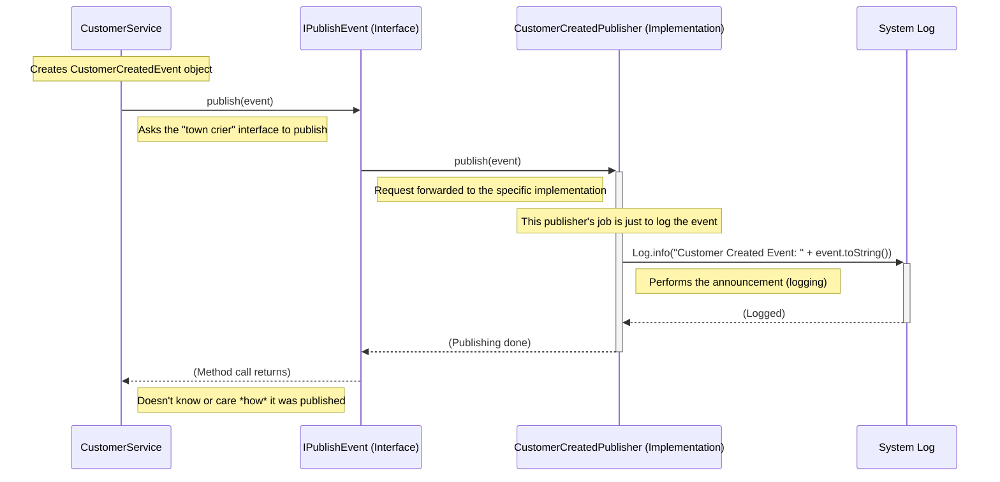

# Chapter 6: Event Publishing (`IPublishEvent`)

Welcome back! In [Chapter 5: Event Model (`IEventModel`)](05_event_model___ieventmodel___.md), we learned how to create structured messages, like `CustomerCreatedEvent`, to represent important facts about things that have happened in our system. We saw how `CustomerService` creates such an event object after successfully saving a new customer.

But just creating the event object (like writing down the news) isn't enough. How do we actually *announce* this news to the rest of the system so that other parts can react?

## What's the Problem?

Our `CustomerService` has just created a `CustomerCreatedEvent` object containing all the details about the new customer, Alice.

```java
// Inside CustomerService...
CustomerCreatedEvent event = new CustomerCreatedEvent(
    LocalDateTime.now(), 
    alice.uuid(), 
    alice.customerNumber(), 
    // ... etc ...
);
// We have the event object! Now what?
```

The `CustomerService` knows this event happened, but maybe other services need to know too:
*   A `NotificationService` might want to send a welcome email.
*   A `ReportingService` might want to update a dashboard.
*   A `LoyaltyService` might want to create a new loyalty account.

The `CustomerService` shouldn't need to know about *all* these other services and call them directly. That would make our code very coupled and hard to change. If we added a new service later that also needed to know about new customers, we'd have to go back and change `CustomerService`!

We need a way for `CustomerService` to simply shout out the news, "Customer Created!", without caring who is listening.

## The Solution: The Event Publisher (`IPublishEvent` Interface)

Think of an **Event Publisher** like a **town crier**. The town crier's job is simple: stand in the town square and announce the news loudly. They don't need to know every single person who might be interested in the news, nor do they deliver the news personally to each house. They just announce it publicly.

In our project, the **`IPublishEvent` interface** defines the "job description" for being an event publisher (a town crier). It's a very simple contract.

```java
// File: core/src/main/java/fhv/hotel/core/event/IPublishEvent.java
package fhv.hotel.core.event;

import fhv.hotel.core.model.IEventModel; // We need the basic event type

// This interface defines the job: to publish an event.
// T must be a specific type of event that implements IEventModel
public interface IPublishEvent<T extends IEventModel> {

    // The only requirement: a method to publish (announce) the event
    void publish(T event); 
}
```

*   **`IPublishEvent<T extends IEventModel>`**: This defines the interface. The `<T extends IEventModel>` part means it's designed to publish specific types of events (like `CustomerCreatedEvent`) that follow the rules of `IEventModel` from [Chapter 5](05_event_model___ieventmodel___.md).
*   **`void publish(T event);`**: This is the core method. Any class that wants to be a publisher for a certain event type `T` *must* provide an implementation for this `publish` method. It takes the event object as input and is responsible for sending it out.

## How It Works: Publishing the `CustomerCreatedEvent`

Now, let's see how `CustomerService` uses this interface.

**1. Declaring the Need (`@Inject`)**

The `CustomerService` doesn't create its own publisher. It just declares that it *needs* one, specifically one that knows how to publish `CustomerCreatedEvent`s.

```java
// File: command/src/main/java/fhv/hotel/command/service/CustomerService.java
// ... other imports ...
import fhv.hotel.core.event.IPublishEvent; // Import the interface
import fhv.hotel.core.model.CustomerCreatedEvent; // Import the event type
import jakarta.inject.Inject; // Import the magic injection tool

@ApplicationScoped
public class CustomerService {

    @Inject // Ask the framework for a repository
    IBasicRepository<Customer, UUID> customerRepository;

    // Ask the framework for a publisher for CustomerCreatedEvent
    @Inject 
    IPublishEvent<CustomerCreatedEvent> customerCreatedPublisher; 
    // ^^^ We get a "town crier" for customer creation news!

    // ... createCustomer method ...
}
```

*   `@Inject IPublishEvent<CustomerCreatedEvent> customerCreatedPublisher;`: This line tells the framework (Quarkus/CDI): "Please find or create an object that implements `IPublishEvent` specifically for `CustomerCreatedEvent`s, and assign it to this `customerCreatedPublisher` field." The `CustomerService` doesn't know or care *which* specific implementation it gets, as long as it fulfills the contract.

**2. Using the Publisher (`.publish()`)**

Inside the `createCustomer` method, after the customer is saved and the event object is created, the service simply uses the injected publisher:

```java
// Inside CustomerService's createCustomer method...

public void createCustomer(CustomerCreate customerCreate) {
    // 1. Create the Customer domain object
    Customer customer = new Customer(/* ... details ... */);
    
    // 2. Save the customer
    customerRepository.save(customer);

    // 3. Create the Event Model object
    CustomerCreatedEvent event = new CustomerCreatedEvent(
        LocalDateTime.now(), 
        customer.uuid(), 
        // ... other customer details ...
    );

    // 4. Use the injected publisher to announce the event!
    customerCreatedPublisher.publish(event); // <-- "Town crier, announce this!"
    
    System.out.println("CustomerService: Published CustomerCreatedEvent for " + customer.firstName());
}
```

*   `customerCreatedPublisher.publish(event);`: This is the crucial line. The `CustomerService` takes the `event` object it created and hands it over to the `customerCreatedPublisher` (our town crier), telling it to "publish" the news. The service's job related to this event is now done. It trusts the publisher to handle the announcement.

## Under the Hood: The Town Crier's Implementation

The `CustomerService` only talks to the `IPublishEvent` *interface* (the job description). But somewhere, there must be an actual class *implementing* that interface – the specific town crier who knows *how* to announce the news.

In our simple example, we have a `CustomerCreatedPublisher` class.

**1. The Flow of Announcement:**



This shows that the `CustomerService` interacts with the abstract `IPublishEvent`. The framework directs the call to the concrete `CustomerCreatedPublisher`. In this case, the publisher's action is simply to write the event details to the application's log.

**2. A Look at the Implementation (`CustomerCreatedPublisher`)**

This class provides the actual code for the `publish` method defined in the `IPublishEvent` interface.

```java
// File: command/src/main/java/fhv/hotel/command/event/CustomerCreatedPublisher.java
package fhv.hotel.command.event;

import fhv.hotel.core.event.IPublishEvent; // The interface we promise to implement
import fhv.hotel.core.model.CustomerCreatedEvent; // The specific event we handle
import io.quarkus.logging.Log; // Tool for logging messages
import jakarta.enterprise.context.ApplicationScoped; // Managed by the framework

@ApplicationScoped // Tells the framework to manage this class
// This class IS-A specific implementation of IPublishEvent for CustomerCreatedEvent
public class CustomerCreatedPublisher implements IPublishEvent<CustomerCreatedEvent> { 

    // This is the actual implementation of the 'publish' method
    @Override 
    public void publish(CustomerCreatedEvent event) {
        // For now, "publishing" just means printing it to the log
        Log.info("PUBLISHER: Announcing Customer Created Event!");
        Log.info("  Time: " + event.dateTime());
        Log.info("  UUID: " + event.customerUUID());
        Log.info("  Name: " + event.firstName() + " " + event.lastName());
        
        // In a real system, this could do more:
        // - Send the event to a message queue (like Kafka, RabbitMQ)
        // - Call another system via HTTP
        // - Write to a specific event log file
        // We'll see a more complex publisher later using TCP:
        // [Chapter 9: TCP Event Bus](...) 
    }
}
```

*   **`implements IPublishEvent<CustomerCreatedEvent>`**: This declares that `CustomerCreatedPublisher` fulfills the contract for publishing `CustomerCreatedEvent`s.
*   **`@ApplicationScoped`**: Makes this class known to the dependency injection framework, so it can be `@Inject`ed where needed.
*   **`publish(CustomerCreatedEvent event)`**: This is the core logic. In this simple version, it just uses `Log.info()` to print the details of the received `event` object to the console/log file. This is our basic "announcement."
*   **Future Possibilities:** As the comments suggest, a publisher could do much more complex things, like sending the event over a network. Our current `CustomerCreatedPublisher` is just a very simple starting point. The beauty is, if we change *how* we publish (e.g., switch from logging to sending over the network), the `CustomerService` *doesn't need to change* because it only depends on the `IPublishEvent` interface.

## Conclusion

In this chapter, we explored **Event Publishing** using the `IPublishEvent` interface. It acts as the mechanism for announcing that an event has occurred.

*   It's like a **town crier**, responsible for broadcasting news (events).
*   The **`IPublishEvent<T>` interface** defines the simple contract: a `publish(T event)` method.
*   Services (like `CustomerService`) use **`@Inject`** to get a publisher instance without knowing its specific implementation details.
*   Services call the **`publish` method** to announce events after successfully completing a command.
*   Actual **implementations** (like `CustomerCreatedPublisher`) define *how* the event is broadcast (e.g., logging, sending to a message bus).
*   This decouples the service that *causes* the event from the mechanism that *announces* it and from any services that might *listen* to it.

We've created an event ([Chapter 5](05_event_model___ieventmodel___.md)) and announced it ([Chapter 6](06_event_publishing___ipublishevent___.md)). But how does anyone actually *hear* this announcement and react to it? How does our potential `NotificationService` or `ReportingService` get notified?

Let's find out how events are received and processed in the next chapter: [Chapter 7: Event Consumption (`IConsumeEvent` / `IReceiveMessage`)](07_event_consumption___iconsumeevent_____ireceivemessage___.md).

