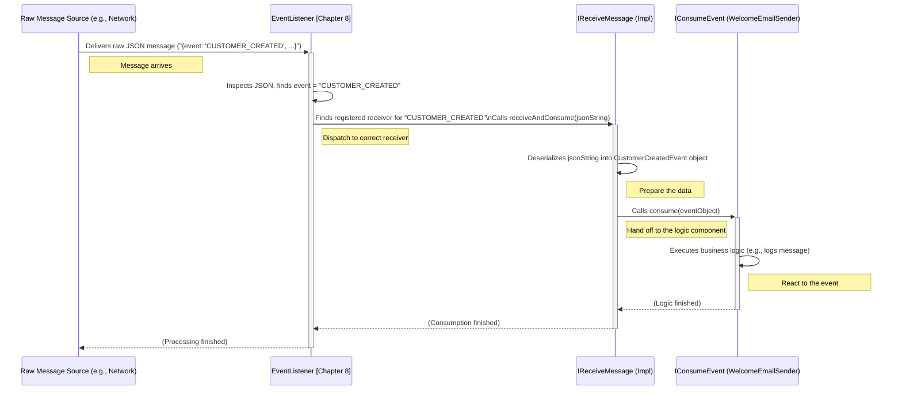

# Chapter 7: Event Consumption (`IConsumeEvent` / `IReceiveMessage`)

Welcome back! In [Chapter 6: Event Publishing (`IPublishEvent`)](06_event_publishing___ipublishevent___.md), we learned how our application can announce important events, like a town crier shouting the news "Customer Created!" But shouting the news is only half the story. Someone needs to *listen* to the announcement and perhaps *do something* based on it.

## What's the Problem?

The `CustomerService` successfully created a new customer, "Alice," and used the `IPublishEvent` publisher to announce the `CustomerCreatedEvent`. Great!

Now, imagine we want to automatically send a welcome email to every new customer. How does the part of our system responsible for sending emails (let's call it a hypothetical `NotificationService`) find out about this specific `CustomerCreatedEvent`? How does it get the details (like Alice's email address, although we didn't store that yet!) so it can perform its task?

The publisher just shouted the event out; it didn't deliver it to anyone specific. We need a mechanism for interested parts of the system to "subscribe" or "listen" for specific types of events and react when they occur.

## The Solution: Event Consumers and Receivers

Think back to our town crier analogy. The crier shouts the news in the square. Who listens? Various news desks might be listening, each interested in different topics: one for local politics, one for merchant news, one for town gossip.

In our application, we have two key interfaces for this "listening" process:

1.  **`IConsumeEvent<T>`:** This represents the **news reporter** or the **specific logic** that *processes* an event once it's received. It defines *what to do* when a specific type of event (like `CustomerCreatedEvent`) arrives. Example: The logic to actually draft and send the welcome email.
2.  **`IReceiveMessage<T>`:** This often represents a slightly lower-level component, like the **person at the news desk** who first receives the message (maybe a written note passed from the crier, or just overhearing the shout). Their job is to handle the raw incoming message (e.g., a piece of text like JSON arriving over the network or from a queue), potentially decode or deserialize it, and make sure it gets to the right reporter (`IConsumeEvent`). It handles the *how* of getting the message ready for processing.

These two work together: `IReceiveMessage` gets the raw message and prepares it, then hands the specific, ready-to-use event data (`CustomerCreatedEvent` object) to `IConsumeEvent` to execute the business logic.

## Key Concept 1: `IConsumeEvent` - The Logic

This interface defines the component that actually *reacts* to a specific event. It contains the business logic for what should happen when that event occurs.

**The Interface:**

```java
// File: core/src/main/java/fhv/hotel/core/event/IConsumeEvent.java
package fhv.hotel.core.event;

import fhv.hotel.core.model.IEventModel;

// Contract for any component that wants to process a specific event type 'T'
public interface IConsumeEvent<T extends IEventModel> {
    
    // The main method: Do something with the received event object
    void consume(T event); 
}
```

*   `IConsumeEvent<T extends IEventModel>`: Defines the interface for consumers of events of type `T`. `T` must be a class that implements [IEventModel](05_event_model___ieventmodel___.md).
*   `void consume(T event)`: This is the single method required. Any class implementing this interface must provide this method. It receives the specific event object (e.g., a `CustomerCreatedEvent`) and contains the code to handle it.

**Example: A Simple Welcome Email "Sender"**

Let's imagine a class that implements `IConsumeEvent` to handle `CustomerCreatedEvent`. Its job is just to log a message saying it *would* send an email.

```java
// Example implementation (could be in a 'notifications' module)
import fhv.hotel.core.event.IConsumeEvent;
import fhv.hotel.core.model.CustomerCreatedEvent;
import io.quarkus.logging.Log;
import jakarta.enterprise.context.ApplicationScoped;

@ApplicationScoped // Managed by the framework
public class WelcomeEmailSender implements IConsumeEvent<CustomerCreatedEvent> {

    @Override // Implementing the method from IConsumeEvent
    public void consume(CustomerCreatedEvent event) {
        // This is the logic that runs when a CustomerCreatedEvent arrives
        Log.info("CONSUMER: Received CustomerCreatedEvent for: " + event.firstName());
        Log.info("  -> Pretending to send welcome email!");
        // In a real system, we'd use the 'event' data (like an email address
        // if it were included) to actually send an email.
    }
}
```

*   This `WelcomeEmailSender` class `implements IConsumeEvent<CustomerCreatedEvent>`, meaning it specifically knows how to handle `CustomerCreatedEvent`s.
*   The `consume` method contains the logic – in this simple case, just printing log messages. It receives the fully formed `CustomerCreatedEvent` object, so it has access to all the event details (`event.firstName()`, `event.customerUUID()`, etc.).

## Key Concept 2: `IReceiveMessage` - The Receiver

This interface deals with the task of getting the message from its source (like a network connection or a message queue) and preparing it for the `IConsumeEvent`.

**The Interface:**

```java
// File: core/src/main/java/fhv/hotel/core/event/IReceiveMessage.java
package fhv.hotel.core.event;

import fhv.hotel.core.model.IEventModel;

// Contract for receiving raw messages and passing them to consumers
public interface IReceiveMessage<T extends IEventModel> {

    // Method to handle a raw message (e.g., JSON string) and trigger consumption
    void receiveAndConsume(String message); 

    // Method to link this receiver to a specific consumer logic
    void registerConsumer(IConsumeEvent<T> consumer); 
}
```

*   `IReceiveMessage<T extends IEventModel>`: Defines the interface for receivers focused on event type `T`.
*   `receiveAndConsume(String message)`: This method is called when a raw message (often as a JSON string) arrives that is believed to be of type `T`. Its job is usually to:
    1.  Deserialize the `message` string into the specific event object (e.g., `CustomerCreatedEvent`).
    2.  Call the `consume` method of the registered `IConsumeEvent` implementation, passing the deserialized event object.
*   `registerConsumer(IConsumeEvent<T> consumer)`: This method is used to connect the receiver with the specific `IConsumeEvent` logic (the "reporter") that should handle events of type `T`.

**How it fits:** Often, the implementation of `IReceiveMessage` is tied to the communication infrastructure. For example, if we use a TCP-based event bus ([Chapter 9: TCP Event Bus](09_tcp_event_bus___tcpserver____tcpclient____connection____event_module__.md)), the TCP client or server part might implement `IReceiveMessage` to handle incoming network data.

## How They Work Together: From Raw Message to Action

Let's trace how a `CustomerCreatedEvent`, originally published by `CustomerService`, might reach our `WelcomeEmailSender`.

1.  **Publishing:** `CustomerService` creates `CustomerCreatedEvent` and calls `publisher.publish(event)`.
2.  **Transmission:** The publisher implementation (e.g., the [TCP Event Bus](09_tcp_event_bus___tcpserver____tcpclient____connection____event_module__.md)) sends the event data, probably as a JSON string, over the network or to a queue.
3.  **Arrival:** The message arrives at a listening component (e.g., another service running the `NotificationService`).
4.  **Sorting (EventListener):** A central component, the [EventListener](08_event_listener___eventlistener___.md) (which we'll see next), often receives the raw message first. It inspects the message (e.g., looks at an "event type" field in the JSON) to figure out it's a `CUSTOMER_CREATED` event.
5.  **Dispatching:** The `EventListener` finds the specific `IReceiveMessage` implementation registered for `CUSTOMER_CREATED` events.
6.  **Receiving & Deserializing:** The `EventListener` calls the `receiveAndConsume(jsonString)` method on that `IReceiveMessage` implementation. This implementation deserializes the JSON string into a `CustomerCreatedEvent` object.
7.  **Consuming:** The `IReceiveMessage` implementation then calls the `consume(eventObject)` method on the `IConsumeEvent` implementation (`WelcomeEmailSender`) that was previously registered with it.
8.  **Action:** The `WelcomeEmailSender.consume()` method executes, logging the "sending email" message.



## Registration: Linking Receiver and Consumer

How does the `IReceiveMessage` know which `IConsumeEvent` to call? They need to be registered together, usually when the application starts up. This is often managed by the [EventListener](08_event_listener___eventlistener___.md).

```java
// Simplified example of how registration might happen (e.g., during startup)

// Assume we have instances managed by the framework:
@Inject WelcomeEmailSender welcomeEmailConsumer; // Our IConsumeEvent implementation
@Inject CustomerEventReceiver customerEventReceiver; // An IReceiveMessage implementation

// Somewhere in the setup code (likely involving EventListener):
EventListener eventListener = new EventListener(); 

// Register the receiver AND the consumer for the "CUSTOMER_CREATED" event type
eventListener.register(
    customerEventReceiver,        // The IReceiveMessage implementation
    welcomeEmailConsumer,         // The IConsumeEvent implementation
    CustomerCreatedEvent.EVENT.name(), // The event type name ("CUSTOMER_CREATED")
    CustomerCreatedEvent.class    // The class of the event object
);

// Now, the EventListener knows that when a "CUSTOMER_CREATED" message arrives,
// it should use 'customerEventReceiver', which in turn knows to call 'welcomeEmailConsumer'.
```

This registration step connects the components:
*   The `EventListener` knows which `IReceiveMessage` handles which event *name*.
*   The `IReceiveMessage` (via `registerConsumer` which is likely called during this setup) knows which `IConsumeEvent` handles the actual event *object*.

*(We'll look at the `EventListener` in detail in the next chapter)*.

## Under the Hood: `EventListener` and Dispatch

The provided code snippets show an `EventListener` class that plays a central role.

```java
// File: core/src/main/java/fhv/hotel/core/event/EventListener.java
// ... imports ...
public class EventListener {
    // ... internal class ReceiverConsumerPair ...

    // Stores registrations: Event Name -> {Receiver, Consumer, EventClass}
    private Map<String, ReceiverConsumerPair<?>> receiverConsumerPairs = new HashMap<>();

    // Method to register a receiver/consumer pair for an event
    public <T extends IEventModel> void register(
        IReceiveMessage<T> receiver, 
        IConsumeEvent<T> consumer, 
        String eventName, 
        Class<T> eventClass) {
        
        // Store the pair in the map, keyed by the event name
        this.receiverConsumerPairs.put(eventName, 
            new ReceiverConsumerPair<>(receiver, consumer, eventClass));
        
        // Likely also calls receiver.registerConsumer(consumer) here!
        receiver.registerConsumer(consumer); 
    }

    // Method called when any raw JSON message arrives
    public void handleJsonMessageAbstract(String jsonMessage) throws JsonProcessingException {
        // 1. Parse JSON to find the event name
        JsonNode root = IEventModel.MAPPER.readTree(jsonMessage);
        String eventName = root.get("event").asText(); // e.g., "CUSTOMER_CREATED"

        // 2. Look up the registered pair for this event name
        ReceiverConsumerPair<?> receiverConsumerPair = receiverConsumerPairs.get(eventName);

        if (receiverConsumerPair != null) {
            // 3. If found, call the 'receiveAndConsume' on the registered receiver
            // Note: The cast here is simplified; real code needs type safety.
            ((IReceiveMessage<IEventModel>) receiverConsumerPair.receiver)
                .receiveAndConsume(jsonMessage); 
        } else {
            LOG.debug("No receiver/consumer for event: " + eventName);
        }
    }
}
```

1.  **`register`**: Stores the `IReceiveMessage` and `IConsumeEvent` instances together in a map, using the event name (like "CUSTOMER_CREATED") as the key. It also calls `receiver.registerConsumer(consumer)` to link them directly.
2.  **`handleJsonMessageAbstract`**: When a raw JSON message arrives, this method:
    *   Parses the JSON to extract the `event` field's value (the event name).
    *   Uses this name to look up the correct `ReceiverConsumerPair` from the map.
    *   Calls the `receiveAndConsume` method on the `IReceiveMessage` instance found in that pair, passing the original JSON message. (The `IReceiveMessage` implementation is then responsible for deserializing and calling the `IConsumeEvent`).

This `EventListener` acts as the central dispatcher, ensuring incoming raw messages get routed to the correct receiver, which in turn activates the appropriate consumer logic.

## Conclusion

In this chapter, we explored how our application listens for and processes events using two key interfaces:

*   **`IConsumeEvent<T>`**: Defines the specific business logic (the "reporter") that reacts to a fully formed event object (`consume` method).
*   **`IReceiveMessage<T>`**: Handles receiving the raw message (the "desk clerk"), preparing it (deserializing), and passing it to the correct `IConsumeEvent` (`receiveAndConsume` method).

We saw how they are linked together, often via a central dispatcher like the `EventListener`, allowing components to react to events without being directly coupled to the components that published them.

Now that we understand publishing ([Chapter 6](06_event_publishing___ipublishevent___.md)) and the basics of consuming events, let's take a closer look at the central coordinator that manages these consumers.

Next up: [Chapter 8: Event Listener (`EventListener`)](08_event_listener___eventlistener___.md)

