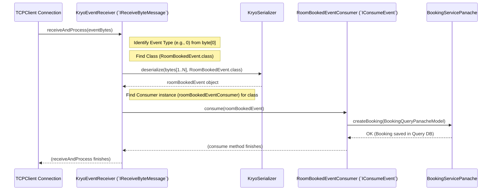

# Chapter 7: Event Consumption (`IConsumeEvent`, `KryoEventReceiver`, `IReceiveByteMessage`)

## The Problem: Reacting to Incoming News

Imagine the Query side's `TCPClient` just received a bunch of bytes from the `TCPServer`. It knows these bytes represent an event because they arrived in a `CONSUME` frame (as discussed in Chapter 6). But:

1.  What *kind* of event is it? A `RoomBookedEvent`? A `CustomerCreatedEvent`?
2.  How can it turn those raw bytes back into a usable Java object (like the `RoomBookedEvent` record)?
3.  Once it has the object, what specific code should run to update the Query database (the [Query Projections & Panache Models](03_query_projections___panache_models__.md))?

We need a system on the Query side to handle these incoming event bytes, interpret them, and trigger the correct actions.

## The Solution: The Event Receiving Team

Think of the Query side's event handling like a company's mailroom and specialized departments:

1.  **`IReceiveByteMessage` (The Mail Clerk Interface):** This is the job description for anyone handling incoming mail. It defines the *ability* to receive raw byte messages (`receiveAndProcess`) and to know which types of mail they are responsible for (`handlesType`, `getEventTypeIds`). It also defines how specialists can register (`registerConsumer`).

2.  **`KryoEventReceiver` (The Actual Mail Clerk):** This is the person (or component) doing the job described by `IReceiveByteMessage`. This clerk has a special tool: **Kryo** ([Chapter 9: Kryo Serialization](09_kryo_serialization_.md)), which is used to "unpack" or **deserialize** the byte messages back into meaningful Java event objects (like `RoomBookedEvent`). This clerk also maintains a directory linking specific types of mail (event types) to the departments that handle them.

3.  **`IConsumeEvent<T>` (The Specialist Department Interface):** This defines the job of a specialist department that handles *one specific type* of mail (event). The `<T>` means it's specialized for a type `T` (e.g., `IConsumeEvent<RoomBookedEvent>`). The main task is `consume(T event)` – process this specific type of event. It also needs to report which event class it handles (`getEventClass`).

4.  **Specific Consumer Classes (e.g., `RoomBookedEventConsumer`):** These are the actual departments implementing the `IConsumeEvent<T>` interface. For example, `RoomBookedEventConsumer` is the department that knows exactly what to do when a `RoomBookedEvent` arrives: update the booking query models.

**How they work together:**
The `TCPClient` (from Chapter 6) receives the raw byte message (the mail). It hands it off to the `KryoEventReceiver` (the mail clerk). The clerk looks at the first byte to identify the event type (mail type), uses Kryo to deserialize the rest of the bytes into the correct event object (unpack the letter), looks up which department handles this type (`RoomBookedEventConsumer`), and delivers the specific event object (the letter) to that department's `consume` method for processing.

## Using Event Consumers: Updating the Booking List

Let's see how we create a specialist "department" to handle `RoomBookedEvent` and update our query-side booking list.

**1. Create the Specialist (`RoomBookedEventConsumer`):**
We create a class that implements `IConsumeEvent` specifically for `RoomBookedEvent`.

```java
// File: query/src/main/java/fhv/hotel/query/event/RoomBookedEventConsumer.java

package fhv.hotel.query.event;

import fhv.hotel.core.event.IConsumeEvent; // The specialist interface
import fhv.hotel.core.model.RoomBookedEvent; // The specific event type
import fhv.hotel.query.model.BookingQueryPanacheModel; // The query model to update
import fhv.hotel.query.service.BookingServicePanache; // Service to interact with query model
import io.quarkus.logging.Log;
import jakarta.inject.Inject;
import jakarta.inject.Singleton;

@Singleton // Make this class available for injection
public class RoomBookedEventConsumer implements IConsumeEvent<RoomBookedEvent> { // Specializes in RoomBookedEvent

    @Inject // Ask for the service that manages booking query models
    BookingServicePanache bookingServicePanache;

    // This is the core logic: what to DO when a RoomBookedEvent arrives
    @Override
    public void consume(RoomBookedEvent event) {
        Log.info("CONSUMING RoomBookedEvent for booking UUID: " + event.bookingUUID());
        // 1. Convert the event data into the query model format
        BookingQueryPanacheModel bookingModel = mapEventToModel(event);
        // 2. Use the service to save this new booking in the query database
        bookingServicePanache.createBooking(bookingModel);
        Log.info("Created booking query model with UUID: " + bookingModel.uuid);
    }

    // Helper method to map event fields to the query model fields
    private BookingQueryPanacheModel mapEventToModel(RoomBookedEvent event) {
        return new BookingQueryPanacheModel(
            event.bookingUUID(), event.bookingNumber(), event.paid(), event.cancelled(),
            event.roomNumber(), event.customerUUID(), event.startDate(),
            event.endDate(), event.paymentOption()
        );
    }

    // Required by IConsumeEvent: specify which event class this handles
    @Override
    public Class<RoomBookedEvent> getEventClass() {
        return RoomBookedEvent.class;
    }
}
```
*   This class `RoomBookedEventConsumer` declares it handles `RoomBookedEvent`.
*   Its `consume` method receives a fully formed `RoomBookedEvent` object.
*   It uses the data from the `event` to create a `BookingQueryPanacheModel`.
*   It then calls `bookingServicePanache.createBooking` to save this new record to the **query database**, making it available for future queries ([Chapter 3](03_query_projections___panache_models__.md)).

We create similar consumer classes for every event type the Query side needs to react to (e.g., `CustomerCreatedConsumer`, `BookingCancelledConsumer`).

**2. Register the Specialist with the Mail Clerk (`EventConfig`):**
How does the `KryoEventReceiver` (mail clerk) know that `RoomBookedEventConsumer` should handle `RoomBookedEvent`s? We need to register this relationship during application startup. We do this in a configuration class, often using a builder pattern provided by `KryoEventReceiver`.

```java
// File: query/src/main/java/fhv/hotel/query/event/EventConfig.java

package fhv.hotel.query.event;

// ... imports for core interfaces, specific events, specific consumers ...
import fhv.hotel.core.event.IConsumeEvent;
import fhv.hotel.core.event.bytebased.IReceiveByteMessage;
import fhv.hotel.core.event.bytebased.KryoEventReceiver;
import fhv.hotel.core.model.*; // Import event classes
import fhv.hotel.event.client.TCPClient; // The client that USES the receiver
import io.quarkus.runtime.Startup;
import io.vertx.core.Vertx;
import jakarta.annotation.PostConstruct;
import jakarta.enterprise.context.ApplicationScoped;
import jakarta.inject.Inject;

@ApplicationScoped
@Startup // Run this configuration when the application starts
public class EventConfig {

    @Inject Vertx vertx; // Needed for TCPClient

    // Inject all the specialist consumer implementations
    @Inject IConsumeEvent<RoomBookedEvent> roomBookedEventConsumer;
    @Inject IConsumeEvent<CustomerCreatedEvent> customerCreatedEventConsumer;
    // ... inject other consumers (BookingCancelledConsumer, etc.) ...

    @PostConstruct // Run this method after injections are complete
    public void initClient() {
        // Create the "Mail Clerk" (KryoEventReceiver) and register specialists
        IReceiveByteMessage byteMessageReceiver = new KryoEventReceiver.Builder()
            // Register RoomBookedEvent: Use its type byte, class, and consumer instance
            .registerConsumer(
                RoomBookedEvent.EVENT.getOrdinalByte(), // The type ID byte (e.g., 0)
                RoomBookedEvent.class,                  // The event class itself
                roomBookedEventConsumer                 // The specialist instance
            )
            // Register CustomerCreatedEvent
            .registerConsumer(
                CustomerCreatedEvent.EVENT.getOrdinalByte(),
                CustomerCreatedEvent.class,
                customerCreatedEventConsumer
            )
            // ... register all other event types and their consumers ...
            .build(); // Finalize the receiver configuration

        // Create the TCPClient (postal worker), giving it the configured receiver
        // The 'true' might indicate rolloutRequested - telling the server to send old events first
        TCPClient client = new TCPClient(vertx, true, byteMessageReceiver);
        // Now the TCPClient is ready to receive bytes and pass them to byteMessageReceiver
    }
}
```
*   This `EventConfig` class runs at startup.
*   It uses `@Inject` to get instances of all our consumer classes (like `RoomBookedEventConsumer`).
*   It creates a `KryoEventReceiver` using its `Builder`.
*   Crucially, `registerConsumer` is called for each event type. It tells the receiver: "When you get a message with this specific type byte (e.g., `RoomBookedEvent.EVENT.getOrdinalByte()`), deserialize it as this `Class` (e.g., `RoomBookedEvent.class`), and then pass the resulting object to this specific `consumer` instance (e.g., `roomBookedEventConsumer`)."
*   Finally, it creates the `TCPClient` and gives it the fully configured `byteMessageReceiver`. Now, when the `TCPClient`'s connection receives bytes (as seen in Chapter 6), it will pass them to our `KryoEventReceiver`.

## How it Works Internally: From Bytes to Action

Let's trace the steps when the Query side `TCPClient` receives the bytes for a `RoomBookedEvent` within a `CONSUME` frame:

1.  **Bytes Received:** The `TCPClient`'s internal `Connection` helper receives the `Frame`, confirms it's `FrameType.CONSUME`, and extracts the payload `byte[] message`. (See Chapter 6, `TCPClient`'s `Connection.processConsumeFrame`).
2.  **Pass to Receiver:** The `TCPClient`'s `Connection` iterates through its list of `IReceiveByteMessage` handlers (in our setup, it's just the one `KryoEventReceiver` instance we created in `EventConfig`). It calls `receiver.receiveAndProcess(message)`.
3.  **Identify Type:** Inside `KryoEventReceiver.receiveAndProcess(message)`:
    *   It checks if the message is valid (not null or too short).
    *   It reads the *first byte* (`eventTypeId = message[0]`). This byte uniquely identifies the event type (e.g., 0 for `ROOM_BOOKED`).
    *   It looks up this `eventTypeId` in its internal `idEventClasses` map (populated during `registerConsumer`) to find the corresponding Java `Class` object (e.g., `RoomBookedEvent.class`). If not found, it stops.
4.  **Deserialize:**
    *   It copies the *rest* of the message bytes (excluding the first type byte) into a new array `eventData`.
    *   It uses its internal `KryoSerializer` instance to deserialize `eventData` into an object of the `eventClass` found in the previous step. `event = kryoSerializer.deserialize(eventData, RoomBookedEvent.class);`. This turns the bytes back into a full `RoomBookedEvent` object!
5.  **Find Consumer:**
    *   It looks up the `eventClass` (e.g., `RoomBookedEvent.class`) in its *other* internal map, `consumersByClass` (also populated by `registerConsumer`). This map stores a list of `IConsumeEvent` instances registered for that class.
6.  **Dispatch:**
    *   It iterates through the list of consumers found (usually just one per class in our setup).
    *   For each consumer, it calls the `consume` method, passing the deserialized `event` object. `((IConsumeEvent<RoomBookedEvent>) consumer).consume(event);`
7.  **Action!** The `RoomBookedEventConsumer`'s `consume` method executes, converting the event to a `BookingQueryPanacheModel` and calling the `BookingServicePanache` to save it to the query database.

**Sequence Diagram:**


This diagram shows the flow: bytes arrive, `KryoEventReceiver` deserializes and finds the right `IConsumeEvent` implementation, calls its `consume` method, which then interacts with a query service to update the data.

## A Peek at the Code (Key Interfaces and Implementation)

**1. `IConsumeEvent<T>` Interface:**

```java
// File: core/src/main/java/fhv/hotel/core/event/IConsumeEvent.java
package fhv.hotel.core.event;

import fhv.hotel.core.model.IEventModel;

// Interface for components that consume a specific event type T
public interface IConsumeEvent<T extends IEventModel> {
    // The main action: process the received event
    void consume(T event);

    // Method to declare which event class this consumer handles
    Class<T> getEventClass();
}
```
*Defines the contract for any specific event consumer.*

**2. `IReceiveByteMessage` Interface:**

```java
// File: core/src/main/java/fhv/hotel/core/event/bytebased/IReceiveByteMessage.java
package fhv.hotel.core.event.bytebased;

import fhv.hotel.core.event.IConsumeEvent;
import fhv.hotel.core.model.IEventModel;

// Interface for components that receive and process raw event bytes
public interface IReceiveByteMessage {
    // Process an incoming message (contains type byte + serialized data)
    void receiveAndProcess(byte[] message);

    // Register a specific consumer for a given event type ID and class
    <T extends IEventModel> void registerConsumer(
            byte eventTypeId, Class<T> eventClass, IConsumeEvent<T> consumer);

    // Check if this receiver handles a specific event type byte
    boolean handlesType(byte type);

    // Get all event type IDs this receiver is registered to handle
    // (Used by TCPClient to tell the server which events to send)
    byte[] getEventTypeIds();
}
```
*Defines the contract for the "mail clerk" component that handles raw bytes.*

**3. `KryoEventReceiver` Implementation (Simplified):**

```java
// File: core/src/main/java/fhv/hotel/core/event/bytebased/KryoEventReceiver.java
package fhv.hotel.core.event.bytebased;

// ... imports ...
import fhv.hotel.core.kryo.KryoSerializer;
import java.util.*;

public class KryoEventReceiver implements IReceiveByteMessage {
    private static final Logger LOG = Logger.getLogger(KryoEventReceiver.class);

    // Maps: Event Type Byte -> Event Class (e.g., 0 -> RoomBookedEvent.class)
    private final Map<Byte, Class<? extends IEventModel>> idEventClasses = new HashMap<>();
    // Maps: Event Class -> List of Consumers (e.g., RoomBookedEvent.class -> [roomBookedConsumer])
    private final Map<Class<? extends IEventModel>, List<IConsumeEvent<?>>> consumersByClass = new HashMap<>();
    private final KryoSerializer kryoSerializer; // Used for deserialization

    public KryoEventReceiver() { this.kryoSerializer = new KryoSerializer(); }

    // Called by EventConfig's Builder
    @Override
    public <T extends IEventModel> void registerConsumer(
            byte eventTypeId, Class<T> eventClass, IConsumeEvent<T> consumer) {
        kryoSerializer.registerClass(eventClass); // Ensure Kryo knows about this class
        idEventClasses.put(eventTypeId, eventClass); // Store ID -> Class mapping
        consumersByClass.computeIfAbsent(eventClass, k -> new ArrayList<>()).add(consumer); // Store Class -> Consumer mapping
        LOG.info("Registered consumer for " + eventClass.getSimpleName() + " ID: " + eventTypeId);
    }

    // Called by TCPClient's Connection when bytes arrive
    @Override
    public void receiveAndProcess(byte[] message) {
        if (message == null || message.length <= 1) return; // Basic validation
        byte eventTypeId = message[0]; // Get type ID

        Class<? extends IEventModel> eventClass = idEventClasses.get(eventTypeId); // Find class
        if (eventClass == null) return; // Unknown type

        // Prepare data for deserialization (bytes AFTER the type byte)
        byte[] eventData = new byte[message.length - 1];
        System.arraycopy(message, 1, eventData, 0, eventData.length);

        IEventModel event;
        try {
            event = kryoSerializer.deserialize(eventData, eventClass); // Deserialize!
        } catch (Exception e) { LOG.error("Deserialize failed", e); return; }

        List<IConsumeEvent<?>> consumers = consumersByClass.get(eventClass); // Find consumers
        if (consumers == null) return; // No consumers registered

        for (IConsumeEvent<?> consumer : consumers) {
            notifyConsumer(consumer, event); // Pass the object to the consumer's 'consume'
        }
    }

    // Helper to safely call the consumer's consume method
    @SuppressWarnings("unchecked")
    private <T extends IEventModel> void notifyConsumer(IConsumeEvent<?> consumer, IEventModel event) {
        try {
            ((IConsumeEvent<T>) consumer).consume((T) event);
        } catch (Exception e) { LOG.error("Error in consumer", e); }
    }

    // Other methods from IReceiveByteMessage (handlesType, getEventTypeIds) omitted for brevity
    @Override public boolean handlesType(byte type) { /* ... */ }
    @Override public byte[] getEventTypeIds() { /* ... */ }

    // ... Builder class also omitted ...
}
```
*This shows the core logic of `KryoEventReceiver`: registering consumers and processing incoming messages by identifying, deserializing, and dispatching.*

## Conclusion

You've now learned how the Query side listens for and reacts to events broadcast by the Command side!

*   **`IConsumeEvent<T>`** defines a specialist component (like `RoomBookedEventConsumer`) responsible for handling one specific type of event (`T`). Its `consume` method contains the logic to update the query models.
*   **`IReceiveByteMessage`** defines the interface for components that receive raw byte messages from the transport layer.
*   **`KryoEventReceiver`** is the concrete implementation of `IReceiveByteMessage`. It uses Kryo to deserialize incoming byte messages back into specific event objects and dispatches them to the correct registered `IConsumeEvent` implementation.
*   Consumers are registered with the `KryoEventReceiver` at startup (e.g., in `EventConfig`) to link event type bytes, event classes, and consumer instances.

This consumption mechanism is crucial for keeping the Query side's data eventually consistent with the changes made on the Command side, ensuring that queries reflect the latest state of the system.

Both the Command Services (Chapter 2) and these Event Consumers often need to interact with data storage (saving command models or updating query models). How is this data persistence handled? Let's look at the Repository pattern next.

**Next:** [Chapter 8: Repository (`IBasicRepository`)](08_repository___ibasicrepository__.md)
