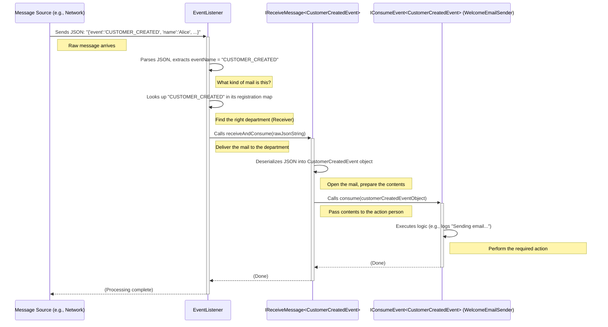

# Chapter 8: Event Listener (`EventListener`)

Welcome back! In [Chapter 7: Event Consumption (`IConsumeEvent` / `IReceiveMessage`)](07_event_consumption___iconsumeevent_____ireceivemessage___.md), we saw how specific components can be set up to *listen* for events (`IReceiveMessage`) and *process* them (`IConsumeEvent`). We learned how a `WelcomeEmailSender` could react to a `CustomerCreatedEvent`.

But how does an incoming event message, maybe arriving as raw text (like JSON) from a network or a queue, actually find its way to the correct `IReceiveMessage` handler? What acts as the central coordinator?

## What's the Problem?

Imagine our hotel system is running. Events might be coming in from different places:
*   A `CUSTOMER_CREATED` event arrives over the network.
*   A `ROOM_BOOKED` event arrives from a message queue.
*   A `BOOKING_CANCELLED` event arrives from another internal service.

These messages arrive as raw data, maybe simple text strings like `"{ \"event\": \"CUSTOMER_CREATED\", ... }"`. How does the system know:
1.  What *kind* of event this message represents?
2.  Which specific `IReceiveMessage` handler is responsible for dealing with events of that kind?

We need a central **traffic controller** or **post office** that can look at an incoming message, figure out what it is, and route it to the correct destination (the right `IReceiveMessage` handler).

## The Solution: `EventListener` - The Central Post Office

The `EventListener` class in our project acts exactly like that central post office or switchboard. Its main job is to:

1.  **Receive** incoming raw event messages (like JSON strings).
2.  **Identify** the type of event based on the message content (e.g., by looking for a field like `"event": "CUSTOMER_CREATED"`).
3.  **Route** the message to the specific `IReceiveMessage` handler that has registered itself as being interested in that particular event type.

It sits at the center of event consumption, making sure messages get to the right place without the message sender needing to know anything about the final receiver.

## How It Works: Registration and Handling

**1. Registration: Telling the Post Office Who Handles What Mail**

Before the `EventListener` can route messages, it needs to know which `IReceiveMessage` handler deals with which event type. This happens during the application's startup phase. We need to "register" pairs of `IReceiveMessage` (the receiver) and `IConsumeEvent` (the processor) with the `EventListener` for each event type they handle.

Think of this like different departments telling the central post office, "Any mail addressed to 'CUSTOMER_CREATED' should come to us."

The `EventListener` provides a `register` method for this purpose.

```java
// File: core/src/main/java/fhv/hotel/core/event/EventListener.java (Partial)

public class EventListener {
    // ... internal structures to store registrations ...

    // Method to register a receiver/consumer pair for a specific event type
    public <T extends IEventModel> void register(
        IReceiveMessage<T> receiver,   // The component that receives raw messages
        IConsumeEvent<T> consumer,     // The component that processes the event object
        String eventName,              // The name of the event (e.g., "CUSTOMER_CREATED")
        Class<T> eventClass            // The Java class of the event object
    ) {
        // Store this information, associating the eventName with its receiver/consumer
        // ... internal map.put(eventName, new Pair(receiver, consumer, eventClass)) ...

        // IMPORTANT: Also tell the receiver which consumer to use!
        receiver.registerConsumer(consumer); 

        System.out.println("EventListener: Registered handler for event '" + eventName + "'");
    }
    
    // ... other methods like handleJsonMessageAbstract ...
}
```

*   **`register(...)`**: This method takes the receiver (`IReceiveMessage`), the consumer (`IConsumeEvent`), the event's name (a string), and the event's class.
*   **Internal Storage**: It stores this information, typically in a `Map`, where the `eventName` is the key.
*   **Linking**: Crucially, it also calls `receiver.registerConsumer(consumer)`, ensuring the `IReceiveMessage` instance knows which `IConsumeEvent` instance to call after it deserializes the message.

Where does registration happen? Often, it's configured during application setup. Sometimes, frameworks can automatically detect your `IReceiveMessage` and `IConsumeEvent` implementations and register them. In our project, we create a single `EventListener` instance that can be shared.

```java
// File: command/src/main/java/fhv/hotel/command/ApplicationConfig.java

// This class sets up shared components for the application
@ApplicationScoped
public class ApplicationConfig {
    
    // This method creates a single instance of EventListener for the whole app
    @Produces // Makes this EventListener available for injection elsewhere
    @Singleton // Ensures only one instance is created
    public EventListener eventListener() {
        EventListener eventListener = new EventListener();
        // NOTE: In a real app using a framework like Quarkus, registration 
        // might happen automatically by finding all IConsumeEvent/IReceiveMessage
        // beans and calling eventListener.register() for each pair.
        // For simplicity, we might manually register them here or elsewhere.
        System.out.println("EventListener instance created.");
        return eventListener;
    }
}
```

*   This configuration ensures there's one central `EventListener` available. The actual registration calls might happen elsewhere or automatically.

**2. Handling: Sorting and Delivering the Mail**

Once handlers are registered, the `EventListener` is ready to receive messages. It has a method, often called something like `handleJsonMessageAbstract`, which takes the raw incoming message string.

```java
// File: core/src/main/java/fhv/hotel/core/event/EventListener.java (Partial)

public class EventListener {
    // ... map for registrations and register method ...

    // Method called when any raw JSON message arrives
    public void handleJsonMessageAbstract(String jsonMessage) throws JsonProcessingException {
        // Step 1: Peek inside the message to find the event type
        // (Uses a JSON library like Jackson to parse the string)
        JsonNode root = IEventModel.MAPPER.readTree(jsonMessage); 
        String eventName = root.get("event").asText(); // Extract the value of the "event" field
        System.out.println("EventListener: Received message for event: " + eventName);

        // Step 2: Look up the registered handler for this event name
        // (Retrieve the ReceiverConsumerPair from the internal map)
        ReceiverConsumerPair<?> pair = receiverConsumerPairs.get(eventName);

        if (pair != null) {
            // Step 3: If a handler is found, pass the raw message to its receiver
            System.out.println("EventListener: Found handler, dispatching message...");
            // We tell the specific IReceiveMessage handler to process this message
            pair.receiver.receiveAndConsume(jsonMessage); 
        } else {
            // No handler was registered for this event type
            System.out.println("EventListener: No handler found for event: " + eventName);
        }
    }

    // Inner class to hold the registered pairs
    private class ReceiverConsumerPair<T extends IEventModel> {
        final IReceiveMessage<T> receiver;
        final IConsumeEvent<T> consumer;
        final Class<T> eventClass;
        // ... constructor ...
    }

    // The map storing registrations: Event Name -> Handler Pair
    private Map<String, ReceiverConsumerPair<?>> receiverConsumerPairs = new HashMap<>();
}
```

*   **Input:** Takes a `jsonMessage` string.
*   **Step 1: Identify:** Parses the JSON string to find the value associated with the `"event"` key (e.g., `"CUSTOMER_CREATED"`).
*   **Step 2: Lookup:** Uses the extracted `eventName` to look up the corresponding `ReceiverConsumerPair` in its internal `Map`.
*   **Step 3: Dispatch:** If a pair is found, it calls the `receiveAndConsume` method on the `IReceiveMessage` instance stored in that pair, passing the *original raw JSON message*.

The `EventListener`'s job is done at this point for this message. It has successfully routed the raw message to the correct initial handler (`IReceiveMessage`). That handler will then take care of deserializing the JSON into the specific event object (e.g., `CustomerCreatedEvent`) and calling the appropriate `IConsumeEvent` logic ([Chapter 7: Event Consumption (`IConsumeEvent` / `IReceiveMessage`)](07_event_consumption___iconsumeevent_____ireceivemessage___.md)).

## Under the Hood: The Routing Flow

Let's visualize the journey of an incoming JSON message for a `CUSTOMER_CREATED` event:



This diagram clearly shows the `EventListener` acting as the central dispatcher based on the event name found in the raw message.

## Conclusion

In this chapter, we learned about the `EventListener`. It's a crucial component that acts as the central coordinator for incoming event messages.

*   It acts like a **central post office** or **switchboard**.
*   It **registers** handlers ([`IReceiveMessage`](07_event_consumption___iconsumeevent_____ireceivemessage___.md) / [`IConsumeEvent`](07_event_consumption___iconsumeevent_____ireceivemessage___.md) pairs) for specific event types during setup.
*   It receives **raw messages** (e.g., JSON strings).
*   It **identifies** the event type from the message content.
*   It **dispatches** the raw message to the appropriate registered `IReceiveMessage` handler.
*   This decouples the message source from the message handlers.

We now understand how events are modeled ([Chapter 5](05_event_model___ieventmodel___.md)), published ([Chapter 6](06_event_publishing___ipublishevent___.md)), consumed ([Chapter 7](07_event_consumption___iconsumeevent_____ireceivemessage___.md)), and routed ([Chapter 8](08_event_listener___eventlistener___.md)). But how do events actually travel between different parts of the system, especially if they are running as separate services? Often, this involves some form of messaging infrastructure.

Let's explore one way to implement this: using a simple network-based event bus.

Next up: [Chapter 9: TCP Event Bus (`TCPServer`, `TCPClient`, `Connection` - event module)](09_tcp_event_bus___tcpserver____tcpclient____connection____event_module__.md)

