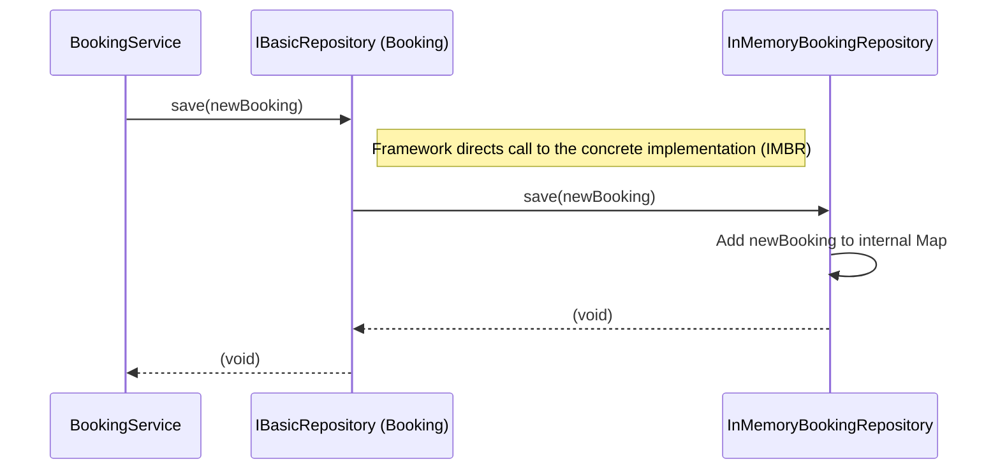
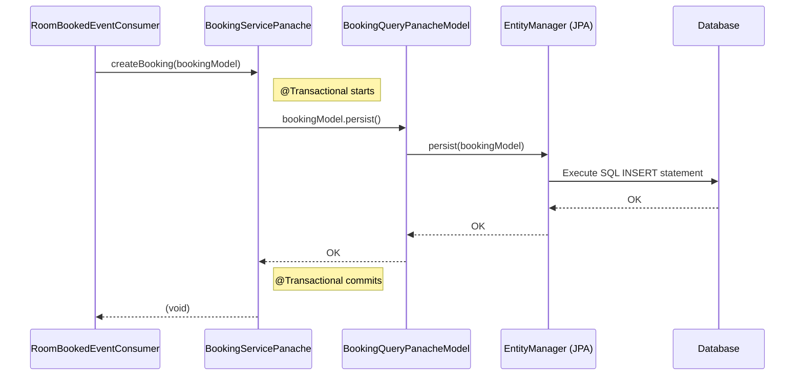

# Chapter 8: Repository (`IBasicRepository`)

## The Problem: Talking Directly to Storage is Messy

Imagine our `BookingService` needed to save a new `Booking`. Without a repository, the code inside `BookingService` might look like this (conceptually):

```java
// Inside BookingService - BAD EXAMPLE (No Repository)
public UUID createBooking(BookingCreate details) {
    // ... load customer, room ...
    Booking newBooking = new Booking(/* ... */);

    // ----> START of messy storage details <----
    if (weAreUsingInMemoryStorage) {
        // Code to add 'newBooking' to a global HashMap
        InMemoryDataStore.bookingsMap.put(newBooking.uuid(), newBooking);
    } else if (weAreUsingADatabase) {
        // Code to connect to database, write SQL INSERT statement,
        // map Booking fields to SQL parameters, execute statement, handle errors...
        String sql = "INSERT INTO bookings (...) VALUES (...)";
        // ... lots of database-specific code ...
    } else {
        // Code for yet another storage type...
    }
    // ----> END of messy storage details <----

    // ... publish event ...
    return newBooking.uuid();
}
```

This is problematic:
*   The `BookingService` needs to know *all* the details about how storage works.
*   If we change the storage (e.g., switch from in-memory to a real database), we have to change the `BookingService` code significantly.
*   The core business logic (creating the booking) is mixed up with storage details, making the code harder to read and test.

## The Solution: The Repository - Your Data Librarian

Think of a Repository as a **librarian** for your data.

*   You don't need to know which shelf, row, or specific box a book (your data object) is stored in.
*   You just go to the librarian (the Repository) and ask:
    *   "Can you **find** the book with this ID?" (`findById`)
    *   "Please **save** this new book for me." (`save`)
    *   "I've made changes to this book; please **update** your records." (`update`)

The librarian handles all the details of interacting with the shelves and boxes (the actual storage mechanism). Your service code stays clean and only talks to the librarian.

In our project, the `IBasicRepository<T, ID>` interface defines the standard "job description" for such a librarian.

## The Interface: `IBasicRepository<T, ID>`

This interface is a contract defined in our `core` module. It specifies the basic operations any data repository should support.

```java
// File: core/src/main/java/fhv/hotel/core/repo/IBasicRepository.java

package fhv.hotel.core.repo;

// A generic blueprint for basic data access operations.
// T represents the Type of object being stored (e.g., Booking, Customer)
// ID represents the Type of the object's identifier (e.g., UUID, Long)
public interface IBasicRepository<T, ID> {

    // Finds an object by its unique identifier.
    T findById(ID id);

    // Saves a brand new object to the storage.
    void save(T t);

    // Updates an existing object in the storage.
    void update(T t);
}
```

*   **`IBasicRepository<T, ID>`:** The `<T, ID>` part uses Java Generics. It means this interface is a template that can work with different types of data (`T`) and different types of IDs (`ID`). For example, `IBasicRepository<Booking, UUID>` is a repository specifically for `Booking` objects identified by a `UUID`. `IBasicRepository<Room, Long>` is for `Room` objects identified by a `Long`.
*   **`findById(ID id)`:** Given an ID, the repository must return the corresponding object (`T`).
*   **`save(T t)`:** Given a new object (`t`), the repository must store it.
*   **`update(T t)`:** Given an existing object (`t`) that has been modified, the repository must update the stored version.

This interface provides a simple, standard way for services to interact with data storage without knowing the underlying details.

## Using the Repository (Command Side Example)

Let's see how the `BookingService` on the Command side uses this interface to save a `Booking`.

1.  **Declare Dependency:** The service declares that it needs a "librarian" for `Booking` objects.

    ```java
    // File: command/src/main/java/fhv/hotel/command/service/BookingService.java
    // (Simplified)

    import fhv.hotel.core.repo.IBasicRepository; // Import the interface
    import fhv.hotel.command.model.domain.Booking; // The data type
    import java.util.UUID; // The ID type
    import jakarta.inject.Inject;
    // ... other imports ...

    @ApplicationScoped
    public class BookingService {

        // Ask the system (@Inject) to provide an implementation
        // of the IBasicRepository for Booking objects with UUID keys.
        @Inject
        IBasicRepository<Booking, UUID> bookingRepository;

        // We might also need repositories for other types:
        @Inject IBasicRepository<Customer, UUID> customerRepository;
        @Inject IBasicRepository<Room, Long> roomRepository;
        // ...
    ```
    *The `@Inject` annotation tells the Quarkus framework: "Please find a class that implements `IBasicRepository<Booking, UUID>` and assign an instance of it to this `bookingRepository` field."*

2.  **Use the Methods:** Inside the service methods, we simply call the standard repository methods.

    ```java
    // File: command/src/main/java/fhv/hotel/command/service/BookingService.java
    // (Inside createBooking method)

    public UUID createBooking(BookingCreate details) {
        // 1. Load related data using findById
        Customer customer = customerRepository.findById(details.customerId());
        Room room = roomRepository.findById(details.roomNumber());
        // ... handle potential errors if not found ...

        // 2. Create the new Booking object
        Booking newBooking = new Booking(/*... booking details ...*/);
        System.out.println("Created new Booking object.");

        // 3. Save the new booking using the librarian's 'save' method
        bookingRepository.save(newBooking); // <= Simple call!
        System.out.println("Booking handed off to repository for saving.");

        // 4. Publish event (as seen before)
        // ... eventPublisher.publish(...) ...

        return newBooking.uuid();
    }
    ```
    *Look how clean the saving part is: `bookingRepository.save(newBooking)`. The `BookingService` doesn't know or care *how* the `bookingRepository` saves it (in-memory, database, file...). It just trusts the "librarian" to do its job.*

## Different Implementations: Tailored Storage

The beauty of using an interface like `IBasicRepository` is that we can have *different* classes implementing it, providing different storage strategies.

**1. Command Side: In-Memory Repositories (`InMemory*Repository`)**

On the Command side, we often prioritize speed for writing data. We want commands to execute quickly. For this purpose, our project uses **in-memory** repositories. These implementations store the data directly in the computer's memory (like simple HashMaps) rather than writing to a slower disk-based database.

```java
// File: command/src/main/java/fhv/hotel/command/repo/InMemoryBookingRepository.java
// (Simplified Structure)

package fhv.hotel.command.repo;

import fhv.hotel.command.model.domain.Booking;
import fhv.hotel.core.repo.IBasicRepository;
import jakarta.inject.Singleton;
import java.util.HashMap;
import java.util.Map;
import java.util.UUID;

@Singleton // Make this class available for injection
// This class IS A librarian for Booking objects, using memory storage.
public class InMemoryBookingRepository implements IBasicRepository<Booking, UUID> {

    // The actual storage: a simple map in memory!
    private final Map<UUID, Booking> bookingStore = new HashMap<>();

    @Override
    public Booking findById(UUID uuid) {
        Booking booking = bookingStore.get(uuid);
        // ... (some logic to handle relationships, error if not found) ...
        return booking;
    }

    @Override
    public void save(Booking booking) {
        if (bookingStore.containsKey(booking.uuid())) {
            // Handle error: already exists
        }
        // Put the booking into the map
        bookingStore.put(booking.uuid(), booking /* maybe a shallow copy */);
        System.out.println("InMemoryRepo: Saved booking " + booking.uuid() + " to map.");
    }

    @Override
    public void update(Booking booking) {
        if (!bookingStore.containsKey(booking.uuid())) {
            // Handle error: doesn't exist
        }
        // Replace the entry in the map
        bookingStore.put(booking.uuid(), booking /* maybe a shallow copy */);
        System.out.println("InMemoryRepo: Updated booking " + booking.uuid() + " in map.");
    }

    // ... (Helper methods related to relationships, not shown) ...
}
```

*   This class implements `IBasicRepository<Booking, UUID>`.
*   It uses a `HashMap` called `bookingStore` to keep the `Booking` objects.
*   The `save`, `findById`, and `update` methods simply interact with this map.
*   **Why In-Memory?** It's very fast for `save` and `update` operations, which is good for the Command side. The downside is that data is lost if the application restarts. However, in CQRS, the *events* are often the persistent source of truth, and the query side handles durable storage.

When the `BookingService` asks for `IBasicRepository<Booking, UUID>`, the framework provides an instance of `InMemoryBookingRepository`.

**2. Query Side: Panache/JPA (`*ServicePanache`)**

On the Query side, we need data to persist permanently so we can query it later. We also need efficient ways to search and retrieve data. Here, we don't typically use the `IBasicRepository` interface directly. Instead, we leverage **Quarkus Panache** with **JPA (Java Persistence API)**.

Panache provides its own convenient ways to interact with a database. The `*ServicePanache` classes (like `BookingServicePanache`) act like repositories for the query models (e.g., `BookingQueryPanacheModel`).

```java
// File: query/src/main/java/fhv/hotel/query/service/BookingServicePanache.java
// (Simplified - showing persistence methods)

package fhv.hotel.query.service;

import fhv.hotel.query.model.BookingQueryPanacheModel; // The Query Model
import io.quarkus.hibernate.orm.panache.Panache; // Panache helper
import jakarta.enterprise.context.ApplicationScoped;
import jakarta.transaction.Transactional; // Handle database transactions
import java.util.Optional;
import java.util.UUID;

@ApplicationScoped
public class BookingServicePanache { // Acts like a Repository for Query Models

    // Find using Panache's built-in static method
    public Optional<BookingQueryPanacheModel> getBookingByUUID(UUID uuid) {
        return BookingQueryPanacheModel.findByIdOptional(uuid);
    }

    // Save using Panache's persist method within a transaction
    @Transactional
    public void createBooking(BookingQueryPanacheModel model) {
        model.persist(); // Panache handles the SQL INSERT
        System.out.println("PanacheService: Persisted booking query model " + model.uuid);
    }

    // Update by loading, changing, and letting the transaction commit
    @Transactional
    public void updateBooking(BookingQueryPanacheModel updatedBooking) {
        // Load the existing entity from DB
        BookingQueryPanacheModel currentBooking = BookingQueryPanacheModel
                .findByIdOptional(updatedBooking.uuid)
                .orElseThrow(/* ... error handling ... */);

        // Modify the loaded entity's fields
        currentBooking.paid = updatedBooking.paid;
        currentBooking.cancelled = updatedBooking.cancelled;
        // ... update other relevant fields ...

        // No explicit 'update' call needed - Panache/JPA handles it
        // when the transaction commits because 'currentBooking' is managed.
        Panache.getEntityManager().flush(); // Optional: force changes now
        System.out.println("PanacheService: Updated booking query model " + currentBooking.uuid);
    }

    // ... (Methods for querying data, as seen in Chapter 3) ...
}
```

*   This class doesn't implement `IBasicRepository`. It uses Panache features.
*   `BookingQueryPanacheModel` likely extends `PanacheEntityBase`, giving it methods like `persist()` and static methods like `findByIdOptional()`.
*   `@Transactional` ensures database operations happen safely.
*   Updates often involve loading the entity, changing its fields, and letting JPA automatically detect and save changes when the transaction completes.
*   **Why Panache/JPA?** It provides robust database persistence, complex querying capabilities, and transaction management needed for the Query side's read store.

Even though the Query side uses a different mechanism, the core idea is the same: the `RoomBookedEventConsumer` uses `BookingServicePanache` to save or update data without needing to know the raw SQL or database specifics.

## Abstraction: The Big Benefit

The key takeaway is **abstraction**.

*   On the Command side, `IBasicRepository` hides whether storage is in-memory or something else.
*   On the Query side, Panache services hide the complexities of JPA and SQL.

This makes our services (`BookingService`, `RoomBookedEventConsumer`) simpler, more focused on their core logic, easier to test, and more adaptable if the storage mechanism needs to change later.

## How it Works: Under the Hood

**Command Side (`save`):**


*The `BookingService` calls the interface method, and the framework ensures the call reaches the `InMemoryBookingRepository`'s implementation, which updates its internal map.*

**Query Side (`createBooking`):**


*The `RoomBookedEventConsumer` calls the Panache service method. Within a transaction, the `persist()` call on the Panache entity triggers the JPA EntityManager to generate and execute an SQL INSERT statement against the database.*

## Conclusion

You've learned about the **Repository pattern** and its role in providing a clean abstraction for data access.

*   The **`IBasicRepository<T, ID>`** interface defines standard operations (`findById`, `save`, `update`) primarily used on the **Command side**.
*   Implementations like **`InMemoryBookingRepository`** provide fast, in-memory storage suitable for command processing.
*   The **Query side** uses a different but related approach with **Panache services** (like `BookingServicePanache`) acting as repositories for JPA/Panache entities, offering database persistence and powerful querying.
*   This abstraction keeps services decoupled from storage details, improving maintainability and testability.

We've mentioned several times that events are serialized into bytes for transport (Chapter 6) and deserialized back into objects on consumption (Chapter 7). How does this serialization actually work? Let's dive into Kryo, the library we use for this process.

**Next:** [Chapter 9: Kryo Serialization](09_kryo_serialization_.md)
