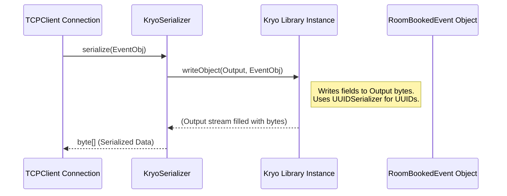
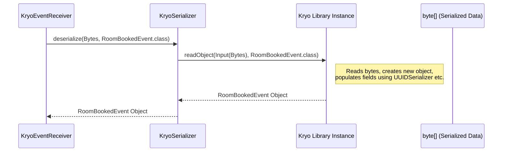

# Chapter 9: Kryo Serialization

## The Problem: Sending Objects vs. Sending Bytes

Imagine you want to mail a detailed toy car model to a friend. You can't just slap a stamp on the car and drop it in the mailbox! It's the wrong shape, delicate, and has many parts. You need to carefully package it: maybe disassemble some parts, wrap them securely, and put them in a compact box suitable for shipping. Once your friend receives the box, they need to unpack it and reassemble the car model.

Sending Java objects over the network is similar. Our `RoomBookedEvent` object is like that detailed toy car. The network (the postal service) only accepts bytes (standard boxes). We need a way to:

1.  **Package (Serialize):** Convert the `RoomBookedEvent` object into a stream of bytes before sending it.
2.  **Unpackage (Deserialize):** Convert the received stream of bytes back into the original `RoomBookedEvent` object on the other end.

This process of converting objects to bytes and back is called **Serialization** and **Deserialization**.

## The Solution: Kryo - The Efficient Packaging Expert

There are many ways to serialize Java objects. Our project uses a popular, fast, and efficient library called **Kryo**.

Think of Kryo as a highly skilled packaging expert. It knows how to take a Java object, look at all its fields (like `bookingUUID`, `startDate`, `roomNumber` in `RoomBookedEvent`), and convert them into a very compact sequence of bytes. It's designed to be faster and produce smaller byte sequences than Java's built-in serialization, which is great for sending messages quickly over the network.

When the message arrives, Kryo also knows how to read the byte sequence and perfectly reconstruct the original Java object.

## Key Components in Our Project

In our `cqrs` project, a few key classes work together to manage Kryo serialization for our events:

1.  **`KryoSerializer` (The Worker):** This is our main tool that uses the Kryo library. It provides two core functions:
    *   `serialize(T object)`: Takes an event object (like `RoomBookedEvent`) and returns an array of bytes (`byte[]`).
    *   `deserialize(byte[] data, Class<T> type)`: Takes an array of bytes and the expected object type (like `RoomBookedEvent.class`) and returns the reconstructed object.

2.  **`StandardKryoConfig` (The Setup Instructions):** Before Kryo can work efficiently, it sometimes needs a little setup. This class tells Kryo about the specific event classes we'll be serializing (like `RoomBookedEvent`, `CustomerCreatedEvent`, etc.). It also tells Kryo to use a special, optimized way to handle `UUID` objects.
    *   **Why Register?** Registering classes helps Kryo work faster and produce even smaller byte outputs. Think of it as giving the packer a list of standard items they'll be handling often, so they can prepare optimized boxes.

3.  **`UUIDSerializer` (The Specialist Packer):** A `UUID` (Universally Unique Identifier) is a standard way to generate unique IDs (like our `bookingUUID`). By default, Kryo might serialize it less efficiently. We provide a custom `UUIDSerializer` that tells Kryo *exactly* how to handle UUIDs: simply write out the two internal `long` numbers that make up a UUID, and read them back in the same way. This is very compact and fast.

## How Kryo Fits into the Event Flow

Now let's see where Kryo comes into play in the processes we've already learned about:

**1. Publishing an Event (Command Side -> Server):**

*   The `BookingService` creates a `RoomBookedEvent` object.
*   It calls `eventPublisher.publish(event)` ([Chapter 5: Event Publishing (`IPublishEvent`)](05_event_publishing___ipublishevent___.md)).
*   The `TCPClient` (which implements `IPublishEvent`) receives the event object.
*   Inside the `TCPClient`'s `Connection` helper ([Chapter 6: Event Bus Transport](06_event_bus_transport__tcp_server_client___frame_protocol__.md)), it uses `KryoSerializer` to package the event:
    ```java
    // Conceptual step inside TCPClient's Connection.sendEvent()
    KryoSerializer serializer = new KryoSerializer();
    IEventModel event = /* the RoomBookedEvent object */;

    // Use Kryo to turn the object into bytes
    byte[] serializedEventBytes = serializer.serialize(event);

    // These bytes (plus the event type byte) become the payload
    // of the Frame sent to the TCPServer.
    // ... create Frame with payload ...
    // ... send Frame over network ...
    ```
    *The `KryoSerializer` turns the event object into bytes ready for network transport.*

**2. Consuming an Event (Server -> Query Side -> Consumer):**

*   The `TCPClient` on the Query side receives a `CONSUME` frame from the `TCPServer` containing the event bytes ([Chapter 6](06_event_bus_transport__tcp_server_client___frame_protocol__.md)).
*   The client passes these bytes to the `KryoEventReceiver` ([Chapter 7: Event Consumption](07_event_consumption___iconsumeevent____kryoeventreceiver____ireceivebytemessage__.md)).
*   The `KryoEventReceiver` uses `KryoSerializer` to unpackage the bytes back into an object:
    ```java
    // Conceptual step inside KryoEventReceiver.receiveAndProcess()
    byte[] messageBytes = /* the byte array from the Frame payload */;
    byte eventTypeId = messageBytes[0];
    byte[] eventDataBytes = /* messageBytes excluding the first byte */;

    // Figure out the expected class (e.g., RoomBookedEvent.class) based on eventTypeId
    Class<? extends IEventModel> eventClass = findClassForTypeId(eventTypeId);

    // Use Kryo to turn the bytes back into an object
    KryoSerializer serializer = new KryoSerializer();
    IEventModel eventObject = serializer.deserialize(eventDataBytes, eventClass);

    // Now pass the reconstructed eventObject to the specific IConsumeEvent handler
    // ... findConsumerForClass(eventClass).consume(eventObject) ...
    ```
    *The `KryoSerializer` turns the received bytes back into the original `RoomBookedEvent` object, ready for processing.*

## A Look Under the Hood

Let's visualize the process and look at the key code snippets.

**Serialization Walkthrough:**

1.  **Input:** `RoomBookedEvent` object.
2.  `TCPClient` calls `kryoSerializer.serialize(event)`.
3.  `KryoSerializer` gets the pre-configured `Kryo` instance from `StandardKryoConfig`.
4.  It tells the `Kryo` instance to write the object's data to an in-memory byte stream (`Output`). Kryo efficiently writes out field values (using the custom `UUIDSerializer` when it encounters a UUID).
5.  **Output:** `byte[]` array containing the compact representation of the event.



**Deserialization Walkthrough:**

1.  **Input:** `byte[]` array received from the network, and the expected `Class` (e.g., `RoomBookedEvent.class`).
2.  `KryoEventReceiver` calls `kryoSerializer.deserialize(bytes, RoomBookedEvent.class)`.
3.  `KryoSerializer` gets the pre-configured `Kryo` instance.
4.  It wraps the input `byte[]` in a Kryo `Input` stream.
5.  It tells the `Kryo` instance to read the object data from the `Input` stream, creating a new object of the specified `Class`. Kryo reconstructs the object field by field (using `UUIDSerializer` when reading UUID data).
6.  **Output:** A fully reconstructed `RoomBookedEvent` object.



## Key Code Snippets (Simplified)

**1. `KryoSerializer`:**

```java
// File: core/src/main/java/fhv/hotel/core/kryo/KryoSerializer.java

import com.esotericsoftware.kryo.kryo5.Kryo;
import com.esotericsoftware.kryo.kryo5.io.Input;
import com.esotericsoftware.kryo.kryo5.io.Output;
import java.io.ByteArrayOutputStream;

public class KryoSerializer {
    private final Kryo kryo; // Holds the configured Kryo instance

    // Constructor gets the standard configured Kryo instance
    public KryoSerializer() {
        this.kryo = StandardKryoConfig.get();
    }

    // Serialize object to bytes
    public <T> byte[] serialize(T object) {
        ByteArrayOutputStream outputStream = new ByteArrayOutputStream();
        Output output = new Output(outputStream); // Kryo output target

        kryo.writeObject(output, object); // Tell Kryo to write the object
        output.close(); // Finish writing
        return outputStream.toByteArray(); // Get the resulting bytes
    }

    // Deserialize bytes back to object
    public <T> T deserialize(byte[] data, Class<T> type) {
        if (data == null || data.length == 0) return null; // Handle empty input

        Input input = new Input(data); // Kryo input source
        T object = kryo.readObject(input, type); // Tell Kryo to read the object
        input.close(); // Finish reading
        return object; // Return the reconstructed object
    }
}
```
*This class provides the simple `serialize` and `deserialize` methods, using a pre-configured `Kryo` instance to do the actual work.*

**2. `StandardKryoConfig`:**

```java
// File: core/src/main/java/fhv/hotel/core/kryo/StandardKryoConfig.java

import com.esotericsoftware.kryo.kryo5.Kryo;
import fhv.hotel.core.model.*; // Import all event classes
import java.util.UUID;

public class StandardKryoConfig {
    // Holds the single, configured Kryo instance for the application
    public static final Kryo KRYO;

    static { // This block runs once when the class is first loaded
        KRYO = new Kryo();
        KRYO.setReferences(true); // Handle object graphs (can be complex)
        KRYO.setRegistrationRequired(false); // Allow unknown classes (flexible but slower)

        // Explicitly register our event classes for efficiency
        KRYO.register(CustomerCreatedEvent.class);
        KRYO.register(CustomerUpdatedEvent.class);
        KRYO.register(BookingCancelledEvent.class);
        KRYO.register(BookingPaidEvent.class);
        KRYO.register(RoomBookedEvent.class);
        // ... register ALL other event types ...

        // Register the special serializer for UUIDs
        KRYO.register(UUID.class, new UUIDSerializer());
    }

    // Method to get the configured instance
    public static Kryo get() {
        return KRYO;
    }
}
```
*This class creates and configures the central `Kryo` instance, registering our specific event classes and the custom `UUIDSerializer`.*

**3. `UUIDSerializer`:**

```java
// File: core/src/main/java/fhv/hotel/core/kryo/UUIDSerializer.java

import com.esotericsoftware.kryo.kryo5.Kryo;
import com.esotericsoftware.kryo.kryo5.Serializer;
import com.esotericsoftware.kryo.kryo5.io.Input;
import com.esotericsoftware.kryo.kryo5.io.Output;
import java.util.UUID;

// Custom Kryo serializer for java.util.UUID objects
public class UUIDSerializer extends Serializer<UUID> {

    // How to write a UUID to bytes
    @Override
    public void write(Kryo kryo, Output output, UUID uuid) {
        // Write the two internal long values of the UUID
        output.writeLong(uuid.getMostSignificantBits());
        output.writeLong(uuid.getLeastSignificantBits());
    }

    // How to read a UUID from bytes
    @Override
    public UUID read(Kryo kryo, Input input, Class<? extends UUID> type) {
        // Read the two long values
        long most = input.readLong();
        long least = input.readLong();
        // Create a new UUID from them
        return new UUID(most, least);
    }
}
```
*This specialist tells Kryo to just read/write the two `long` components of a `UUID`, which is very efficient.*

## Conclusion

You've now learned about **Kryo Serialization**, the essential mechanism that allows us to send our complex Java event objects over the network as compact streams of bytes.

*   **Serialization** converts objects to bytes (packaging).
*   **Deserialization** converts bytes back to objects (unpackaging).
*   We use the **Kryo** library because it's fast and efficient.
*   `KryoSerializer` is our main tool for performing serialization/deserialization.
*   `StandardKryoConfig` sets up Kryo, registering our event classes and the custom `UUIDSerializer` for optimal performance.
*   This process is crucial for both publishing events from the Command side and consuming them on the Query side via the TCP Event Bus.

This concludes our journey through the core concepts of the `cqrs` project! We've covered the fundamental CQRS pattern, Command handling, Query projections, the Event model, publishing, transport, consumption, repositories, and finally, the serialization that ties the network communication together. Hopefully, this gives you a solid foundation for understanding and working with the code.
