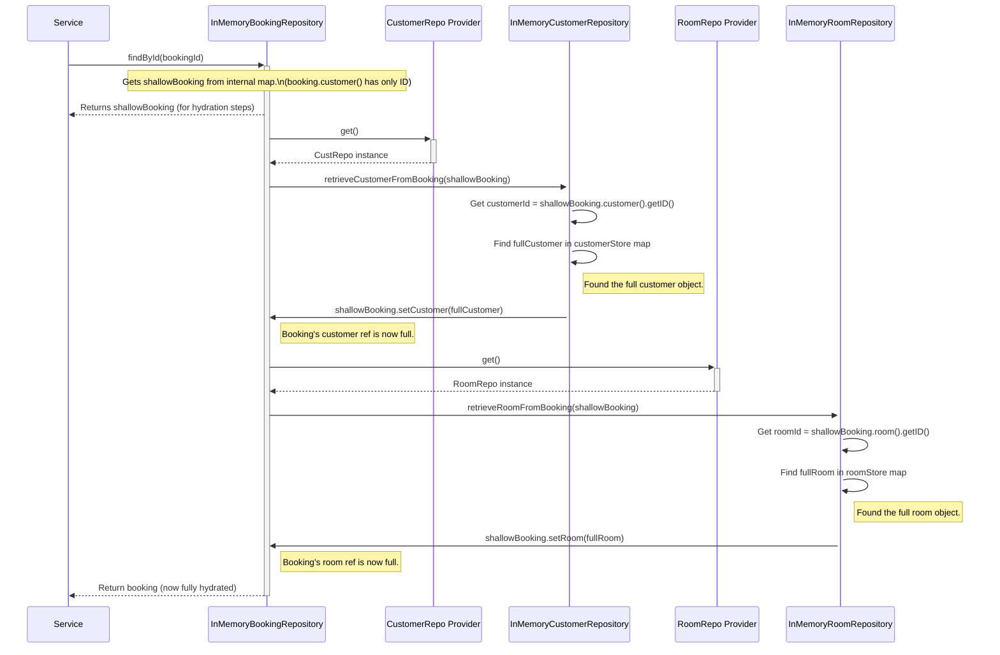

# Chapter 10: Shallow Projection (`IShallowProjection`)

Welcome to the final chapter of our introductory tour through the `cqrs` project! In [Chapter 9: TCP Event Bus (`TCPServer`, `TCPClient`, `Connection` - event module)](09_tcp_event_bus___tcpserver____tcpclient____connection____event_module__.md), we saw how events can travel between different parts of our system using a network bus. We've covered how commands are processed and how events enable communication.

Now, let's zoom back in on a specific detail related to how we manage data within our in-memory repositories: **Shallow Projection**. This technique helps us handle relationships between our data models efficiently.

## What's the Problem? Infinite Loops and Wasted Memory!

Remember our [Command Domain Models (`Booking`, `Customer`, `Room`)](03_command_domain_models___booking____customer____room___.md)? They have relationships:
*   A `Booking` object holds a reference to its `Customer` and `Room`.
*   A `Customer` object holds a list of all their `Booking`s.
*   A `Room` object holds a list of all its `Booking`s.

Now, imagine we are using our simple [In-Memory Repositories](04_repository___ibasicrepository___.md) (like `InMemoryBookingRepository`) which store these objects directly in memory (e.g., in a `HashMap`).

**Problem 1: Infinite Loops**
If we try to load a `Booking` from the repository, and that `Booking` object contains a full `Customer` object, what happens? The `Customer` object contains a list of *its* bookings, which includes the original `Booking` we are trying to load! If the system tries to load everything fully at once, it can get stuck in an infinite loop: Booking needs Customer needs Booking needs Customer...

**Problem 2: Wasted Memory**
If we store the *entire* `Customer` object inside *every single* `Booking` object associated with that customer in our in-memory store, we're storing the customer's name, birthday, etc., multiple times unnecessarily. This is very inefficient, especially if a customer has many bookings.

We need a smarter way to handle these relationships in memory.

## The Solution: Shallow Projections (Like Phone Numbers)

The **Shallow Projection** technique solves these problems. Think about your phone's address book. When you look at an entry for "Mom," you probably see her name and phone number. You don't see her entire life story, her list of friends, or *their* phone numbers embedded directly in her entry. If you want more details about Mom, you look them up separately. The phone number acts as a *reference* or *pointer* to her full details.

Shallow Projection works similarly in our code:

1.  **Saving:** When we save a `Booking` object to our in-memory repository, instead of storing the *full* `Customer` and `Room` objects inside it, we store special "shallow" versions. These shallow versions contain **only the unique ID** (like the phone number) of the `Customer` and `Room`.
2.  **Loading:** When we retrieve the `Booking` later, it initially comes back with these shallow `Customer` and `Room` objects (just the IDs).
3.  **Hydration (Getting Full Details):** If we actually need the full details of the customer or room associated with that booking, the repository performs an extra step. It uses the ID from the shallow object to look up the *full* `Customer` or `Room` object from their respective repositories and then links the full object to the `Booking`. This process is sometimes called "hydration" – filling in the missing details.

This avoids infinite loops because we don't try to load everything at once. It saves memory because we only store the full `Customer` and `Room` objects once in their own repositories, and bookings just store the lightweight IDs.

## Key Concepts

1.  **`IShallowProjection<M, ID>` Interface:** This is a contract (defined in Java as an `interface`) that our domain models (`Booking`, `Customer`, `Room`) implement. It standardizes how shallow projections work for each model.

    ```java
    // File: command/src/main/java/fhv/hotel/command/model/domain/IShallowProjection.java
    package fhv.hotel.command.model.domain;

    // The contract for models that support shallow projection
    public interface IShallowProjection<M, ID> {
        // Check if this object instance is currently shallow (only ID exists)
        boolean isShallow(); 

        // Create a new shallow instance of the model, given an ID
        M buildShallowModel(ID id); 

        // Get the ID of this model instance (works even if shallow)
        ID getID(); 
    }
    ```
    *   `isShallow()`: Returns `true` if the object is just a placeholder with an ID.
    *   `buildShallowModel(ID id)`: A factory method to create a new shallow placeholder object containing only the given `id`.
    *   `getID()`: Returns the ID of the object.

2.  **Shallow Object:** An instance of a domain model (like `Customer`) where only the `uuid` (or `roomNumber`) field is filled. All other fields (like `firstName`, `bookings`) are `null` or empty. It acts as a lightweight reference.

3.  **Full Object:** A regular instance of a domain model with all its data fields populated.

4.  **Hydration:** The process of replacing a shallow object reference within another object (e.g., the shallow `Customer` inside a `Booking`) with the corresponding full object reference, fetched using the ID from the shallow object.

## How It's Used in In-Memory Repositories

Let's see how `InMemoryBookingRepository` uses this technique.

**1. Saving a Booking (`save` method)**

When the `BookingService` calls `bookingRepository.save(booking)`, the `booking` object passed in likely contains references to *full* `Customer` and `Room` objects.

```java
// File: command/src/main/java/fhv/hotel/command/repo/InMemoryBookingRepository.java (Simplified Save)
@Singleton
public class InMemoryBookingRepository implements IBasicRepository<Booking, UUID> {
    private final Map<UUID, Booking> bookingStore = new HashMap<>();
    // ... repository providers injection ...

    @Override
    public void save(Booking booking) {
        if (bookingStore.containsKey(booking.uuid())) {
            throw new IllegalArgumentException("booking already exists");
        }

        // *** Create a SHALLOW version before storing ***
        Booking bookingShallow = new Booking(
                booking.uuid(),
                booking.bookingNumber(),
                booking.paid(),
                booking.cancelled(),
                // Use buildShallowModel to get Customer with ID only
                booking.customer().buildShallowModel(booking.customer().getID()), 
                // Use buildShallowModel to get Room with ID only
                booking.room().buildShallowModel(booking.room().getID()),     
                booking.startDate(),
                booking.endDate()
        );

        // Store the version with shallow references in the map
        bookingStore.put(booking.uuid(), bookingShallow); 
        System.out.println("InMemoryBookingRepo: Saved Booking " + booking.uuid() + " with shallow Customer/Room refs.");
    }
    // ... findById, update, etc. ...
}
```

*   **Before Storing:** Inside `save`, it doesn't put the original `booking` directly into the `bookingStore` map.
*   **`buildShallowModel`:** It creates a new `Booking` instance (`bookingShallow`). For the `customer` and `room` fields of this new instance, it calls `buildShallowModel()` on the original full objects. This generates shallow `Customer` and `Room` objects containing only their IDs.
*   **Store Shallow:** It's this `bookingShallow` object, containing references to shallow `Customer` and `Room` placeholders, that gets stored in the `bookingStore` map.

**2. Loading a Booking (`findById` method and Hydration)**

When `bookingRepository.findById(uuid)` is called later:

```java
// File: command/src/main/java/fhv/hotel/command/repo/InMemoryBookingRepository.java (Simplified FindById)

@Singleton
public class InMemoryBookingRepository implements IBasicRepository<Booking, UUID> {
    private final Map<UUID, Booking> bookingStore = new HashMap<>();

    // Providers to get instances of other repositories
    @Inject Provider<InMemoryCustomerRepository> customerRepositoryProvider;
    @Inject Provider<InMemoryRoomRepository> roomRepositoryProvider;

    @Override
    public Booking findById(UUID uuid) {
        // 1. Get the booking from the store - it has SHALLOW refs initially
        Booking booking = bookingStore.get(uuid); 
        if (booking == null) { /* ... handle not found ... */ }
        System.out.println("InMemoryBookingRepo: Found Booking " + uuid + ", has shallow refs.");

        // 2. *** Hydrate the references ***
        // Ask Customer repo to find the full customer and attach it
        customerRepositoryProvider.get().retrieveCustomerFromBooking(booking); 
        // Ask Room repo to find the full room and attach it
        roomRepositoryProvider.get().retrieveRoomFromBooking(booking);         

        System.out.println("InMemoryBookingRepo: Hydrated refs for Booking " + uuid);
        // 3. Return the booking, now with FULL Customer and Room refs
        return booking; 
    }
    // ... save, update, helper methods ...
}
```

*   **Get Shallow:** It first retrieves the `Booking` object from the `bookingStore`. At this point, `booking.customer()` and `booking.room()` return the shallow placeholder objects (with only IDs).
*   **Hydrate:** It then calls helper methods on the *other* repositories (`customerRepositoryProvider.get().retrieveCustomerFromBooking(...)`). Let's look at that helper:

```java
// File: command/src/main/java/fhv/hotel/command/repo/InMemoryCustomerRepository.java (Helper Method)

@Singleton
public class InMemoryCustomerRepository implements IBasicRepository<Customer, UUID> {
    private final Map<UUID, Customer> customerStore = new HashMap<>();
    // ... other methods ...

    // Helper called by BookingRepository to hydrate the Customer reference
    public void retrieveCustomerFromBooking(Booking booking) {
        // Get the ID from the shallow customer object inside the booking
        UUID customerId = booking.customer().getID(); 
        // Find the FULL customer object in *this* repository's store
        Customer fullCustomer = customerStore.get(customerId); 
        if (fullCustomer == null) { /* ... handle error ... */ }
        // Replace the shallow customer ref in the booking with the full one
        booking.setCustomer(fullCustomer); 
        System.out.println("InMemoryCustomerRepo: Hydrated Customer " + customerId + " onto Booking " + booking.uuid());
    }
}
```
*   The `retrieveCustomerFromBooking` method gets the `customerId` from the shallow reference inside the `booking`.
*   It looks up the *full* `Customer` object in its own `customerStore`.
*   It calls `booking.setCustomer(fullCustomer)` to replace the shallow placeholder in the `Booking` object with the actual full `Customer` object.
*   A similar process happens in `InMemoryRoomRepository` for the `Room` reference.
*   **Return Full:** The `InMemoryBookingRepository.findById` method finally returns the `booking` object, which now has its `customer` and `room` fields pointing to the fully loaded objects.

The `InMemoryCustomerRepository` and `InMemoryRoomRepository` also have corresponding helper methods (`retrieveBookingsFromCustomer`, `retrieveBookingsFromRoom`) to hydrate the list of bookings when a `Customer` or `Room` is loaded.

## Under the Hood: The `findById` Hydration Flow

Let's visualize the process when `findById` is called for a `Booking`, showing how the shallow references are replaced with full ones.



This diagram shows the steps: get the object with shallow references, then use the IDs in those references to fetch the full objects from their respective repositories and link them back to the original object.

## Conclusion

In this final chapter, we learned about the **Shallow Projection (`IShallowProjection`)** technique used within our in-memory repositories.

*   It solves the problems of **infinite loops** and **memory inefficiency** when handling object relationships in memory.
*   **Saving:** Stores related objects as "shallow" placeholders containing only their **IDs**.
*   **Loading:** Retrieves the main object with shallow placeholders.
*   **Hydration:** Uses the IDs from placeholders to fetch the full related objects from their repositories and link them back when needed.
*   It relies on the **`IShallowProjection` interface** implemented by domain models and helper methods within the repositories.
*   Think of it like storing **phone numbers (IDs)** instead of entire contact details within related entries.

This technique is a practical implementation detail that makes our simple in-memory data storage workable and efficient for handling related data.

---

This concludes our introductory journey through the core concepts of the `cqrs` project! We've covered how commands are handled, how data is modeled and stored, how events enable communication between decoupled parts, and even some implementation details like the TCP event bus and shallow projections. We hope this gives you a solid foundation for understanding and working with this project.
