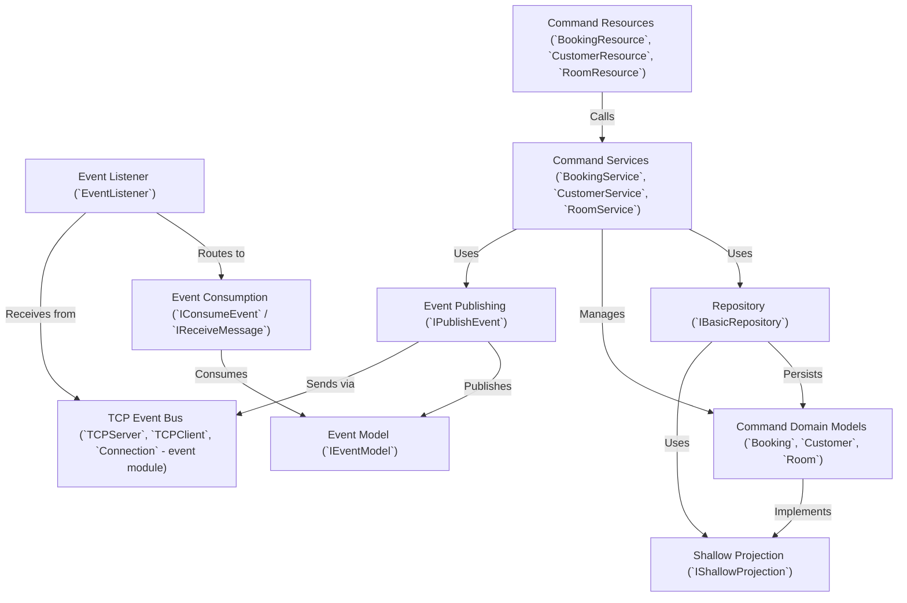

# Tutorial: CQRS - Hotel system

This project implements a hotel management system using the **CQRS** (Command Query Responsibility Segregation) pattern.
It separates actions that *change* data (like booking a room or creating a customer), called **Commands**, from how data is read (which is less detailed in these snippets).
Important occurrences within the system, like a customer being created, are captured and communicated as **Events**. The system uses *Repositories* to handle data storage and *Services* to manage business logic. It also includes a custom **TCP Event Bus** for potential event distribution.

## Chapters

1. [Command Resources (`BookingResource`, `CustomerResource`, `RoomResource`)
](01_command_resources___bookingresource____customerresource____roomresource___.md)
2. [Command Services (`BookingService`, `CustomerService`, `RoomService`)
](02_command_services___bookingservice____customerservice____roomservice___.md)
3. [Command Domain Models (`Booking`, `Customer`, `Room`)
](03_command_domain_models___booking____customer____room___.md)
4. [Repository (`IBasicRepository`)
](04_repository___ibasicrepository___.md)
5. [Event Model (`IEventModel`)
](05_event_model___ieventmodel___.md)
6. [Event Publishing (`IPublishEvent`)
](06_event_publishing___ipublishevent___.md)
7. [Event Consumption (`IConsumeEvent` / `IReceiveMessage`)
](07_event_consumption___iconsumeevent_____ireceivemessage___.md)
8. [Event Listener (`EventListener`)
](08_event_listener___eventlistener___.md)
9. [TCP Event Bus (`TCPServer`, `TCPClient`, `Connection` - event module)
](09_tcp_event_bus___tcpserver____tcpclient____connection____event_module__.md)
10. [Shallow Projection (`IShallowProjection`)
](10_shallow_projection___ishallowprojection___.md)

