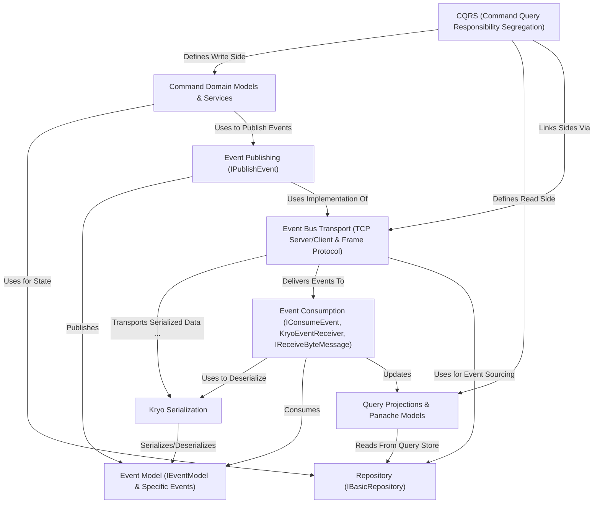

# Documentation: CQRS - Hotel system

This project implements a hotel booking system using the **CQRS** (*Command Query Responsibility Segregation*) pattern.
It separates operations that *change* data (**Commands**, like making a booking) from operations that *read* data (**Queries**, like viewing available rooms).
*Events* (like `RoomBookedEvent`) are created by Commands and used to update the Query side, keeping the read models eventually consistent.
The system uses a custom **TCP Event Bus** with **Kryo Serialization** for efficient communication between the Command and Query components.

## Chapters

1. [CQRS (Command Query Responsibility Segregation)
](01_cqrs__command_query_responsibility_segregation__.md)
2. [Command Domain Models & Services
](02_command_domain_models___services_.md)
3. [Query Projections & Panache Models
](03_query_projections___panache_models_.md)
4. [Event Model (`IEventModel` & Specific Events)
](04_event_model___ieventmodel____specific_events__.md)
5. [Event Publishing (`IPublishEvent`)
](05_event_publishing___ipublishevent___.md)
6. [Event Bus Transport (TCP Server/Client & Frame Protocol)
](06_event_bus_transport__tcp_server_client___frame_protocol__.md)
7. [Event Consumption (`IConsumeEvent`, `KryoEventReceiver`, `IReceiveByteMessage`)
](07_event_consumption___iconsumeevent____kryoeventreceiver____ireceivebytemessage___.md)
8. [Repository (`IBasicRepository`)
](08_repository___ibasicrepository___.md)
9. [Kryo Serialization
](09_kryo_serialization_.md)
